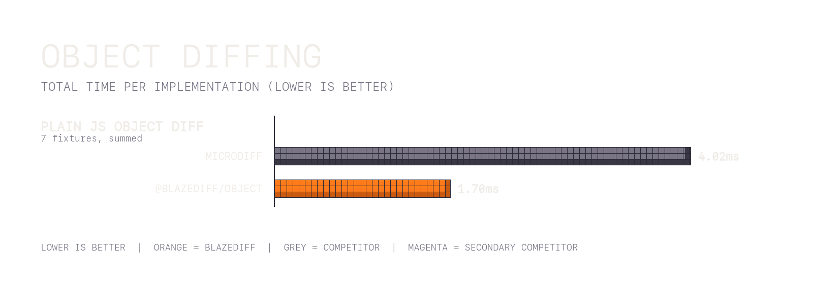

# Object Diffing Benchmarks

Deep-diff comparisons for plain JS objects and arrays.

## Object (`@blazediff/object` vs `microdiff`)

_10000 iterations (50 warmup)_

> **~55%** performance improvement on average.

<table>
  <thead>
    <tr>
      <th width="500">Benchmark</th>
      <th width="500">Microdiff</th>
      <th width="500">BlazeDiff</th>
      <th width="500">Time Saved</th>
      <th width="500">% Improvement</th>
    </tr>
  </thead>
  <tbody>
    <tr>
      <td>complex object</td>
      <td>0.0040ms</td>
      <td>0.0015ms</td>
      <td>0.0025ms</td>
      <td>63.0%</td>
    </tr>
    <tr>
      <td>deep nested</td>
      <td>0.0021ms</td>
      <td>0.0010ms</td>
      <td>0.0011ms</td>
      <td>52.0%</td>
    </tr>
    <tr>
      <td>large array</td>
      <td>0.5859ms</td>
      <td>0.2391ms</td>
      <td>0.3468ms</td>
      <td>59.2%</td>
    </tr>
    <tr>
      <td>large identical arrays</td>
      <td>0.0919ms</td>
      <td>0.0031ms</td>
      <td>0.0888ms</td>
      <td>96.6%</td>
    </tr>
    <tr>
      <td>large nested object</td>
      <td>3.3318ms</td>
      <td>1.4536ms</td>
      <td>1.8783ms</td>
      <td>56.4%</td>
    </tr>
    <tr>
      <td>nested object</td>
      <td>0.0031ms</td>
      <td>0.0013ms</td>
      <td>0.0019ms</td>
      <td>59.3%</td>
    </tr>
    <tr>
      <td>simple object</td>
      <td>0.0003ms</td>
      <td>0.0002ms</td>
      <td>0.0002ms</td>
      <td>54.2%</td>
    </tr>
    <tr>
      <td>simple object</td>
      <td>0.0003ms</td>
      <td>0.0002ms</td>
      <td>0.0001ms</td>
      <td>41.3%</td>
    </tr>
  </tbody>
</table>

_Benchmarks run on MacBook Pro M1 Max, Node.js 22_
