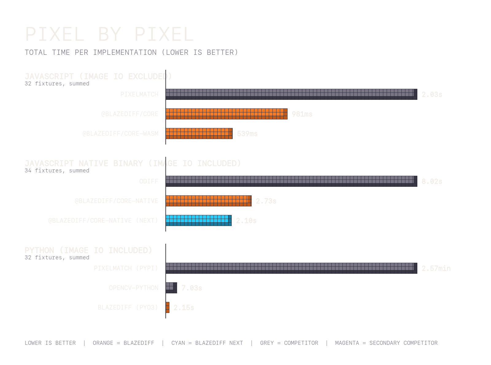

# Pixel By Pixel Benchmarks

Comparisons that compare pixels directly (RGBA or YIQ perceptual delta). Image decode is excluded except where the section title explicitly says "image IO included" (native binary, Python bindings).

## JavaScript (`@blazediff/core` vs `pixelmatch`) (image IO excluded)

_50 iterations (5 warmup)_

> **~61.6%** performance improvement on average.

<table>
  <thead>
    <tr>
      <th width="500">Benchmark</th>
      <th width="500">Pixelmatch</th>
      <th width="500">BlazeDiff</th>
      <th width="500">Time Saved</th>
      <th width="500">% Improvement</th>
    </tr>
  </thead>
  <tbody>
    <tr>
      <td>4k/1</td>
      <td>349.90ms</td>
      <td>172.60ms</td>
      <td>177.30ms</td>
      <td>50.7%</td>
    </tr>
    <tr>
      <td>4k/1 (identical)</td>
      <td>21.47ms</td>
      <td>3.52ms</td>
      <td>17.95ms</td>
      <td>83.6%</td>
    </tr>
    <tr>
      <td>4k/2</td>
      <td>348.25ms</td>
      <td>182.57ms</td>
      <td>165.68ms</td>
      <td>47.6%</td>
    </tr>
    <tr>
      <td>4k/2 (identical)</td>
      <td>22.86ms</td>
      <td>2.60ms</td>
      <td>20.26ms</td>
      <td>88.6%</td>
    </tr>
    <tr>
      <td>4k/3</td>
      <td>432.30ms</td>
      <td>231.08ms</td>
      <td>201.22ms</td>
      <td>46.5%</td>
    </tr>
    <tr>
      <td>4k/3 (identical)</td>
      <td>27.66ms</td>
      <td>3.20ms</td>
      <td>24.46ms</td>
      <td>88.4%</td>
    </tr>
    <tr>
      <td>blazediff/1</td>
      <td>1.25ms</td>
      <td>0.68ms</td>
      <td>0.57ms</td>
      <td>45.6%</td>
    </tr>
    <tr>
      <td>blazediff/1 (identical)</td>
      <td>0.50ms</td>
      <td>0.05ms</td>
      <td>0.45ms</td>
      <td>89.9%</td>
    </tr>
    <tr>
      <td>blazediff/2</td>
      <td>1.72ms</td>
      <td>1.07ms</td>
      <td>0.64ms</td>
      <td>37.5%</td>
    </tr>
    <tr>
      <td>blazediff/2 (identical)</td>
      <td>0.40ms</td>
      <td>0.04ms</td>
      <td>0.37ms</td>
      <td>90.7%</td>
    </tr>
    <tr>
      <td>blazediff/3</td>
      <td>10.75ms</td>
      <td>11.60ms</td>
      <td>-0.85ms</td>
      <td>-7.9%</td>
    </tr>
    <tr>
      <td>blazediff/3 (identical)</td>
      <td>1.90ms</td>
      <td>0.23ms</td>
      <td>1.67ms</td>
      <td>87.7%</td>
    </tr>
    <tr>
      <td>blazediff/4</td>
      <td>12.44ms</td>
      <td>7.95ms</td>
      <td>4.49ms</td>
      <td>36.1%</td>
    </tr>
    <tr>
      <td>blazediff/4 (identical)</td>
      <td>4.92ms</td>
      <td>0.50ms</td>
      <td>4.42ms</td>
      <td>89.9%</td>
    </tr>
    <tr>
      <td>page/1</td>
      <td>147.00ms</td>
      <td>94.64ms</td>
      <td>52.36ms</td>
      <td>35.6%</td>
    </tr>
    <tr>
      <td>page/1 (identical)</td>
      <td>70.36ms</td>
      <td>7.77ms</td>
      <td>62.59ms</td>
      <td>89.0%</td>
    </tr>
    <tr>
      <td>page/2</td>
      <td>525.37ms</td>
      <td>253.35ms</td>
      <td>272.02ms</td>
      <td>51.8%</td>
    </tr>
    <tr>
      <td>page/2 (identical)</td>
      <td>48.83ms</td>
      <td>7.11ms</td>
      <td>41.73ms</td>
      <td>85.4%</td>
    </tr>
    <tr>
      <td>pixelmatch/1</td>
      <td>0.60ms</td>
      <td>0.37ms</td>
      <td>0.23ms</td>
      <td>38.9%</td>
    </tr>
    <tr>
      <td>pixelmatch/1 (identical)</td>
      <td>0.15ms</td>
      <td>0.02ms</td>
      <td>0.13ms</td>
      <td>88.8%</td>
    </tr>
    <tr>
      <td>pixelmatch/2</td>
      <td>2.27ms</td>
      <td>1.84ms</td>
      <td>0.43ms</td>
      <td>19.0%</td>
    </tr>
    <tr>
      <td>pixelmatch/2 (identical)</td>
      <td>0.08ms</td>
      <td>0.01ms</td>
      <td>0.07ms</td>
      <td>90.3%</td>
    </tr>
    <tr>
      <td>pixelmatch/3</td>
      <td>0.39ms</td>
      <td>0.27ms</td>
      <td>0.13ms</td>
      <td>32.6%</td>
    </tr>
    <tr>
      <td>pixelmatch/3 (identical)</td>
      <td>0.15ms</td>
      <td>0.01ms</td>
      <td>0.13ms</td>
      <td>90.3%</td>
    </tr>
    <tr>
      <td>pixelmatch/4</td>
      <td>4.20ms</td>
      <td>3.62ms</td>
      <td>0.59ms</td>
      <td>14.0%</td>
    </tr>
    <tr>
      <td>pixelmatch/4 (identical)</td>
      <td>0.21ms</td>
      <td>0.02ms</td>
      <td>0.19ms</td>
      <td>90.7%</td>
    </tr>
    <tr>
      <td>pixelmatch/5</td>
      <td>0.19ms</td>
      <td>0.14ms</td>
      <td>0.05ms</td>
      <td>24.9%</td>
    </tr>
    <tr>
      <td>pixelmatch/5 (identical)</td>
      <td>0.08ms</td>
      <td>0.01ms</td>
      <td>0.07ms</td>
      <td>90.5%</td>
    </tr>
    <tr>
      <td>pixelmatch/6</td>
      <td>0.78ms</td>
      <td>0.81ms</td>
      <td>-0.03ms</td>
      <td>-3.8%</td>
    </tr>
    <tr>
      <td>pixelmatch/6 (identical)</td>
      <td>0.08ms</td>
      <td>0.01ms</td>
      <td>0.07ms</td>
      <td>89.6%</td>
    </tr>
    <tr>
      <td>pixelmatch/7</td>
      <td>1.24ms</td>
      <td>0.96ms</td>
      <td>0.28ms</td>
      <td>22.5%</td>
    </tr>
    <tr>
      <td>pixelmatch/7 (identical)</td>
      <td>0.28ms</td>
      <td>0.03ms</td>
      <td>0.26ms</td>
      <td>90.9%</td>
    </tr>
    <tr>
      <td>same/1</td>
      <td>2.05ms</td>
      <td>0.22ms</td>
      <td>1.83ms</td>
      <td>89.5%</td>
    </tr>
    <tr>
      <td>same/1 (identical)</td>
      <td>2.03ms</td>
      <td>0.22ms</td>
      <td>1.81ms</td>
      <td>89.0%</td>
    </tr>
  </tbody>
</table>

_Benchmarks run on MacBook Pro M1 Max, Node.js 22_

## JavaScript with output buffer (`@blazediff/core` vs `pixelmatch`) (image IO excluded)

_50 iterations (5 warmup)_

> **~30.9%** performance improvement on average.

<table>
  <thead>
    <tr>
      <th width="500">Benchmark</th>
      <th width="500">Pixelmatch</th>
      <th width="500">BlazeDiff</th>
      <th width="500">Time Saved</th>
      <th width="500">% Improvement</th>
    </tr>
  </thead>
  <tbody>
    <tr>
      <td>4k/1</td>
      <td>394.73ms</td>
      <td>179.14ms</td>
      <td>215.59ms</td>
      <td>54.6%</td>
    </tr>
    <tr>
      <td>4k/1 (identical)</td>
      <td>75.70ms</td>
      <td>52.08ms</td>
      <td>23.63ms</td>
      <td>31.2%</td>
    </tr>
    <tr>
      <td>4k/2</td>
      <td>401.19ms</td>
      <td>194.79ms</td>
      <td>206.40ms</td>
      <td>51.4%</td>
    </tr>
    <tr>
      <td>4k/2 (identical)</td>
      <td>85.04ms</td>
      <td>54.78ms</td>
      <td>30.26ms</td>
      <td>35.6%</td>
    </tr>
    <tr>
      <td>4k/3</td>
      <td>504.06ms</td>
      <td>242.61ms</td>
      <td>261.45ms</td>
      <td>51.9%</td>
    </tr>
    <tr>
      <td>4k/3 (identical)</td>
      <td>99.18ms</td>
      <td>65.62ms</td>
      <td>33.56ms</td>
      <td>33.8%</td>
    </tr>
    <tr>
      <td>blazediff/1</td>
      <td>2.66ms</td>
      <td>1.95ms</td>
      <td>0.71ms</td>
      <td>26.6%</td>
    </tr>
    <tr>
      <td>blazediff/1 (identical)</td>
      <td>2.00ms</td>
      <td>1.30ms</td>
      <td>0.70ms</td>
      <td>35.1%</td>
    </tr>
    <tr>
      <td>blazediff/2</td>
      <td>2.91ms</td>
      <td>2.13ms</td>
      <td>0.77ms</td>
      <td>26.6%</td>
    </tr>
    <tr>
      <td>blazediff/2 (identical)</td>
      <td>1.43ms</td>
      <td>0.96ms</td>
      <td>0.47ms</td>
      <td>33.1%</td>
    </tr>
    <tr>
      <td>blazediff/3</td>
      <td>17.72ms</td>
      <td>16.55ms</td>
      <td>1.17ms</td>
      <td>6.6%</td>
    </tr>
    <tr>
      <td>blazediff/3 (identical)</td>
      <td>6.81ms</td>
      <td>4.82ms</td>
      <td>1.99ms</td>
      <td>29.3%</td>
    </tr>
    <tr>
      <td>blazediff/4</td>
      <td>24.98ms</td>
      <td>19.15ms</td>
      <td>5.83ms</td>
      <td>23.3%</td>
    </tr>
    <tr>
      <td>blazediff/4 (identical)</td>
      <td>15.53ms</td>
      <td>10.30ms</td>
      <td>5.23ms</td>
      <td>33.7%</td>
    </tr>
    <tr>
      <td>page/1</td>
      <td>347.32ms</td>
      <td>270.86ms</td>
      <td>76.46ms</td>
      <td>22.0%</td>
    </tr>
    <tr>
      <td>page/1 (identical)</td>
      <td>241.59ms</td>
      <td>161.64ms</td>
      <td>79.94ms</td>
      <td>33.1%</td>
    </tr>
    <tr>
      <td>page/2</td>
      <td>650.76ms</td>
      <td>367.04ms</td>
      <td>283.72ms</td>
      <td>43.6%</td>
    </tr>
    <tr>
      <td>page/2 (identical)</td>
      <td>175.32ms</td>
      <td>118.94ms</td>
      <td>56.38ms</td>
      <td>32.2%</td>
    </tr>
    <tr>
      <td>pixelmatch/1</td>
      <td>1.04ms</td>
      <td>0.84ms</td>
      <td>0.20ms</td>
      <td>18.8%</td>
    </tr>
    <tr>
      <td>pixelmatch/1 (identical)</td>
      <td>0.54ms</td>
      <td>0.37ms</td>
      <td>0.18ms</td>
      <td>32.7%</td>
    </tr>
    <tr>
      <td>pixelmatch/2</td>
      <td>2.46ms</td>
      <td>1.99ms</td>
      <td>0.47ms</td>
      <td>19.2%</td>
    </tr>
    <tr>
      <td>pixelmatch/2 (identical)</td>
      <td>0.28ms</td>
      <td>0.18ms</td>
      <td>0.10ms</td>
      <td>36.3%</td>
    </tr>
    <tr>
      <td>pixelmatch/3</td>
      <td>0.86ms</td>
      <td>0.64ms</td>
      <td>0.22ms</td>
      <td>25.3%</td>
    </tr>
    <tr>
      <td>pixelmatch/3 (identical)</td>
      <td>0.52ms</td>
      <td>0.36ms</td>
      <td>0.16ms</td>
      <td>31.3%</td>
    </tr>
    <tr>
      <td>pixelmatch/4</td>
      <td>4.85ms</td>
      <td>3.92ms</td>
      <td>0.93ms</td>
      <td>19.2%</td>
    </tr>
    <tr>
      <td>pixelmatch/4 (identical)</td>
      <td>0.74ms</td>
      <td>0.49ms</td>
      <td>0.25ms</td>
      <td>33.7%</td>
    </tr>
    <tr>
      <td>pixelmatch/5</td>
      <td>0.41ms</td>
      <td>0.32ms</td>
      <td>0.10ms</td>
      <td>23.2%</td>
    </tr>
    <tr>
      <td>pixelmatch/5 (identical)</td>
      <td>0.26ms</td>
      <td>0.18ms</td>
      <td>0.08ms</td>
      <td>31.8%</td>
    </tr>
    <tr>
      <td>pixelmatch/6</td>
      <td>1.17ms</td>
      <td>0.89ms</td>
      <td>0.28ms</td>
      <td>23.8%</td>
    </tr>
    <tr>
      <td>pixelmatch/6 (identical)</td>
      <td>0.26ms</td>
      <td>0.18ms</td>
      <td>0.08ms</td>
      <td>31.5%</td>
    </tr>
    <tr>
      <td>pixelmatch/7</td>
      <td>2.10ms</td>
      <td>1.66ms</td>
      <td>0.44ms</td>
      <td>20.8%</td>
    </tr>
    <tr>
      <td>pixelmatch/7 (identical)</td>
      <td>1.01ms</td>
      <td>0.68ms</td>
      <td>0.33ms</td>
      <td>32.6%</td>
    </tr>
    <tr>
      <td>same/1</td>
      <td>7.09ms</td>
      <td>4.76ms</td>
      <td>2.32ms</td>
      <td>32.8%</td>
    </tr>
    <tr>
      <td>same/1 (identical)</td>
      <td>7.15ms</td>
      <td>4.73ms</td>
      <td>2.42ms</td>
      <td>33.8%</td>
    </tr>
  </tbody>
</table>

## WebAssembly (`@blazediff/core-wasm` vs `pixelmatch`) (image IO excluded)

_25 iterations (5 warmup)_

> **~58%** performance improvement on average.

The WebAssembly build of BlazeDiff uses the same Rust algorithm as the native binary, compiled to `wasm32` with `v128` SIMD (`+simd128`). Counts agree with `pixelmatch` to within ~0.05% across the fixture set (e.g. `pixelmatch/1`: identical 106 vs 106; `blazediff/3`: 22 869 vs 22 883 out of 1 630 784 pixels; `4k/1`: 69 932 vs 69 912 out of 17 920 000): both use a YIQ-style perceptual delta, so they classify the same pixels modulo a handful of edge cases.

<table>
  <thead>
    <tr>
      <th width="500">Benchmark</th>
      <th width="500">Pixelmatch</th>
      <th width="500">BlazeDiff (core-wasm)</th>
      <th width="500">Time Saved</th>
      <th width="500">% Improvement</th>
    </tr>
  </thead>
  <tbody>
    <tr>
      <td>4k/1</td>
      <td>287.72ms</td>
      <td>51.75ms</td>
      <td>235.97ms</td>
      <td>82.0%</td>
    </tr>
    <tr>
      <td>4k/1 (identical)</td>
      <td>24.82ms</td>
      <td>14.59ms</td>
      <td>10.23ms</td>
      <td>41.2%</td>
    </tr>
    <tr>
      <td>4k/2</td>
      <td>299.62ms</td>
      <td>74.35ms</td>
      <td>225.27ms</td>
      <td>75.2%</td>
    </tr>
    <tr>
      <td>4k/2 (identical)</td>
      <td>27.83ms</td>
      <td>18.78ms</td>
      <td>9.05ms</td>
      <td>32.5%</td>
    </tr>
    <tr>
      <td>4k/3</td>
      <td>366.81ms</td>
      <td>69.90ms</td>
      <td>296.91ms</td>
      <td>80.9%</td>
    </tr>
    <tr>
      <td>4k/3 (identical)</td>
      <td>33.24ms</td>
      <td>21.60ms</td>
      <td>11.65ms</td>
      <td>35.0%</td>
    </tr>
    <tr>
      <td>blazediff/1</td>
      <td>2.54ms</td>
      <td>0.35ms</td>
      <td>2.19ms</td>
      <td>86.4%</td>
    </tr>
    <tr>
      <td>blazediff/1 (identical)</td>
      <td>0.60ms</td>
      <td>0.27ms</td>
      <td>0.33ms</td>
      <td>55.6%</td>
    </tr>
    <tr>
      <td>blazediff/2</td>
      <td>2.67ms</td>
      <td>0.47ms</td>
      <td>2.20ms</td>
      <td>82.4%</td>
    </tr>
    <tr>
      <td>blazediff/2 (identical)</td>
      <td>0.48ms</td>
      <td>0.22ms</td>
      <td>0.26ms</td>
      <td>54.6%</td>
    </tr>
    <tr>
      <td>blazediff/3</td>
      <td>14.60ms</td>
      <td>5.52ms</td>
      <td>9.09ms</td>
      <td>62.2%</td>
    </tr>
    <tr>
      <td>blazediff/3 (identical)</td>
      <td>2.23ms</td>
      <td>1.22ms</td>
      <td>1.01ms</td>
      <td>45.1%</td>
    </tr>
    <tr>
      <td>page/1</td>
      <td>317.16ms</td>
      <td>63.97ms</td>
      <td>253.19ms</td>
      <td>79.8%</td>
    </tr>
    <tr>
      <td>page/1 (identical)</td>
      <td>81.91ms</td>
      <td>59.47ms</td>
      <td>22.44ms</td>
      <td>27.4%</td>
    </tr>
    <tr>
      <td>page/2</td>
      <td>443.83ms</td>
      <td>109.74ms</td>
      <td>334.10ms</td>
      <td>75.3%</td>
    </tr>
    <tr>
      <td>page/2 (identical)</td>
      <td>58.12ms</td>
      <td>38.62ms</td>
      <td>19.51ms</td>
      <td>33.6%</td>
    </tr>
    <tr>
      <td>pixelmatch/1</td>
      <td>0.87ms</td>
      <td>0.13ms</td>
      <td>0.74ms</td>
      <td>84.6%</td>
    </tr>
    <tr>
      <td>pixelmatch/1 (identical)</td>
      <td>0.18ms</td>
      <td>0.08ms</td>
      <td>0.10ms</td>
      <td>55.8%</td>
    </tr>
    <tr>
      <td>pixelmatch/2</td>
      <td>2.10ms</td>
      <td>1.28ms</td>
      <td>0.81ms</td>
      <td>38.7%</td>
    </tr>
    <tr>
      <td>pixelmatch/2 (identical)</td>
      <td>0.09ms</td>
      <td>0.04ms</td>
      <td>0.05ms</td>
      <td>56.6%</td>
    </tr>
    <tr>
      <td>pixelmatch/3</td>
      <td>0.74ms</td>
      <td>0.12ms</td>
      <td>0.62ms</td>
      <td>84.0%</td>
    </tr>
    <tr>
      <td>pixelmatch/3 (identical)</td>
      <td>0.18ms</td>
      <td>0.08ms</td>
      <td>0.10ms</td>
      <td>57.3%</td>
    </tr>
    <tr>
      <td>pixelmatch/4</td>
      <td>4.23ms</td>
      <td>2.73ms</td>
      <td>1.50ms</td>
      <td>35.4%</td>
    </tr>
    <tr>
      <td>pixelmatch/4 (identical)</td>
      <td>0.24ms</td>
      <td>0.12ms</td>
      <td>0.13ms</td>
      <td>51.5%</td>
    </tr>
    <tr>
      <td>pixelmatch/5</td>
      <td>0.37ms</td>
      <td>0.06ms</td>
      <td>0.31ms</td>
      <td>84.2%</td>
    </tr>
    <tr>
      <td>pixelmatch/5 (identical)</td>
      <td>0.09ms</td>
      <td>0.04ms</td>
      <td>0.05ms</td>
      <td>56.5%</td>
    </tr>
    <tr>
      <td>pixelmatch/6</td>
      <td>0.90ms</td>
      <td>0.52ms</td>
      <td>0.38ms</td>
      <td>41.9%</td>
    </tr>
    <tr>
      <td>pixelmatch/6 (identical)</td>
      <td>0.09ms</td>
      <td>0.05ms</td>
      <td>0.05ms</td>
      <td>50.1%</td>
    </tr>
    <tr>
      <td>pixelmatch/7</td>
      <td>1.86ms</td>
      <td>0.58ms</td>
      <td>1.28ms</td>
      <td>68.8%</td>
    </tr>
    <tr>
      <td>pixelmatch/7 (identical)</td>
      <td>0.35ms</td>
      <td>0.16ms</td>
      <td>0.19ms</td>
      <td>54.2%</td>
    </tr>
    <tr>
      <td>same/1</td>
      <td>2.50ms</td>
      <td>1.19ms</td>
      <td>1.31ms</td>
      <td>52.4%</td>
    </tr>
    <tr>
      <td>same/1 (identical)</td>
      <td>2.48ms</td>
      <td>1.43ms</td>
      <td>1.05ms</td>
      <td>42.4%</td>
    </tr>
  </tbody>
</table>

_Benchmarks run on MacBook Pro M1 Max, Node.js 22_

## JavaScript Native Binary (`@blazediff/core-native` vs `odiff`) (image IO included)

_25 runs (5 warmup)_

> **3-4x faster than odiff** on 4K images.
> **~43.5%** performance improvement on average.

The native Rust binary with SIMD optimization is the fastest single-threaded image diff in the world.

<table>
  <thead>
    <tr>
      <th width="500">Benchmark</th>
      <th width="500">ODiff</th>
      <th width="500">BlazeDiff</th>
      <th width="500">BlazeDiff Next</th>
      <th width="500">BlazeDiff Saved</th>
      <th width="500">BlazeDiff %</th>
      <th width="500">BlazeDiff Next Saved</th>
      <th width="500">BlazeDiff Next %</th>
    </tr>
  </thead>
  <tbody>
    <tr>
      <td>4k/1</td>
      <td>1222.71ms</td>
      <td>282.45ms</td>
      <td>218.92ms</td>
      <td>940.26ms</td>
      <td>76.9%</td>
      <td>1003.79ms</td>
      <td>82.1%</td>
    </tr>
    <tr>
      <td>4k/1 (identical)</td>
      <td>276.93ms</td>
      <td>183.25ms</td>
      <td>142.57ms</td>
      <td>93.68ms</td>
      <td>33.8%</td>
      <td>134.37ms</td>
      <td>48.5%</td>
    </tr>
    <tr>
      <td>4k/2</td>
      <td>1547.67ms</td>
      <td>344.91ms</td>
      <td>268.42ms</td>
      <td>1202.75ms</td>
      <td>77.7%</td>
      <td>1279.25ms</td>
      <td>82.7%</td>
    </tr>
    <tr>
      <td>4k/2 (identical)</td>
      <td>358.87ms</td>
      <td>223.04ms</td>
      <td>165.06ms</td>
      <td>135.84ms</td>
      <td>37.9%</td>
      <td>193.81ms</td>
      <td>54.0%</td>
    </tr>
    <tr>
      <td>4k/3</td>
      <td>1762.35ms</td>
      <td>356.26ms</td>
      <td>291.91ms</td>
      <td>1406.10ms</td>
      <td>79.8%</td>
      <td>1470.45ms</td>
      <td>83.4%</td>
    </tr>
    <tr>
      <td>4k/3 (identical)</td>
      <td>381.14ms</td>
      <td>228.13ms</td>
      <td>169.34ms</td>
      <td>153.01ms</td>
      <td>40.1%</td>
      <td>211.81ms</td>
      <td>55.6%</td>
    </tr>
    <tr>
      <td>blazediff/1</td>
      <td>3.96ms</td>
      <td>2.16ms</td>
      <td>1.79ms</td>
      <td>1.80ms</td>
      <td>45.5%</td>
      <td>2.17ms</td>
      <td>54.9%</td>
    </tr>
    <tr>
      <td>blazediff/1 (identical)</td>
      <td>1.58ms</td>
      <td>0.93ms</td>
      <td>0.81ms</td>
      <td>0.64ms</td>
      <td>40.7%</td>
      <td>0.76ms</td>
      <td>48.3%</td>
    </tr>
    <tr>
      <td>blazediff/2</td>
      <td>4.01ms</td>
      <td>2.37ms</td>
      <td>2.56ms</td>
      <td>1.64ms</td>
      <td>40.9%</td>
      <td>1.44ms</td>
      <td>36.0%</td>
    </tr>
    <tr>
      <td>blazediff/2 (identical)</td>
      <td>1.44ms</td>
      <td>1.00ms</td>
      <td>0.78ms</td>
      <td>0.44ms</td>
      <td>30.4%</td>
      <td>0.66ms</td>
      <td>46.1%</td>
    </tr>
    <tr>
      <td>blazediff/3</td>
      <td>46.83ms</td>
      <td>23.01ms</td>
      <td>18.81ms</td>
      <td>23.81ms</td>
      <td>50.9%</td>
      <td>28.02ms</td>
      <td>59.8%</td>
    </tr>
    <tr>
      <td>blazediff/3 (identical)</td>
      <td>19.25ms</td>
      <td>14.64ms</td>
      <td>11.42ms</td>
      <td>4.61ms</td>
      <td>24.0%</td>
      <td>7.83ms</td>
      <td>40.7%</td>
    </tr>
    <tr>
      <td>blazediff/4</td>
      <td>22.58ms</td>
      <td>19.29ms</td>
      <td>13.24ms</td>
      <td>3.29ms</td>
      <td>14.6%</td>
      <td>9.34ms</td>
      <td>41.4%</td>
    </tr>
    <tr>
      <td>blazediff/4 (identical)</td>
      <td>9.13ms</td>
      <td>4.57ms</td>
      <td>3.73ms</td>
      <td>4.57ms</td>
      <td>50.0%</td>
      <td>5.41ms</td>
      <td>59.2%</td>
    </tr>
    <tr>
      <td>page/1</td>
      <td>1034.08ms</td>
      <td>467.82ms</td>
      <td>339.61ms</td>
      <td>566.26ms</td>
      <td>54.8%</td>
      <td>694.47ms</td>
      <td>67.2%</td>
    </tr>
    <tr>
      <td>page/1 (identical)</td>
      <td>566.00ms</td>
      <td>244.78ms</td>
      <td>165.71ms</td>
      <td>321.22ms</td>
      <td>56.8%</td>
      <td>400.29ms</td>
      <td>70.7%</td>
    </tr>
    <tr>
      <td>page/2</td>
      <td>601.68ms</td>
      <td>264.74ms</td>
      <td>233.56ms</td>
      <td>336.95ms</td>
      <td>56.0%</td>
      <td>368.12ms</td>
      <td>61.2%</td>
    </tr>
    <tr>
      <td>page/2 (identical)</td>
      <td>106.28ms</td>
      <td>41.46ms</td>
      <td>33.51ms</td>
      <td>64.82ms</td>
      <td>61.0%</td>
      <td>72.77ms</td>
      <td>68.5%</td>
    </tr>
    <tr>
      <td>pixelmatch/1</td>
      <td>3.48ms</td>
      <td>1.57ms</td>
      <td>1.22ms</td>
      <td>1.91ms</td>
      <td>54.9%</td>
      <td>2.27ms</td>
      <td>65.1%</td>
    </tr>
    <tr>
      <td>pixelmatch/1 (identical)</td>
      <td>1.77ms</td>
      <td>1.15ms</td>
      <td>0.85ms</td>
      <td>0.62ms</td>
      <td>35.2%</td>
      <td>0.92ms</td>
      <td>52.0%</td>
    </tr>
    <tr>
      <td>pixelmatch/2</td>
      <td>3.50ms</td>
      <td>2.15ms</td>
      <td>1.41ms</td>
      <td>1.35ms</td>
      <td>38.5%</td>
      <td>2.09ms</td>
      <td>59.7%</td>
    </tr>
    <tr>
      <td>pixelmatch/2 (identical)</td>
      <td>0.50ms</td>
      <td>0.57ms</td>
      <td>0.22ms</td>
      <td>-0.06ms</td>
      <td>-12.5%</td>
      <td>0.28ms</td>
      <td>56.6%</td>
    </tr>
    <tr>
      <td>pixelmatch/3</td>
      <td>2.53ms</td>
      <td>1.25ms</td>
      <td>0.91ms</td>
      <td>1.28ms</td>
      <td>50.6%</td>
      <td>1.62ms</td>
      <td>64.0%</td>
    </tr>
    <tr>
      <td>pixelmatch/3 (identical)</td>
      <td>1.73ms</td>
      <td>0.86ms</td>
      <td>0.62ms</td>
      <td>0.87ms</td>
      <td>50.1%</td>
      <td>1.11ms</td>
      <td>64.4%</td>
    </tr>
    <tr>
      <td>pixelmatch/4</td>
      <td>9.74ms</td>
      <td>4.75ms</td>
      <td>4.29ms</td>
      <td>4.99ms</td>
      <td>51.2%</td>
      <td>5.45ms</td>
      <td>55.9%</td>
    </tr>
    <tr>
      <td>pixelmatch/4 (identical)</td>
      <td>2.85ms</td>
      <td>2.11ms</td>
      <td>1.24ms</td>
      <td>0.74ms</td>
      <td>26.0%</td>
      <td>1.61ms</td>
      <td>56.3%</td>
    </tr>
    <tr>
      <td>pixelmatch/5</td>
      <td>0.91ms</td>
      <td>0.61ms</td>
      <td>0.92ms</td>
      <td>0.30ms</td>
      <td>32.6%</td>
      <td>-0.02ms</td>
      <td>-2.1%</td>
    </tr>
    <tr>
      <td>pixelmatch/5 (identical)</td>
      <td>1.24ms</td>
      <td>0.68ms</td>
      <td>0.40ms</td>
      <td>0.56ms</td>
      <td>44.8%</td>
      <td>0.84ms</td>
      <td>68.1%</td>
    </tr>
    <tr>
      <td>pixelmatch/6</td>
      <td>5.62ms</td>
      <td>1.75ms</td>
      <td>1.55ms</td>
      <td>3.87ms</td>
      <td>68.9%</td>
      <td>4.07ms</td>
      <td>72.5%</td>
    </tr>
    <tr>
      <td>pixelmatch/6 (identical)</td>
      <td>1.09ms</td>
      <td>0.85ms</td>
      <td>0.47ms</td>
      <td>0.24ms</td>
      <td>22.0%</td>
      <td>0.61ms</td>
      <td>56.5%</td>
    </tr>
    <tr>
      <td>pixelmatch/7</td>
      <td>3.44ms</td>
      <td>1.97ms</td>
      <td>1.39ms</td>
      <td>1.47ms</td>
      <td>42.7%</td>
      <td>2.04ms</td>
      <td>59.5%</td>
    </tr>
    <tr>
      <td>pixelmatch/7 (identical)</td>
      <td>0.88ms</td>
      <td>0.59ms</td>
      <td>0.32ms</td>
      <td>0.29ms</td>
      <td>33.0%</td>
      <td>0.56ms</td>
      <td>63.3%</td>
    </tr>
    <tr>
      <td>same/1</td>
      <td>5.56ms</td>
      <td>3.43ms</td>
      <td>2.67ms</td>
      <td>2.13ms</td>
      <td>38.3%</td>
      <td>2.89ms</td>
      <td>51.9%</td>
    </tr>
    <tr>
      <td>same/1 (identical)</td>
      <td>5.09ms</td>
      <td>3.60ms</td>
      <td>2.52ms</td>
      <td>1.49ms</td>
      <td>29.3%</td>
      <td>2.57ms</td>
      <td>50.5%</td>
    </tr>
  </tbody>
</table>

_Benchmarks run on MacBook Pro M1 Max using hyperfine_

## Python Bindings (`blazediff` PyPI via PyO3) (image IO included)

The PyO3-backed `blazediff` PyPI package wraps the same Rust core as the native binary; published as platform-tagged wheels (manylinux / macOS / Windows). Comparisons below use the path-based `compare()` API, so PNG decode is part of the timed region (directly comparable to the Native Binary section above).

### vs `pixelmatch` (pypi)

_25 iterations (5 warmup) for blazediff; 10 iterations (5 warmup) for pixelmatch - pure-Python `pixelmatch` runs many seconds per call on 4k/page fixtures._

> **~83%** performance improvement on average.

<table>
  <thead>
    <tr>
      <th width="500">Benchmark</th>
      <th width="500">pixelmatch (pypi)</th>
      <th width="500">BlazeDiff</th>
      <th width="500">Time Saved</th>
      <th width="500">% Improvement</th>
    </tr>
  </thead>
  <tbody>
    <tr>
      <td>4k/1</td>
      <td>19.54s</td>
      <td>215.03ms</td>
      <td>19.33s</td>
      <td>98.9%</td>
    </tr>
    <tr>
      <td>4k/1 (identical)</td>
      <td>610.87ms</td>
      <td>188.91ms</td>
      <td>421.96ms</td>
      <td>69.1%</td>
    </tr>
    <tr>
      <td>4k/2</td>
      <td>23.28s</td>
      <td>259.39ms</td>
      <td>23.02s</td>
      <td>98.9%</td>
    </tr>
    <tr>
      <td>4k/2 (identical)</td>
      <td>713.84ms</td>
      <td>234.29ms</td>
      <td>479.55ms</td>
      <td>67.2%</td>
    </tr>
    <tr>
      <td>4k/3</td>
      <td>26.32s</td>
      <td>269.23ms</td>
      <td>26.05s</td>
      <td>99.0%</td>
    </tr>
    <tr>
      <td>4k/3 (identical)</td>
      <td>776.98ms</td>
      <td>239.67ms</td>
      <td>537.31ms</td>
      <td>69.2%</td>
    </tr>
    <tr>
      <td>blazediff/1</td>
      <td>262.81ms</td>
      <td>0.85ms</td>
      <td>261.97ms</td>
      <td>99.7%</td>
    </tr>
    <tr>
      <td>blazediff/1 (identical)</td>
      <td>4.44ms</td>
      <td>0.84ms</td>
      <td>3.60ms</td>
      <td>81.1%</td>
    </tr>
    <tr>
      <td>blazediff/2</td>
      <td>273.60ms</td>
      <td>1.12ms</td>
      <td>272.48ms</td>
      <td>99.6%</td>
    </tr>
    <tr>
      <td>blazediff/2 (identical)</td>
      <td>3.90ms</td>
      <td>0.94ms</td>
      <td>2.96ms</td>
      <td>75.9%</td>
    </tr>
    <tr>
      <td>blazediff/3</td>
      <td>1.51s</td>
      <td>14.92ms</td>
      <td>1.50s</td>
      <td>99.0%</td>
    </tr>
    <tr>
      <td>blazediff/3 (identical)</td>
      <td>46.03ms</td>
      <td>14.73ms</td>
      <td>31.30ms</td>
      <td>68.0%</td>
    </tr>
    <tr>
      <td>page/1</td>
      <td>36.52s</td>
      <td>264.83ms</td>
      <td>36.26s</td>
      <td>99.3%</td>
    </tr>
    <tr>
      <td>page/1 (identical)</td>
      <td>1.09s</td>
      <td>264.56ms</td>
      <td>826.66ms</td>
      <td>75.8%</td>
    </tr>
    <tr>
      <td>page/2</td>
      <td>41.90s</td>
      <td>99.35ms</td>
      <td>41.80s</td>
      <td>99.8%</td>
    </tr>
    <tr>
      <td>page/2 (identical)</td>
      <td>171.92ms</td>
      <td>56.01ms</td>
      <td>115.90ms</td>
      <td>67.4%</td>
    </tr>
    <tr>
      <td>pixelmatch/1</td>
      <td>93.52ms</td>
      <td>1.06ms</td>
      <td>92.46ms</td>
      <td>98.9%</td>
    </tr>
    <tr>
      <td>pixelmatch/1 (identical)</td>
      <td>2.85ms</td>
      <td>1.24ms</td>
      <td>1.61ms</td>
      <td>56.6%</td>
    </tr>
    <tr>
      <td>pixelmatch/2</td>
      <td>177.75ms</td>
      <td>0.74ms</td>
      <td>177.01ms</td>
      <td>99.6%</td>
    </tr>
    <tr>
      <td>pixelmatch/2 (identical)</td>
      <td>0.90ms</td>
      <td>0.45ms</td>
      <td>0.44ms</td>
      <td>49.4%</td>
    </tr>
    <tr>
      <td>pixelmatch/3</td>
      <td>87.52ms</td>
      <td>0.83ms</td>
      <td>86.69ms</td>
      <td>99.1%</td>
    </tr>
    <tr>
      <td>pixelmatch/3 (identical)</td>
      <td>2.24ms</td>
      <td>0.84ms</td>
      <td>1.40ms</td>
      <td>62.5%</td>
    </tr>
    <tr>
      <td>pixelmatch/4</td>
      <td>365.96ms</td>
      <td>2.71ms</td>
      <td>363.25ms</td>
      <td>99.3%</td>
    </tr>
    <tr>
      <td>pixelmatch/4 (identical)</td>
      <td>6.05ms</td>
      <td>2.12ms</td>
      <td>3.93ms</td>
      <td>64.9%</td>
    </tr>
    <tr>
      <td>pixelmatch/5</td>
      <td>52.21ms</td>
      <td>0.51ms</td>
      <td>51.70ms</td>
      <td>99.0%</td>
    </tr>
    <tr>
      <td>pixelmatch/5 (identical)</td>
      <td>1.21ms</td>
      <td>0.54ms</td>
      <td>0.67ms</td>
      <td>55.0%</td>
    </tr>
    <tr>
      <td>pixelmatch/6</td>
      <td>99.65ms</td>
      <td>1.17ms</td>
      <td>98.48ms</td>
      <td>98.8%</td>
    </tr>
    <tr>
      <td>pixelmatch/6 (identical)</td>
      <td>1.61ms</td>
      <td>0.78ms</td>
      <td>0.83ms</td>
      <td>51.7%</td>
    </tr>
    <tr>
      <td>pixelmatch/7</td>
      <td>193.54ms</td>
      <td>0.66ms</td>
      <td>192.88ms</td>
      <td>99.7%</td>
    </tr>
    <tr>
      <td>pixelmatch/7 (identical)</td>
      <td>1.86ms</td>
      <td>0.64ms</td>
      <td>1.22ms</td>
      <td>65.7%</td>
    </tr>
    <tr>
      <td>same/1</td>
      <td>25.69ms</td>
      <td>3.32ms</td>
      <td>22.37ms</td>
      <td>87.1%</td>
    </tr>
    <tr>
      <td>same/1 (identical)</td>
      <td>23.47ms</td>
      <td>3.28ms</td>
      <td>20.18ms</td>
      <td>86.0%</td>
    </tr>
  </tbody>
</table>

### vs `opencv-python` (`cv2.absdiff`)

_25 iterations (5 warmup)_

> **~69%** performance improvement on average.

OpenCV's `cv2.absdiff` is a grayscale absolute-difference baseline (the snippet from the OpenCV cookbook); blazediff additionally computes a YIQ perceptual delta with anti-aliasing detection, yet still wins on every fixture.

<table>
  <thead>
    <tr>
      <th width="500">Benchmark</th>
      <th width="500">OpenCV absdiff</th>
      <th width="500">BlazeDiff</th>
      <th width="500">Time Saved</th>
      <th width="500">% Improvement</th>
    </tr>
  </thead>
  <tbody>
    <tr>
      <td>4k/1</td>
      <td>538.87ms</td>
      <td>215.03ms</td>
      <td>323.84ms</td>
      <td>60.1%</td>
    </tr>
    <tr>
      <td>4k/1 (identical)</td>
      <td>573.01ms</td>
      <td>188.91ms</td>
      <td>384.10ms</td>
      <td>67.0%</td>
    </tr>
    <tr>
      <td>4k/2</td>
      <td>752.53ms</td>
      <td>259.39ms</td>
      <td>493.14ms</td>
      <td>65.5%</td>
    </tr>
    <tr>
      <td>4k/2 (identical)</td>
      <td>700.45ms</td>
      <td>234.29ms</td>
      <td>466.16ms</td>
      <td>66.6%</td>
    </tr>
    <tr>
      <td>4k/3</td>
      <td>803.75ms</td>
      <td>269.23ms</td>
      <td>534.52ms</td>
      <td>66.5%</td>
    </tr>
    <tr>
      <td>4k/3 (identical)</td>
      <td>784.05ms</td>
      <td>239.67ms</td>
      <td>544.38ms</td>
      <td>69.4%</td>
    </tr>
    <tr>
      <td>blazediff/1</td>
      <td>4.53ms</td>
      <td>0.85ms</td>
      <td>3.68ms</td>
      <td>81.3%</td>
    </tr>
    <tr>
      <td>blazediff/1 (identical)</td>
      <td>4.66ms</td>
      <td>0.84ms</td>
      <td>3.82ms</td>
      <td>82.0%</td>
    </tr>
    <tr>
      <td>blazediff/2</td>
      <td>4.05ms</td>
      <td>1.12ms</td>
      <td>2.93ms</td>
      <td>72.3%</td>
    </tr>
    <tr>
      <td>blazediff/2 (identical)</td>
      <td>4.06ms</td>
      <td>0.94ms</td>
      <td>3.12ms</td>
      <td>76.8%</td>
    </tr>
    <tr>
      <td>blazediff/3</td>
      <td>45.08ms</td>
      <td>14.92ms</td>
      <td>30.16ms</td>
      <td>66.9%</td>
    </tr>
    <tr>
      <td>blazediff/3 (identical)</td>
      <td>44.88ms</td>
      <td>14.73ms</td>
      <td>30.15ms</td>
      <td>67.2%</td>
    </tr>
    <tr>
      <td>page/1</td>
      <td>1.06s</td>
      <td>264.83ms</td>
      <td>799.20ms</td>
      <td>75.1%</td>
    </tr>
    <tr>
      <td>page/1 (identical)</td>
      <td>1.06s</td>
      <td>264.56ms</td>
      <td>791.06ms</td>
      <td>74.9%</td>
    </tr>
    <tr>
      <td>page/2</td>
      <td>290.31ms</td>
      <td>99.35ms</td>
      <td>190.96ms</td>
      <td>65.8%</td>
    </tr>
    <tr>
      <td>page/2 (identical)</td>
      <td>286.79ms</td>
      <td>56.01ms</td>
      <td>230.77ms</td>
      <td>80.5%</td>
    </tr>
    <tr>
      <td>pixelmatch/1</td>
      <td>3.62ms</td>
      <td>1.06ms</td>
      <td>2.55ms</td>
      <td>70.6%</td>
    </tr>
    <tr>
      <td>pixelmatch/1 (identical)</td>
      <td>3.75ms</td>
      <td>1.24ms</td>
      <td>2.51ms</td>
      <td>67.0%</td>
    </tr>
    <tr>
      <td>pixelmatch/2</td>
      <td>1.11ms</td>
      <td>0.74ms</td>
      <td>0.37ms</td>
      <td>33.4%</td>
    </tr>
    <tr>
      <td>pixelmatch/2 (identical)</td>
      <td>1.18ms</td>
      <td>0.45ms</td>
      <td>0.73ms</td>
      <td>61.6%</td>
    </tr>
    <tr>
      <td>pixelmatch/3</td>
      <td>3.29ms</td>
      <td>0.83ms</td>
      <td>2.46ms</td>
      <td>74.7%</td>
    </tr>
    <tr>
      <td>pixelmatch/3 (identical)</td>
      <td>3.38ms</td>
      <td>0.84ms</td>
      <td>2.54ms</td>
      <td>75.1%</td>
    </tr>
    <tr>
      <td>pixelmatch/4</td>
      <td>6.35ms</td>
      <td>2.71ms</td>
      <td>3.63ms</td>
      <td>57.2%</td>
    </tr>
    <tr>
      <td>pixelmatch/4 (identical)</td>
      <td>5.71ms</td>
      <td>2.12ms</td>
      <td>3.59ms</td>
      <td>62.8%</td>
    </tr>
    <tr>
      <td>pixelmatch/5</td>
      <td>1.72ms</td>
      <td>0.51ms</td>
      <td>1.21ms</td>
      <td>70.5%</td>
    </tr>
    <tr>
      <td>pixelmatch/5 (identical)</td>
      <td>1.85ms</td>
      <td>0.54ms</td>
      <td>1.31ms</td>
      <td>70.6%</td>
    </tr>
    <tr>
      <td>pixelmatch/6</td>
      <td>2.57ms</td>
      <td>1.17ms</td>
      <td>1.40ms</td>
      <td>54.4%</td>
    </tr>
    <tr>
      <td>pixelmatch/6 (identical)</td>
      <td>2.33ms</td>
      <td>0.78ms</td>
      <td>1.55ms</td>
      <td>66.6%</td>
    </tr>
    <tr>
      <td>pixelmatch/7</td>
      <td>1.98ms</td>
      <td>0.66ms</td>
      <td>1.32ms</td>
      <td>66.5%</td>
    </tr>
    <tr>
      <td>pixelmatch/7 (identical)</td>
      <td>1.91ms</td>
      <td>0.64ms</td>
      <td>1.27ms</td>
      <td>66.6%</td>
    </tr>
    <tr>
      <td>same/1</td>
      <td>18.22ms</td>
      <td>3.32ms</td>
      <td>14.90ms</td>
      <td>81.8%</td>
    </tr>
    <tr>
      <td>same/1 (identical)</td>
      <td>18.17ms</td>
      <td>3.28ms</td>
      <td>14.89ms</td>
      <td>81.9%</td>
    </tr>
  </tbody>
</table>

_Benchmarks run on MacBook Pro M1 Max, Python 3.11_
