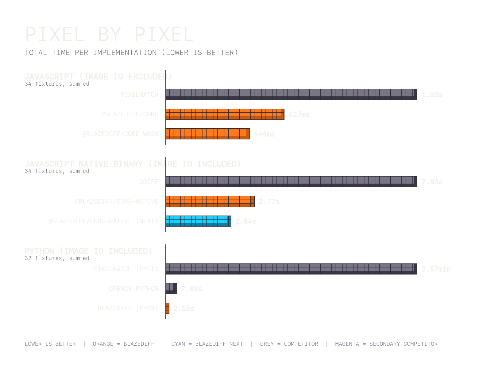

# Pixel By Pixel Benchmarks

Comparisons that compare pixels directly (RGBA or YIQ perceptual delta). Image decode is excluded except where the section title explicitly says "image IO included" (native binary, Python bindings).

## JavaScript (`@blazediff/core` vs `pixelmatch`) (image IO excluded)

_50 iterations (5 warmup)_

> **~62.2%** performance improvement on average.

<table>
  <thead>
    <tr>
      <th width="500">Benchmark</th>
      <th width="500">Pixelmatch</th>
      <th width="500">BlazeDiff</th>
      <th width="500">Time Saved</th>
      <th width="500">% Improvement</th>
    </tr>
  </thead>
  <tbody>
    <tr>
      <td>4k/1</td>
      <td>201.60ms</td>
      <td>96.52ms</td>
      <td>105.07ms</td>
      <td>52.1%</td>
    </tr>
    <tr>
      <td>4k/1 (identical)</td>
      <td>23.79ms</td>
      <td>2.50ms</td>
      <td>21.30ms</td>
      <td>89.5%</td>
    </tr>
    <tr>
      <td>4k/2</td>
      <td>222.73ms</td>
      <td>106.63ms</td>
      <td>116.10ms</td>
      <td>52.1%</td>
    </tr>
    <tr>
      <td>4k/2 (identical)</td>
      <td>28.04ms</td>
      <td>2.91ms</td>
      <td>25.13ms</td>
      <td>89.6%</td>
    </tr>
    <tr>
      <td>4k/3</td>
      <td>253.77ms</td>
      <td>135.89ms</td>
      <td>117.88ms</td>
      <td>46.5%</td>
    </tr>
    <tr>
      <td>4k/3 (identical)</td>
      <td>27.85ms</td>
      <td>3.77ms</td>
      <td>24.08ms</td>
      <td>86.5%</td>
    </tr>
    <tr>
      <td>blazediff/1</td>
      <td>1.14ms</td>
      <td>0.66ms</td>
      <td>0.48ms</td>
      <td>42.1%</td>
    </tr>
    <tr>
      <td>blazediff/1 (identical)</td>
      <td>0.49ms</td>
      <td>0.06ms</td>
      <td>0.43ms</td>
      <td>88.4%</td>
    </tr>
    <tr>
      <td>blazediff/2</td>
      <td>1.54ms</td>
      <td>0.93ms</td>
      <td>0.60ms</td>
      <td>39.4%</td>
    </tr>
    <tr>
      <td>blazediff/2 (identical)</td>
      <td>0.40ms</td>
      <td>0.04ms</td>
      <td>0.36ms</td>
      <td>89.0%</td>
    </tr>
    <tr>
      <td>blazediff/3</td>
      <td>9.23ms</td>
      <td>7.84ms</td>
      <td>1.40ms</td>
      <td>15.1%</td>
    </tr>
    <tr>
      <td>blazediff/3 (identical)</td>
      <td>1.88ms</td>
      <td>0.22ms</td>
      <td>1.66ms</td>
      <td>88.2%</td>
    </tr>
    <tr>
      <td>blazediff/4</td>
      <td>10.90ms</td>
      <td>8.28ms</td>
      <td>2.62ms</td>
      <td>24.0%</td>
    </tr>
    <tr>
      <td>blazediff/4 (identical)</td>
      <td>4.46ms</td>
      <td>0.55ms</td>
      <td>3.91ms</td>
      <td>87.7%</td>
    </tr>
    <tr>
      <td>page/1</td>
      <td>145.03ms</td>
      <td>96.38ms</td>
      <td>48.65ms</td>
      <td>33.5%</td>
    </tr>
    <tr>
      <td>page/1 (identical)</td>
      <td>67.84ms</td>
      <td>8.29ms</td>
      <td>59.55ms</td>
      <td>87.8%</td>
    </tr>
    <tr>
      <td>page/2</td>
      <td>267.84ms</td>
      <td>142.53ms</td>
      <td>125.31ms</td>
      <td>46.8%</td>
    </tr>
    <tr>
      <td>page/2 (identical)</td>
      <td>47.33ms</td>
      <td>5.77ms</td>
      <td>41.56ms</td>
      <td>87.8%</td>
    </tr>
    <tr>
      <td>pixelmatch/1</td>
      <td>0.42ms</td>
      <td>0.28ms</td>
      <td>0.14ms</td>
      <td>34.1%</td>
    </tr>
    <tr>
      <td>pixelmatch/1 (identical)</td>
      <td>0.15ms</td>
      <td>0.01ms</td>
      <td>0.13ms</td>
      <td>90.5%</td>
    </tr>
    <tr>
      <td>pixelmatch/2</td>
      <td>1.95ms</td>
      <td>1.82ms</td>
      <td>0.13ms</td>
      <td>6.6%</td>
    </tr>
    <tr>
      <td>pixelmatch/2 (identical)</td>
      <td>0.07ms</td>
      <td>0.01ms</td>
      <td>0.07ms</td>
      <td>88.1%</td>
    </tr>
    <tr>
      <td>pixelmatch/3</td>
      <td>0.34ms</td>
      <td>0.23ms</td>
      <td>0.11ms</td>
      <td>31.8%</td>
    </tr>
    <tr>
      <td>pixelmatch/3 (identical)</td>
      <td>0.15ms</td>
      <td>0.01ms</td>
      <td>0.13ms</td>
      <td>90.2%</td>
    </tr>
    <tr>
      <td>pixelmatch/4</td>
      <td>3.46ms</td>
      <td>2.97ms</td>
      <td>0.49ms</td>
      <td>14.2%</td>
    </tr>
    <tr>
      <td>pixelmatch/4 (identical)</td>
      <td>0.21ms</td>
      <td>0.02ms</td>
      <td>0.19ms</td>
      <td>90.7%</td>
    </tr>
    <tr>
      <td>pixelmatch/5</td>
      <td>0.16ms</td>
      <td>0.12ms</td>
      <td>0.05ms</td>
      <td>28.9%</td>
    </tr>
    <tr>
      <td>pixelmatch/5 (identical)</td>
      <td>0.08ms</td>
      <td>0.01ms</td>
      <td>0.07ms</td>
      <td>89.8%</td>
    </tr>
    <tr>
      <td>pixelmatch/6</td>
      <td>0.79ms</td>
      <td>0.59ms</td>
      <td>0.20ms</td>
      <td>25.0%</td>
    </tr>
    <tr>
      <td>pixelmatch/6 (identical)</td>
      <td>0.08ms</td>
      <td>0.01ms</td>
      <td>0.07ms</td>
      <td>89.9%</td>
    </tr>
    <tr>
      <td>pixelmatch/7</td>
      <td>1.07ms</td>
      <td>0.84ms</td>
      <td>0.24ms</td>
      <td>22.1%</td>
    </tr>
    <tr>
      <td>pixelmatch/7 (identical)</td>
      <td>0.27ms</td>
      <td>0.03ms</td>
      <td>0.25ms</td>
      <td>89.3%</td>
    </tr>
    <tr>
      <td>same/1</td>
      <td>2.02ms</td>
      <td>0.22ms</td>
      <td>1.80ms</td>
      <td>89.1%</td>
    </tr>
    <tr>
      <td>same/1 (identical)</td>
      <td>2.00ms</td>
      <td>0.24ms</td>
      <td>1.76ms</td>
      <td>88.0%</td>
    </tr>
  </tbody>
</table>

_Benchmarks run on MacBook Pro M1 Max, Node.js 22_

## JavaScript with output buffer (`@blazediff/core` vs `pixelmatch`) (image IO excluded)

_50 iterations (5 warmup)_

> **~28.2%** performance improvement on average.

<table>
  <thead>
    <tr>
      <th width="500">Benchmark</th>
      <th width="500">Pixelmatch</th>
      <th width="500">BlazeDiff</th>
      <th width="500">Time Saved</th>
      <th width="500">% Improvement</th>
    </tr>
  </thead>
  <tbody>
    <tr>
      <td>4k/1</td>
      <td>280.79ms</td>
      <td>151.72ms</td>
      <td>129.08ms</td>
      <td>46.0%</td>
    </tr>
    <tr>
      <td>4k/1 (identical)</td>
      <td>75.09ms</td>
      <td>50.69ms</td>
      <td>24.40ms</td>
      <td>32.5%</td>
    </tr>
    <tr>
      <td>4k/2</td>
      <td>293.99ms</td>
      <td>166.07ms</td>
      <td>127.93ms</td>
      <td>43.5%</td>
    </tr>
    <tr>
      <td>4k/2 (identical)</td>
      <td>85.44ms</td>
      <td>56.28ms</td>
      <td>29.15ms</td>
      <td>34.1%</td>
    </tr>
    <tr>
      <td>4k/3</td>
      <td>336.93ms</td>
      <td>205.21ms</td>
      <td>131.72ms</td>
      <td>39.1%</td>
    </tr>
    <tr>
      <td>4k/3 (identical)</td>
      <td>99.50ms</td>
      <td>66.58ms</td>
      <td>32.92ms</td>
      <td>33.1%</td>
    </tr>
    <tr>
      <td>blazediff/1</td>
      <td>2.97ms</td>
      <td>1.93ms</td>
      <td>1.03ms</td>
      <td>34.8%</td>
    </tr>
    <tr>
      <td>blazediff/1 (identical)</td>
      <td>1.75ms</td>
      <td>1.18ms</td>
      <td>0.58ms</td>
      <td>32.8%</td>
    </tr>
    <tr>
      <td>blazediff/2</td>
      <td>2.60ms</td>
      <td>1.95ms</td>
      <td>0.65ms</td>
      <td>25.1%</td>
    </tr>
    <tr>
      <td>blazediff/2 (identical)</td>
      <td>1.51ms</td>
      <td>0.96ms</td>
      <td>0.55ms</td>
      <td>36.6%</td>
    </tr>
    <tr>
      <td>blazediff/3</td>
      <td>14.16ms</td>
      <td>12.73ms</td>
      <td>1.43ms</td>
      <td>10.1%</td>
    </tr>
    <tr>
      <td>blazediff/3 (identical)</td>
      <td>6.60ms</td>
      <td>4.58ms</td>
      <td>2.02ms</td>
      <td>30.6%</td>
    </tr>
    <tr>
      <td>blazediff/4</td>
      <td>22.29ms</td>
      <td>20.81ms</td>
      <td>1.48ms</td>
      <td>6.6%</td>
    </tr>
    <tr>
      <td>blazediff/4 (identical)</td>
      <td>15.38ms</td>
      <td>10.34ms</td>
      <td>5.04ms</td>
      <td>32.8%</td>
    </tr>
    <tr>
      <td>page/1</td>
      <td>322.32ms</td>
      <td>272.67ms</td>
      <td>49.66ms</td>
      <td>15.4%</td>
    </tr>
    <tr>
      <td>page/1 (identical)</td>
      <td>258.80ms</td>
      <td>168.42ms</td>
      <td>90.38ms</td>
      <td>34.9%</td>
    </tr>
    <tr>
      <td>page/2</td>
      <td>398.54ms</td>
      <td>263.23ms</td>
      <td>135.32ms</td>
      <td>34.0%</td>
    </tr>
    <tr>
      <td>page/2 (identical)</td>
      <td>168.84ms</td>
      <td>122.41ms</td>
      <td>46.43ms</td>
      <td>27.5%</td>
    </tr>
    <tr>
      <td>pixelmatch/1</td>
      <td>0.83ms</td>
      <td>0.69ms</td>
      <td>0.14ms</td>
      <td>16.4%</td>
    </tr>
    <tr>
      <td>pixelmatch/1 (identical)</td>
      <td>0.53ms</td>
      <td>0.36ms</td>
      <td>0.17ms</td>
      <td>31.6%</td>
    </tr>
    <tr>
      <td>pixelmatch/2</td>
      <td>2.23ms</td>
      <td>1.88ms</td>
      <td>0.35ms</td>
      <td>15.6%</td>
    </tr>
    <tr>
      <td>pixelmatch/2 (identical)</td>
      <td>0.26ms</td>
      <td>0.18ms</td>
      <td>0.08ms</td>
      <td>31.3%</td>
    </tr>
    <tr>
      <td>pixelmatch/3</td>
      <td>0.74ms</td>
      <td>0.65ms</td>
      <td>0.09ms</td>
      <td>12.8%</td>
    </tr>
    <tr>
      <td>pixelmatch/3 (identical)</td>
      <td>0.53ms</td>
      <td>0.36ms</td>
      <td>0.17ms</td>
      <td>32.5%</td>
    </tr>
    <tr>
      <td>pixelmatch/4</td>
      <td>4.45ms</td>
      <td>3.54ms</td>
      <td>0.91ms</td>
      <td>20.5%</td>
    </tr>
    <tr>
      <td>pixelmatch/4 (identical)</td>
      <td>0.73ms</td>
      <td>0.50ms</td>
      <td>0.23ms</td>
      <td>31.1%</td>
    </tr>
    <tr>
      <td>pixelmatch/5</td>
      <td>0.36ms</td>
      <td>0.32ms</td>
      <td>0.05ms</td>
      <td>12.9%</td>
    </tr>
    <tr>
      <td>pixelmatch/5 (identical)</td>
      <td>0.29ms</td>
      <td>0.18ms</td>
      <td>0.11ms</td>
      <td>38.0%</td>
    </tr>
    <tr>
      <td>pixelmatch/6</td>
      <td>0.94ms</td>
      <td>0.77ms</td>
      <td>0.16ms</td>
      <td>17.3%</td>
    </tr>
    <tr>
      <td>pixelmatch/6 (identical)</td>
      <td>0.28ms</td>
      <td>0.18ms</td>
      <td>0.10ms</td>
      <td>35.3%</td>
    </tr>
    <tr>
      <td>pixelmatch/7</td>
      <td>1.85ms</td>
      <td>1.55ms</td>
      <td>0.29ms</td>
      <td>16.0%</td>
    </tr>
    <tr>
      <td>pixelmatch/7 (identical)</td>
      <td>0.99ms</td>
      <td>0.72ms</td>
      <td>0.28ms</td>
      <td>27.9%</td>
    </tr>
    <tr>
      <td>same/1</td>
      <td>7.55ms</td>
      <td>4.77ms</td>
      <td>2.78ms</td>
      <td>36.8%</td>
    </tr>
    <tr>
      <td>same/1 (identical)</td>
      <td>7.09ms</td>
      <td>4.80ms</td>
      <td>2.29ms</td>
      <td>32.2%</td>
    </tr>
  </tbody>
</table>

## WebAssembly (`@blazediff/core-wasm` vs `pixelmatch`) (image IO excluded)

_25 iterations (5 warmup)_

> **~50.8%** performance improvement on average.

The WebAssembly build of BlazeDiff uses the same Rust algorithm as the native binary, compiled to `wasm32` with `v128` SIMD (`+simd128`). Counts agree with `pixelmatch` to within ~0.05% across the fixture set (e.g. `pixelmatch/1`: identical 106 vs 106; `blazediff/3`: 22 869 vs 22 883 out of 1 630 784 pixels; `4k/1`: 69 932 vs 69 912 out of 17 920 000): both use a YIQ-style perceptual delta, so they classify the same pixels modulo a handful of edge cases.

Byte-identical pairs used to be the one case where `pixelmatch` won. The cause was the
decoded-equality shortcut: on `wasm32-unknown-unknown` there is no libc, so Rust's
`Vec<u8> == Vec<u8>` lowered to `compiler_builtins`' scalar byte-loop memcmp, measured at
~2.4 GB/s: about 30ms for a 4K pair, which on its own costs more than running the whole
SIMD diff over that pair. The shortcut is now skipped on wasm (the cold block-scan reaches
the same conclusion with v128 compares), which roughly halved `4k/1 (identical)`, from
~33ms to the 17.47ms in the table below, and turned every `(identical)` row from a
~60-70% loss into a win.

<table>
  <thead>
    <tr>
      <th width="500">Benchmark</th>
      <th width="500">Pixelmatch</th>
      <th width="500">BlazeDiff (core-wasm)</th>
      <th width="500">Time Saved</th>
      <th width="500">% Improvement</th>
    </tr>
  </thead>
  <tbody>
    <tr>
      <td>4k/1</td>
      <td>332.26ms</td>
      <td>33.18ms</td>
      <td>299.08ms</td>
      <td>90.0%</td>
    </tr>
    <tr>
      <td>4k/1 (identical)</td>
      <td>19.86ms</td>
      <td>17.47ms</td>
      <td>2.39ms</td>
      <td>12.1%</td>
    </tr>
    <tr>
      <td>4k/2</td>
      <td>333.33ms</td>
      <td>68.37ms</td>
      <td>264.96ms</td>
      <td>79.5%</td>
    </tr>
    <tr>
      <td>4k/2 (identical)</td>
      <td>22.70ms</td>
      <td>22.17ms</td>
      <td>0.53ms</td>
      <td>2.3%</td>
    </tr>
    <tr>
      <td>4k/3</td>
      <td>423.14ms</td>
      <td>44.65ms</td>
      <td>378.49ms</td>
      <td>89.4%</td>
    </tr>
    <tr>
      <td>4k/3 (identical)</td>
      <td>30.53ms</td>
      <td>20.80ms</td>
      <td>9.73ms</td>
      <td>31.9%</td>
    </tr>
    <tr>
      <td>blazediff/1</td>
      <td>1.24ms</td>
      <td>0.24ms</td>
      <td>1.00ms</td>
      <td>80.3%</td>
    </tr>
    <tr>
      <td>blazediff/1 (identical)</td>
      <td>0.49ms</td>
      <td>0.25ms</td>
      <td>0.24ms</td>
      <td>48.6%</td>
    </tr>
    <tr>
      <td>blazediff/2</td>
      <td>1.66ms</td>
      <td>0.50ms</td>
      <td>1.16ms</td>
      <td>70.2%</td>
    </tr>
    <tr>
      <td>blazediff/2 (identical)</td>
      <td>0.40ms</td>
      <td>0.27ms</td>
      <td>0.13ms</td>
      <td>32.1%</td>
    </tr>
    <tr>
      <td>blazediff/3</td>
      <td>10.28ms</td>
      <td>6.09ms</td>
      <td>4.19ms</td>
      <td>40.7%</td>
    </tr>
    <tr>
      <td>blazediff/3 (identical)</td>
      <td>1.83ms</td>
      <td>1.05ms</td>
      <td>0.78ms</td>
      <td>42.6%</td>
    </tr>
    <tr>
      <td>blazediff/4</td>
      <td>11.96ms</td>
      <td>5.52ms</td>
      <td>6.44ms</td>
      <td>53.9%</td>
    </tr>
    <tr>
      <td>blazediff/4 (identical)</td>
      <td>4.34ms</td>
      <td>2.51ms</td>
      <td>1.84ms</td>
      <td>42.3%</td>
    </tr>
    <tr>
      <td>page/1</td>
      <td>152.72ms</td>
      <td>51.25ms</td>
      <td>101.48ms</td>
      <td>66.4%</td>
    </tr>
    <tr>
      <td>page/1 (identical)</td>
      <td>69.23ms</td>
      <td>53.46ms</td>
      <td>15.77ms</td>
      <td>22.8%</td>
    </tr>
    <tr>
      <td>page/2</td>
      <td>513.06ms</td>
      <td>73.42ms</td>
      <td>439.64ms</td>
      <td>85.7%</td>
    </tr>
    <tr>
      <td>page/2 (identical)</td>
      <td>47.01ms</td>
      <td>33.70ms</td>
      <td>13.31ms</td>
      <td>28.3%</td>
    </tr>
    <tr>
      <td>pixelmatch/1</td>
      <td>0.58ms</td>
      <td>0.22ms</td>
      <td>0.36ms</td>
      <td>62.0%</td>
    </tr>
    <tr>
      <td>pixelmatch/1 (identical)</td>
      <td>0.15ms</td>
      <td>0.06ms</td>
      <td>0.08ms</td>
      <td>57.5%</td>
    </tr>
    <tr>
      <td>pixelmatch/2</td>
      <td>2.13ms</td>
      <td>1.41ms</td>
      <td>0.71ms</td>
      <td>33.6%</td>
    </tr>
    <tr>
      <td>pixelmatch/2 (identical)</td>
      <td>0.07ms</td>
      <td>0.03ms</td>
      <td>0.04ms</td>
      <td>53.4%</td>
    </tr>
    <tr>
      <td>pixelmatch/3</td>
      <td>0.37ms</td>
      <td>0.13ms</td>
      <td>0.24ms</td>
      <td>64.4%</td>
    </tr>
    <tr>
      <td>pixelmatch/3 (identical)</td>
      <td>0.14ms</td>
      <td>0.06ms</td>
      <td>0.08ms</td>
      <td>55.8%</td>
    </tr>
    <tr>
      <td>pixelmatch/4</td>
      <td>5.11ms</td>
      <td>3.42ms</td>
      <td>1.68ms</td>
      <td>33.0%</td>
    </tr>
    <tr>
      <td>pixelmatch/4 (identical)</td>
      <td>0.20ms</td>
      <td>0.09ms</td>
      <td>0.11ms</td>
      <td>54.5%</td>
    </tr>
    <tr>
      <td>pixelmatch/5</td>
      <td>0.18ms</td>
      <td>0.06ms</td>
      <td>0.13ms</td>
      <td>68.7%</td>
    </tr>
    <tr>
      <td>pixelmatch/5 (identical)</td>
      <td>0.07ms</td>
      <td>0.03ms</td>
      <td>0.04ms</td>
      <td>54.8%</td>
    </tr>
    <tr>
      <td>pixelmatch/6</td>
      <td>0.75ms</td>
      <td>0.67ms</td>
      <td>0.08ms</td>
      <td>10.9%</td>
    </tr>
    <tr>
      <td>pixelmatch/6 (identical)</td>
      <td>0.07ms</td>
      <td>0.03ms</td>
      <td>0.04ms</td>
      <td>52.7%</td>
    </tr>
    <tr>
      <td>pixelmatch/7</td>
      <td>1.21ms</td>
      <td>0.61ms</td>
      <td>0.60ms</td>
      <td>49.4%</td>
    </tr>
    <tr>
      <td>pixelmatch/7 (identical)</td>
      <td>0.28ms</td>
      <td>0.13ms</td>
      <td>0.15ms</td>
      <td>54.8%</td>
    </tr>
    <tr>
      <td>same/1</td>
      <td>2.10ms</td>
      <td>1.11ms</td>
      <td>0.99ms</td>
      <td>47.1%</td>
    </tr>
    <tr>
      <td>same/1 (identical)</td>
      <td>2.07ms</td>
      <td>0.90ms</td>
      <td>1.16ms</td>
      <td>56.3%</td>
    </tr>
  </tbody>
</table>

_Benchmarks run on MacBook Pro M1 Max, Node.js 22_

## JavaScript Native Binary (`@blazediff/core-native` vs `odiff`) (image IO included)

_25 runs (5 warmup)_

> **4.4-4.9x faster than odiff** on 4K images (5.7-6.7x from encoded buffers).
> **~41.2%** performance improvement on average.

The native Rust binary with SIMD optimization is the fastest single-threaded image diff in the world.

<table>
  <thead>
    <tr>
      <th width="500">Benchmark</th>
      <th width="500">ODiff</th>
      <th width="500">BlazeDiff</th>
      <th width="500">BlazeDiff Next</th>
      <th width="500">BlazeDiff Saved</th>
      <th width="500">BlazeDiff %</th>
      <th width="500">BlazeDiff Next Saved</th>
      <th width="500">BlazeDiff Next %</th>
    </tr>
  </thead>
  <tbody>
    <tr>
      <td>4k/1</td>
      <td>1157.12ms</td>
      <td>288.01ms</td>
      <td>215.31ms</td>
      <td>869.10ms</td>
      <td>75.1%</td>
      <td>941.81ms</td>
      <td>81.4%</td>
    </tr>
    <tr>
      <td>4k/1 (identical)</td>
      <td>269.36ms</td>
      <td>183.94ms</td>
      <td>142.02ms</td>
      <td>85.42ms</td>
      <td>31.7%</td>
      <td>127.34ms</td>
      <td>47.3%</td>
    </tr>
    <tr>
      <td>4k/2</td>
      <td>1473.44ms</td>
      <td>348.26ms</td>
      <td>260.31ms</td>
      <td>1125.19ms</td>
      <td>76.4%</td>
      <td>1213.14ms</td>
      <td>82.3%</td>
    </tr>
    <tr>
      <td>4k/2 (identical)</td>
      <td>329.18ms</td>
      <td>223.18ms</td>
      <td>164.84ms</td>
      <td>105.99ms</td>
      <td>32.2%</td>
      <td>164.33ms</td>
      <td>49.9%</td>
    </tr>
    <tr>
      <td>4k/3</td>
      <td>1677.13ms</td>
      <td>349.43ms</td>
      <td>269.41ms</td>
      <td>1327.70ms</td>
      <td>79.2%</td>
      <td>1407.72ms</td>
      <td>83.9%</td>
    </tr>
    <tr>
      <td>4k/3 (identical)</td>
      <td>366.79ms</td>
      <td>230.29ms</td>
      <td>168.72ms</td>
      <td>136.51ms</td>
      <td>37.2%</td>
      <td>198.08ms</td>
      <td>54.0%</td>
    </tr>
    <tr>
      <td>blazediff/1</td>
      <td>3.40ms</td>
      <td>2.11ms</td>
      <td>1.72ms</td>
      <td>1.28ms</td>
      <td>37.8%</td>
      <td>1.68ms</td>
      <td>49.3%</td>
    </tr>
    <tr>
      <td>blazediff/1 (identical)</td>
      <td>1.43ms</td>
      <td>0.91ms</td>
      <td>0.82ms</td>
      <td>0.52ms</td>
      <td>36.2%</td>
      <td>0.61ms</td>
      <td>42.7%</td>
    </tr>
    <tr>
      <td>blazediff/2</td>
      <td>3.44ms</td>
      <td>2.19ms</td>
      <td>1.75ms</td>
      <td>1.25ms</td>
      <td>36.4%</td>
      <td>1.69ms</td>
      <td>49.1%</td>
    </tr>
    <tr>
      <td>blazediff/2 (identical)</td>
      <td>1.34ms</td>
      <td>1.00ms</td>
      <td>0.77ms</td>
      <td>0.33ms</td>
      <td>25.0%</td>
      <td>0.57ms</td>
      <td>42.3%</td>
    </tr>
    <tr>
      <td>blazediff/3</td>
      <td>45.23ms</td>
      <td>21.76ms</td>
      <td>18.10ms</td>
      <td>23.46ms</td>
      <td>51.9%</td>
      <td>27.12ms</td>
      <td>60.0%</td>
    </tr>
    <tr>
      <td>blazediff/3 (identical)</td>
      <td>19.04ms</td>
      <td>13.94ms</td>
      <td>11.35ms</td>
      <td>5.11ms</td>
      <td>26.8%</td>
      <td>7.69ms</td>
      <td>40.4%</td>
    </tr>
    <tr>
      <td>blazediff/4</td>
      <td>23.19ms</td>
      <td>19.71ms</td>
      <td>12.64ms</td>
      <td>3.48ms</td>
      <td>15.0%</td>
      <td>10.55ms</td>
      <td>45.5%</td>
    </tr>
    <tr>
      <td>blazediff/4 (identical)</td>
      <td>7.69ms</td>
      <td>4.64ms</td>
      <td>3.73ms</td>
      <td>3.05ms</td>
      <td>39.6%</td>
      <td>3.96ms</td>
      <td>51.5%</td>
    </tr>
    <tr>
      <td>page/1</td>
      <td>975.23ms</td>
      <td>460.66ms</td>
      <td>317.14ms</td>
      <td>514.58ms</td>
      <td>52.8%</td>
      <td>658.09ms</td>
      <td>67.5%</td>
    </tr>
    <tr>
      <td>page/1 (identical)</td>
      <td>519.27ms</td>
      <td>244.84ms</td>
      <td>165.31ms</td>
      <td>274.43ms</td>
      <td>52.8%</td>
      <td>353.97ms</td>
      <td>68.2%</td>
    </tr>
    <tr>
      <td>page/2</td>
      <td>567.59ms</td>
      <td>272.01ms</td>
      <td>198.35ms</td>
      <td>295.58ms</td>
      <td>52.1%</td>
      <td>369.24ms</td>
      <td>65.1%</td>
    </tr>
    <tr>
      <td>page/2 (identical)</td>
      <td>112.32ms</td>
      <td>42.47ms</td>
      <td>32.75ms</td>
      <td>69.85ms</td>
      <td>62.2%</td>
      <td>79.57ms</td>
      <td>70.8%</td>
    </tr>
    <tr>
      <td>pixelmatch/1</td>
      <td>3.15ms</td>
      <td>1.58ms</td>
      <td>1.22ms</td>
      <td>1.57ms</td>
      <td>49.9%</td>
      <td>1.93ms</td>
      <td>61.2%</td>
    </tr>
    <tr>
      <td>pixelmatch/1 (identical)</td>
      <td>1.67ms</td>
      <td>1.11ms</td>
      <td>0.84ms</td>
      <td>0.56ms</td>
      <td>33.8%</td>
      <td>0.84ms</td>
      <td>50.0%</td>
    </tr>
    <tr>
      <td>pixelmatch/2</td>
      <td>3.34ms</td>
      <td>1.77ms</td>
      <td>1.43ms</td>
      <td>1.57ms</td>
      <td>47.1%</td>
      <td>1.90ms</td>
      <td>57.0%</td>
    </tr>
    <tr>
      <td>pixelmatch/2 (identical)</td>
      <td>0.45ms</td>
      <td>0.48ms</td>
      <td>0.22ms</td>
      <td>-0.03ms</td>
      <td>-6.4%</td>
      <td>0.23ms</td>
      <td>50.9%</td>
    </tr>
    <tr>
      <td>pixelmatch/3</td>
      <td>2.63ms</td>
      <td>1.27ms</td>
      <td>0.97ms</td>
      <td>1.36ms</td>
      <td>51.8%</td>
      <td>1.66ms</td>
      <td>63.0%</td>
    </tr>
    <tr>
      <td>pixelmatch/3 (identical)</td>
      <td>1.48ms</td>
      <td>0.85ms</td>
      <td>0.63ms</td>
      <td>0.63ms</td>
      <td>42.4%</td>
      <td>0.85ms</td>
      <td>57.5%</td>
    </tr>
    <tr>
      <td>pixelmatch/4</td>
      <td>9.48ms</td>
      <td>4.71ms</td>
      <td>7.13ms</td>
      <td>4.77ms</td>
      <td>50.3%</td>
      <td>2.36ms</td>
      <td>24.8%</td>
    </tr>
    <tr>
      <td>pixelmatch/4 (identical)</td>
      <td>2.92ms</td>
      <td>2.06ms</td>
      <td>1.25ms</td>
      <td>0.86ms</td>
      <td>29.6%</td>
      <td>1.67ms</td>
      <td>57.3%</td>
    </tr>
    <tr>
      <td>pixelmatch/5</td>
      <td>0.79ms</td>
      <td>0.59ms</td>
      <td>0.45ms</td>
      <td>0.20ms</td>
      <td>25.3%</td>
      <td>0.34ms</td>
      <td>42.8%</td>
    </tr>
    <tr>
      <td>pixelmatch/5 (identical)</td>
      <td>0.86ms</td>
      <td>0.56ms</td>
      <td>0.40ms</td>
      <td>0.30ms</td>
      <td>34.8%</td>
      <td>0.45ms</td>
      <td>53.0%</td>
    </tr>
    <tr>
      <td>pixelmatch/6</td>
      <td>5.45ms</td>
      <td>1.72ms</td>
      <td>1.27ms</td>
      <td>3.73ms</td>
      <td>68.5%</td>
      <td>4.18ms</td>
      <td>76.7%</td>
    </tr>
    <tr>
      <td>pixelmatch/6 (identical)</td>
      <td>0.98ms</td>
      <td>0.78ms</td>
      <td>0.48ms</td>
      <td>0.20ms</td>
      <td>20.3%</td>
      <td>0.51ms</td>
      <td>51.7%</td>
    </tr>
    <tr>
      <td>pixelmatch/7</td>
      <td>3.53ms</td>
      <td>1.56ms</td>
      <td>1.14ms</td>
      <td>1.97ms</td>
      <td>55.8%</td>
      <td>2.39ms</td>
      <td>67.6%</td>
    </tr>
    <tr>
      <td>pixelmatch/7 (identical)</td>
      <td>0.67ms</td>
      <td>0.60ms</td>
      <td>0.33ms</td>
      <td>0.07ms</td>
      <td>9.8%</td>
      <td>0.34ms</td>
      <td>50.7%</td>
    </tr>
    <tr>
      <td>same/1</td>
      <td>5.11ms</td>
      <td>3.49ms</td>
      <td>2.63ms</td>
      <td>1.62ms</td>
      <td>31.7%</td>
      <td>2.48ms</td>
      <td>48.5%</td>
    </tr>
    <tr>
      <td>same/1 (identical)</td>
      <td>5.14ms</td>
      <td>3.36ms</td>
      <td>2.57ms</td>
      <td>1.79ms</td>
      <td>34.7%</td>
      <td>2.57ms</td>
      <td>50.0%</td>
    </tr>
  </tbody>
</table>

_Benchmarks run on MacBook Pro M1 Max using hyperfine_

## Python Bindings (`blazediff` PyPI via PyO3) (image IO included)

The PyO3-backed `blazediff` PyPI package wraps the same Rust core as the native binary; published as platform-tagged wheels (manylinux / macOS / Windows). Comparisons below use the path-based `compare()` API, so PNG decode is part of the timed region (directly comparable to the Native Binary section above).

### vs `pixelmatch` (pypi)

_25 iterations (5 warmup) for blazediff; 10 iterations (5 warmup) for pixelmatch - pure-Python `pixelmatch` runs many seconds per call on 4k/page fixtures._

> **~83%** performance improvement on average.

<table>
  <thead>
    <tr>
      <th width="500">Benchmark</th>
      <th width="500">pixelmatch (pypi)</th>
      <th width="500">BlazeDiff</th>
      <th width="500">Time Saved</th>
      <th width="500">% Improvement</th>
    </tr>
  </thead>
  <tbody>
    <tr>
      <td>4k/1</td>
      <td>19.54s</td>
      <td>215.03ms</td>
      <td>19.33s</td>
      <td>98.9%</td>
    </tr>
    <tr>
      <td>4k/1 (identical)</td>
      <td>610.87ms</td>
      <td>188.91ms</td>
      <td>421.96ms</td>
      <td>69.1%</td>
    </tr>
    <tr>
      <td>4k/2</td>
      <td>23.28s</td>
      <td>259.39ms</td>
      <td>23.02s</td>
      <td>98.9%</td>
    </tr>
    <tr>
      <td>4k/2 (identical)</td>
      <td>713.84ms</td>
      <td>234.29ms</td>
      <td>479.55ms</td>
      <td>67.2%</td>
    </tr>
    <tr>
      <td>4k/3</td>
      <td>26.32s</td>
      <td>269.23ms</td>
      <td>26.05s</td>
      <td>99.0%</td>
    </tr>
    <tr>
      <td>4k/3 (identical)</td>
      <td>776.98ms</td>
      <td>239.67ms</td>
      <td>537.31ms</td>
      <td>69.2%</td>
    </tr>
    <tr>
      <td>blazediff/1</td>
      <td>262.81ms</td>
      <td>0.85ms</td>
      <td>261.97ms</td>
      <td>99.7%</td>
    </tr>
    <tr>
      <td>blazediff/1 (identical)</td>
      <td>4.44ms</td>
      <td>0.84ms</td>
      <td>3.60ms</td>
      <td>81.1%</td>
    </tr>
    <tr>
      <td>blazediff/2</td>
      <td>273.60ms</td>
      <td>1.12ms</td>
      <td>272.48ms</td>
      <td>99.6%</td>
    </tr>
    <tr>
      <td>blazediff/2 (identical)</td>
      <td>3.90ms</td>
      <td>0.94ms</td>
      <td>2.96ms</td>
      <td>75.9%</td>
    </tr>
    <tr>
      <td>blazediff/3</td>
      <td>1.51s</td>
      <td>14.92ms</td>
      <td>1.50s</td>
      <td>99.0%</td>
    </tr>
    <tr>
      <td>blazediff/3 (identical)</td>
      <td>46.03ms</td>
      <td>14.73ms</td>
      <td>31.30ms</td>
      <td>68.0%</td>
    </tr>
    <tr>
      <td>page/1</td>
      <td>36.52s</td>
      <td>264.83ms</td>
      <td>36.26s</td>
      <td>99.3%</td>
    </tr>
    <tr>
      <td>page/1 (identical)</td>
      <td>1.09s</td>
      <td>264.56ms</td>
      <td>826.66ms</td>
      <td>75.8%</td>
    </tr>
    <tr>
      <td>page/2</td>
      <td>41.90s</td>
      <td>99.35ms</td>
      <td>41.80s</td>
      <td>99.8%</td>
    </tr>
    <tr>
      <td>page/2 (identical)</td>
      <td>171.92ms</td>
      <td>56.01ms</td>
      <td>115.90ms</td>
      <td>67.4%</td>
    </tr>
    <tr>
      <td>pixelmatch/1</td>
      <td>93.52ms</td>
      <td>1.06ms</td>
      <td>92.46ms</td>
      <td>98.9%</td>
    </tr>
    <tr>
      <td>pixelmatch/1 (identical)</td>
      <td>2.85ms</td>
      <td>1.24ms</td>
      <td>1.61ms</td>
      <td>56.6%</td>
    </tr>
    <tr>
      <td>pixelmatch/2</td>
      <td>177.75ms</td>
      <td>0.74ms</td>
      <td>177.01ms</td>
      <td>99.6%</td>
    </tr>
    <tr>
      <td>pixelmatch/2 (identical)</td>
      <td>0.90ms</td>
      <td>0.45ms</td>
      <td>0.44ms</td>
      <td>49.4%</td>
    </tr>
    <tr>
      <td>pixelmatch/3</td>
      <td>87.52ms</td>
      <td>0.83ms</td>
      <td>86.69ms</td>
      <td>99.1%</td>
    </tr>
    <tr>
      <td>pixelmatch/3 (identical)</td>
      <td>2.24ms</td>
      <td>0.84ms</td>
      <td>1.40ms</td>
      <td>62.5%</td>
    </tr>
    <tr>
      <td>pixelmatch/4</td>
      <td>365.96ms</td>
      <td>2.71ms</td>
      <td>363.25ms</td>
      <td>99.3%</td>
    </tr>
    <tr>
      <td>pixelmatch/4 (identical)</td>
      <td>6.05ms</td>
      <td>2.12ms</td>
      <td>3.93ms</td>
      <td>64.9%</td>
    </tr>
    <tr>
      <td>pixelmatch/5</td>
      <td>52.21ms</td>
      <td>0.51ms</td>
      <td>51.70ms</td>
      <td>99.0%</td>
    </tr>
    <tr>
      <td>pixelmatch/5 (identical)</td>
      <td>1.21ms</td>
      <td>0.54ms</td>
      <td>0.67ms</td>
      <td>55.0%</td>
    </tr>
    <tr>
      <td>pixelmatch/6</td>
      <td>99.65ms</td>
      <td>1.17ms</td>
      <td>98.48ms</td>
      <td>98.8%</td>
    </tr>
    <tr>
      <td>pixelmatch/6 (identical)</td>
      <td>1.61ms</td>
      <td>0.78ms</td>
      <td>0.83ms</td>
      <td>51.7%</td>
    </tr>
    <tr>
      <td>pixelmatch/7</td>
      <td>193.54ms</td>
      <td>0.66ms</td>
      <td>192.88ms</td>
      <td>99.7%</td>
    </tr>
    <tr>
      <td>pixelmatch/7 (identical)</td>
      <td>1.86ms</td>
      <td>0.64ms</td>
      <td>1.22ms</td>
      <td>65.7%</td>
    </tr>
    <tr>
      <td>same/1</td>
      <td>25.69ms</td>
      <td>3.32ms</td>
      <td>22.37ms</td>
      <td>87.1%</td>
    </tr>
    <tr>
      <td>same/1 (identical)</td>
      <td>23.47ms</td>
      <td>3.28ms</td>
      <td>20.18ms</td>
      <td>86.0%</td>
    </tr>
  </tbody>
</table>

### vs `opencv-python` (`cv2.absdiff`)

_25 iterations (5 warmup)_

> **~69%** performance improvement on average.

OpenCV's `cv2.absdiff` is a grayscale absolute-difference baseline (the snippet from the OpenCV cookbook); blazediff additionally computes a YIQ perceptual delta with anti-aliasing detection, yet still wins on every fixture.

<table>
  <thead>
    <tr>
      <th width="500">Benchmark</th>
      <th width="500">OpenCV absdiff</th>
      <th width="500">BlazeDiff</th>
      <th width="500">Time Saved</th>
      <th width="500">% Improvement</th>
    </tr>
  </thead>
  <tbody>
    <tr>
      <td>4k/1</td>
      <td>538.87ms</td>
      <td>215.03ms</td>
      <td>323.84ms</td>
      <td>60.1%</td>
    </tr>
    <tr>
      <td>4k/1 (identical)</td>
      <td>573.01ms</td>
      <td>188.91ms</td>
      <td>384.10ms</td>
      <td>67.0%</td>
    </tr>
    <tr>
      <td>4k/2</td>
      <td>752.53ms</td>
      <td>259.39ms</td>
      <td>493.14ms</td>
      <td>65.5%</td>
    </tr>
    <tr>
      <td>4k/2 (identical)</td>
      <td>700.45ms</td>
      <td>234.29ms</td>
      <td>466.16ms</td>
      <td>66.6%</td>
    </tr>
    <tr>
      <td>4k/3</td>
      <td>803.75ms</td>
      <td>269.23ms</td>
      <td>534.52ms</td>
      <td>66.5%</td>
    </tr>
    <tr>
      <td>4k/3 (identical)</td>
      <td>784.05ms</td>
      <td>239.67ms</td>
      <td>544.38ms</td>
      <td>69.4%</td>
    </tr>
    <tr>
      <td>blazediff/1</td>
      <td>4.53ms</td>
      <td>0.85ms</td>
      <td>3.68ms</td>
      <td>81.3%</td>
    </tr>
    <tr>
      <td>blazediff/1 (identical)</td>
      <td>4.66ms</td>
      <td>0.84ms</td>
      <td>3.82ms</td>
      <td>82.0%</td>
    </tr>
    <tr>
      <td>blazediff/2</td>
      <td>4.05ms</td>
      <td>1.12ms</td>
      <td>2.93ms</td>
      <td>72.3%</td>
    </tr>
    <tr>
      <td>blazediff/2 (identical)</td>
      <td>4.06ms</td>
      <td>0.94ms</td>
      <td>3.12ms</td>
      <td>76.8%</td>
    </tr>
    <tr>
      <td>blazediff/3</td>
      <td>45.08ms</td>
      <td>14.92ms</td>
      <td>30.16ms</td>
      <td>66.9%</td>
    </tr>
    <tr>
      <td>blazediff/3 (identical)</td>
      <td>44.88ms</td>
      <td>14.73ms</td>
      <td>30.15ms</td>
      <td>67.2%</td>
    </tr>
    <tr>
      <td>page/1</td>
      <td>1.06s</td>
      <td>264.83ms</td>
      <td>799.20ms</td>
      <td>75.1%</td>
    </tr>
    <tr>
      <td>page/1 (identical)</td>
      <td>1.06s</td>
      <td>264.56ms</td>
      <td>791.06ms</td>
      <td>74.9%</td>
    </tr>
    <tr>
      <td>page/2</td>
      <td>290.31ms</td>
      <td>99.35ms</td>
      <td>190.96ms</td>
      <td>65.8%</td>
    </tr>
    <tr>
      <td>page/2 (identical)</td>
      <td>286.79ms</td>
      <td>56.01ms</td>
      <td>230.77ms</td>
      <td>80.5%</td>
    </tr>
    <tr>
      <td>pixelmatch/1</td>
      <td>3.62ms</td>
      <td>1.06ms</td>
      <td>2.55ms</td>
      <td>70.6%</td>
    </tr>
    <tr>
      <td>pixelmatch/1 (identical)</td>
      <td>3.75ms</td>
      <td>1.24ms</td>
      <td>2.51ms</td>
      <td>67.0%</td>
    </tr>
    <tr>
      <td>pixelmatch/2</td>
      <td>1.11ms</td>
      <td>0.74ms</td>
      <td>0.37ms</td>
      <td>33.4%</td>
    </tr>
    <tr>
      <td>pixelmatch/2 (identical)</td>
      <td>1.18ms</td>
      <td>0.45ms</td>
      <td>0.73ms</td>
      <td>61.6%</td>
    </tr>
    <tr>
      <td>pixelmatch/3</td>
      <td>3.29ms</td>
      <td>0.83ms</td>
      <td>2.46ms</td>
      <td>74.7%</td>
    </tr>
    <tr>
      <td>pixelmatch/3 (identical)</td>
      <td>3.38ms</td>
      <td>0.84ms</td>
      <td>2.54ms</td>
      <td>75.1%</td>
    </tr>
    <tr>
      <td>pixelmatch/4</td>
      <td>6.35ms</td>
      <td>2.71ms</td>
      <td>3.63ms</td>
      <td>57.2%</td>
    </tr>
    <tr>
      <td>pixelmatch/4 (identical)</td>
      <td>5.71ms</td>
      <td>2.12ms</td>
      <td>3.59ms</td>
      <td>62.8%</td>
    </tr>
    <tr>
      <td>pixelmatch/5</td>
      <td>1.72ms</td>
      <td>0.51ms</td>
      <td>1.21ms</td>
      <td>70.5%</td>
    </tr>
    <tr>
      <td>pixelmatch/5 (identical)</td>
      <td>1.85ms</td>
      <td>0.54ms</td>
      <td>1.31ms</td>
      <td>70.6%</td>
    </tr>
    <tr>
      <td>pixelmatch/6</td>
      <td>2.57ms</td>
      <td>1.17ms</td>
      <td>1.40ms</td>
      <td>54.4%</td>
    </tr>
    <tr>
      <td>pixelmatch/6 (identical)</td>
      <td>2.33ms</td>
      <td>0.78ms</td>
      <td>1.55ms</td>
      <td>66.6%</td>
    </tr>
    <tr>
      <td>pixelmatch/7</td>
      <td>1.98ms</td>
      <td>0.66ms</td>
      <td>1.32ms</td>
      <td>66.5%</td>
    </tr>
    <tr>
      <td>pixelmatch/7 (identical)</td>
      <td>1.91ms</td>
      <td>0.64ms</td>
      <td>1.27ms</td>
      <td>66.6%</td>
    </tr>
    <tr>
      <td>same/1</td>
      <td>18.22ms</td>
      <td>3.32ms</td>
      <td>14.90ms</td>
      <td>81.8%</td>
    </tr>
    <tr>
      <td>same/1 (identical)</td>
      <td>18.17ms</td>
      <td>3.28ms</td>
      <td>14.89ms</td>
      <td>81.9%</td>
    </tr>
  </tbody>
</table>

_Benchmarks run on MacBook Pro M1 Max, Python 3.11_
