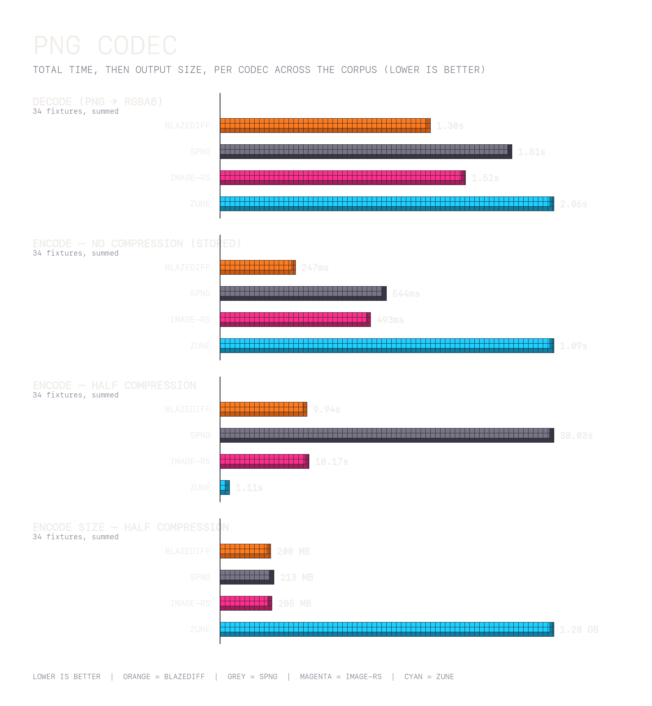

# PNG Codec Benchmarks

A from-scratch PNG codec in Rust - `blazediff-png` - against [spng](https://libspng.org), image-rs (`png`), and [zune-png](https://github.com/etemesi254/zune-image). Decode and encode are timed (best-of, size-scaled iteration counts) over the full fixture corpus (34 PNGs, 342.7 MPx), single-threaded on Apple Silicon. Lower is better.

Encode is measured at two settings so the speed/size trade-off is explicit and zune's stored-only encoder is compared fairly: **no compression** (stored deflate blocks) and **half compression** (half of each codec's own max deflate level - libdeflate 12 → 6, zlib 9 → 4).

## Decode

> blazediff decodes **~1.39×** faster than spng across the corpus.

<table>
  <thead>
    <tr>
      <th width="500">Benchmark</th>
      <th width="500">MPx</th>
      <th width="500">blazediff</th>
      <th width="500">spng</th>
      <th width="500">image-rs</th>
      <th width="500">zune</th>
      <th width="500">BlazeDiff vs spng</th>
    </tr>
  </thead>
  <tbody>
    <tr>
      <td>4k/1a.png</td>
      <td>17.9</td>
      <td>134.93ms</td>
      <td>173.28ms</td>
      <td>148.92ms</td>
      <td>200.45ms</td>
      <td>22.1%</td>
    </tr>
    <tr>
      <td>4k/1b.png</td>
      <td>17.9</td>
      <td>123.27ms</td>
      <td>161.80ms</td>
      <td>139.96ms</td>
      <td>188.15ms</td>
      <td>23.8%</td>
    </tr>
    <tr>
      <td>4k/2a.png</td>
      <td>20.0</td>
      <td>155.63ms</td>
      <td>211.59ms</td>
      <td>192.49ms</td>
      <td>234.31ms</td>
      <td>26.4%</td>
    </tr>
    <tr>
      <td>4k/2b.png</td>
      <td>20.0</td>
      <td>160.49ms</td>
      <td>223.08ms</td>
      <td>197.56ms</td>
      <td>240.97ms</td>
      <td>28.1%</td>
    </tr>
    <tr>
      <td>4k/3a.png</td>
      <td>24.0</td>
      <td>161.71ms</td>
      <td>219.93ms</td>
      <td>195.11ms</td>
      <td>266.82ms</td>
      <td>26.5%</td>
    </tr>
    <tr>
      <td>4k/3b.png</td>
      <td>24.0</td>
      <td>161.93ms</td>
      <td>219.84ms</td>
      <td>192.57ms</td>
      <td>263.53ms</td>
      <td>26.3%</td>
    </tr>
    <tr>
      <td>blazediff/1a.png</td>
      <td>0.4</td>
      <td>0.60ms</td>
      <td>0.68ms</td>
      <td>0.74ms</td>
      <td>1.02ms</td>
      <td>11.5%</td>
    </tr>
    <tr>
      <td>blazediff/1b.png</td>
      <td>0.4</td>
      <td>0.61ms</td>
      <td>0.68ms</td>
      <td>0.74ms</td>
      <td>1.01ms</td>
      <td>10.3%</td>
    </tr>
    <tr>
      <td>blazediff/2a.png</td>
      <td>0.4</td>
      <td>0.60ms</td>
      <td>0.79ms</td>
      <td>0.71ms</td>
      <td>0.93ms</td>
      <td>23.7%</td>
    </tr>
    <tr>
      <td>blazediff/2b.png</td>
      <td>0.4</td>
      <td>0.65ms</td>
      <td>0.85ms</td>
      <td>0.78ms</td>
      <td>1.02ms</td>
      <td>22.9%</td>
    </tr>
    <tr>
      <td>blazediff/3a.png</td>
      <td>1.6</td>
      <td>10.78ms</td>
      <td>13.25ms</td>
      <td>12.92ms</td>
      <td>17.43ms</td>
      <td>18.7%</td>
    </tr>
    <tr>
      <td>blazediff/3b.png</td>
      <td>1.6</td>
      <td>10.77ms</td>
      <td>13.22ms</td>
      <td>12.94ms</td>
      <td>17.41ms</td>
      <td>18.5%</td>
    </tr>
    <tr>
      <td>blazediff/4a.png</td>
      <td>3.8</td>
      <td>2.77ms</td>
      <td>3.40ms</td>
      <td>3.44ms</td>
      <td>4.46ms</td>
      <td>18.4%</td>
    </tr>
    <tr>
      <td>blazediff/4b.png</td>
      <td>3.8</td>
      <td>2.83ms</td>
      <td>3.45ms</td>
      <td>3.51ms</td>
      <td>4.51ms</td>
      <td>17.7%</td>
    </tr>
    <tr>
      <td>page/1a.png</td>
      <td>58.9</td>
      <td>155.00ms</td>
      <td>236.10ms</td>
      <td>181.59ms</td>
      <td>243.01ms</td>
      <td>34.4%</td>
    </tr>
    <tr>
      <td>page/1b.png</td>
      <td>58.9</td>
      <td>155.97ms</td>
      <td>235.93ms</td>
      <td>181.84ms</td>
      <td>245.78ms</td>
      <td>33.9%</td>
    </tr>
    <tr>
      <td>page/2a.png</td>
      <td>41.7</td>
      <td>26.11ms</td>
      <td>36.11ms</td>
      <td>20.73ms</td>
      <td>57.29ms</td>
      <td>27.7%</td>
    </tr>
    <tr>
      <td>page/2b.png</td>
      <td>41.7</td>
      <td>26.19ms</td>
      <td>35.83ms</td>
      <td>20.33ms</td>
      <td>48.03ms</td>
      <td>26.9%</td>
    </tr>
    <tr>
      <td>pixelmatch/1a.png</td>
      <td>0.1</td>
      <td>0.69ms</td>
      <td>0.94ms</td>
      <td>0.72ms</td>
      <td>1.07ms</td>
      <td>26.8%</td>
    </tr>
    <tr>
      <td>pixelmatch/1b.png</td>
      <td>0.1</td>
      <td>0.54ms</td>
      <td>0.71ms</td>
      <td>0.58ms</td>
      <td>0.89ms</td>
      <td>23.3%</td>
    </tr>
    <tr>
      <td>pixelmatch/2a.png</td>
      <td>0.1</td>
      <td>0.10ms</td>
      <td>0.36ms</td>
      <td>0.12ms</td>
      <td>0.16ms</td>
      <td>71.4%</td>
    </tr>
    <tr>
      <td>pixelmatch/2b.png</td>
      <td>0.1</td>
      <td>0.11ms</td>
      <td>0.37ms</td>
      <td>0.12ms</td>
      <td>0.16ms</td>
      <td>70.7%</td>
    </tr>
    <tr>
      <td>pixelmatch/3a.png</td>
      <td>0.1</td>
      <td>0.48ms</td>
      <td>0.72ms</td>
      <td>0.51ms</td>
      <td>0.75ms</td>
      <td>33.0%</td>
    </tr>
    <tr>
      <td>pixelmatch/3b.png</td>
      <td>0.1</td>
      <td>0.49ms</td>
      <td>0.71ms</td>
      <td>0.50ms</td>
      <td>0.74ms</td>
      <td>30.7%</td>
    </tr>
    <tr>
      <td>pixelmatch/4a.png</td>
      <td>0.2</td>
      <td>1.08ms</td>
      <td>1.82ms</td>
      <td>1.35ms</td>
      <td>1.74ms</td>
      <td>40.5%</td>
    </tr>
    <tr>
      <td>pixelmatch/4b.png</td>
      <td>0.2</td>
      <td>1.29ms</td>
      <td>1.75ms</td>
      <td>1.40ms</td>
      <td>2.19ms</td>
      <td>26.5%</td>
    </tr>
    <tr>
      <td>pixelmatch/5a.png</td>
      <td>0.1</td>
      <td>0.29ms</td>
      <td>0.43ms</td>
      <td>0.28ms</td>
      <td>0.38ms</td>
      <td>32.4%</td>
    </tr>
    <tr>
      <td>pixelmatch/5b.png</td>
      <td>0.1</td>
      <td>0.29ms</td>
      <td>0.43ms</td>
      <td>0.26ms</td>
      <td>0.36ms</td>
      <td>32.9%</td>
    </tr>
    <tr>
      <td>pixelmatch/6a.png</td>
      <td>0.1</td>
      <td>0.34ms</td>
      <td>0.66ms</td>
      <td>0.38ms</td>
      <td>0.45ms</td>
      <td>47.9%</td>
    </tr>
    <tr>
      <td>pixelmatch/6b.png</td>
      <td>0.1</td>
      <td>0.57ms</td>
      <td>0.93ms</td>
      <td>0.53ms</td>
      <td>0.84ms</td>
      <td>38.9%</td>
    </tr>
    <tr>
      <td>pixelmatch/7a.png</td>
      <td>0.3</td>
      <td>0.18ms</td>
      <td>0.46ms</td>
      <td>0.19ms</td>
      <td>0.31ms</td>
      <td>61.8%</td>
    </tr>
    <tr>
      <td>pixelmatch/7b.png</td>
      <td>0.3</td>
      <td>0.17ms</td>
      <td>0.46ms</td>
      <td>0.18ms</td>
      <td>0.31ms</td>
      <td>62.1%</td>
    </tr>
    <tr>
      <td>same/1a.png</td>
      <td>1.7</td>
      <td>2.08ms</td>
      <td>2.52ms</td>
      <td>2.60ms</td>
      <td>9.10ms</td>
      <td>17.4%</td>
    </tr>
    <tr>
      <td>same/1b.png</td>
      <td>1.7</td>
      <td>2.04ms</td>
      <td>2.51ms</td>
      <td>2.62ms</td>
      <td>9.15ms</td>
      <td>18.7%</td>
    </tr>
    <tr>
      <td><strong>TOTAL</strong></td>
      <td></td>
      <td><strong>1301.61ms</strong></td>
      <td><strong>1805.58ms</strong></td>
      <td><strong>1519.25ms</strong></td>
      <td><strong>2064.72ms</strong></td>
      <td><strong>27.9%</strong></td>
    </tr>
  </tbody>
</table>

## Encode - No Compression

_Levels: blazediff stored · spng stored · image-rs stored · zune stored._

> blazediff encodes **~2.20×** faster than spng (stored) across the corpus.

<table>
  <thead>
    <tr>
      <th width="500">Benchmark</th>
      <th width="500">MPx</th>
      <th width="500">blazediff</th>
      <th width="500">spng</th>
      <th width="500">image-rs</th>
      <th width="500">zune</th>
      <th width="500">BlazeDiff vs spng</th>
    </tr>
  </thead>
  <tbody>
    <tr>
      <td>4k/1a.png</td>
      <td>17.9</td>
      <td>12.53ms</td>
      <td>26.57ms</td>
      <td>20.40ms</td>
      <td>54.32ms</td>
      <td>52.8%</td>
    </tr>
    <tr>
      <td>4k/1b.png</td>
      <td>17.9</td>
      <td>12.40ms</td>
      <td>26.28ms</td>
      <td>22.70ms</td>
      <td>54.80ms</td>
      <td>52.8%</td>
    </tr>
    <tr>
      <td>4k/2a.png</td>
      <td>20.0</td>
      <td>14.92ms</td>
      <td>33.87ms</td>
      <td>31.14ms</td>
      <td>61.48ms</td>
      <td>56.0%</td>
    </tr>
    <tr>
      <td>4k/2b.png</td>
      <td>20.0</td>
      <td>13.79ms</td>
      <td>41.76ms</td>
      <td>32.74ms</td>
      <td>76.54ms</td>
      <td>67.0%</td>
    </tr>
    <tr>
      <td>4k/3a.png</td>
      <td>24.0</td>
      <td>16.85ms</td>
      <td>37.14ms</td>
      <td>35.94ms</td>
      <td>73.38ms</td>
      <td>54.6%</td>
    </tr>
    <tr>
      <td>4k/3b.png</td>
      <td>24.0</td>
      <td>16.96ms</td>
      <td>46.30ms</td>
      <td>33.15ms</td>
      <td>77.65ms</td>
      <td>63.4%</td>
    </tr>
    <tr>
      <td>blazediff/1a.png</td>
      <td>0.4</td>
      <td>0.30ms</td>
      <td>0.49ms</td>
      <td>0.39ms</td>
      <td>1.15ms</td>
      <td>39.6%</td>
    </tr>
    <tr>
      <td>blazediff/1b.png</td>
      <td>0.4</td>
      <td>0.30ms</td>
      <td>0.45ms</td>
      <td>0.40ms</td>
      <td>1.15ms</td>
      <td>34.0%</td>
    </tr>
    <tr>
      <td>blazediff/2a.png</td>
      <td>0.4</td>
      <td>0.23ms</td>
      <td>0.36ms</td>
      <td>0.31ms</td>
      <td>0.94ms</td>
      <td>36.1%</td>
    </tr>
    <tr>
      <td>blazediff/2b.png</td>
      <td>0.4</td>
      <td>0.23ms</td>
      <td>0.36ms</td>
      <td>0.31ms</td>
      <td>0.94ms</td>
      <td>35.7%</td>
    </tr>
    <tr>
      <td>blazediff/3a.png</td>
      <td>1.6</td>
      <td>1.10ms</td>
      <td>1.95ms</td>
      <td>2.81ms</td>
      <td>4.80ms</td>
      <td>43.6%</td>
    </tr>
    <tr>
      <td>blazediff/3b.png</td>
      <td>1.6</td>
      <td>1.10ms</td>
      <td>2.23ms</td>
      <td>2.20ms</td>
      <td>4.61ms</td>
      <td>50.6%</td>
    </tr>
    <tr>
      <td>blazediff/4a.png</td>
      <td>3.8</td>
      <td>2.55ms</td>
      <td>5.56ms</td>
      <td>7.08ms</td>
      <td>11.59ms</td>
      <td>54.2%</td>
    </tr>
    <tr>
      <td>blazediff/4b.png</td>
      <td>3.8</td>
      <td>2.50ms</td>
      <td>5.45ms</td>
      <td>4.60ms</td>
      <td>11.29ms</td>
      <td>54.1%</td>
    </tr>
    <tr>
      <td>page/1a.png</td>
      <td>58.9</td>
      <td>43.39ms</td>
      <td>90.77ms</td>
      <td>72.11ms</td>
      <td>184.00ms</td>
      <td>52.2%</td>
    </tr>
    <tr>
      <td>page/1b.png</td>
      <td>58.9</td>
      <td>42.70ms</td>
      <td>87.22ms</td>
      <td>70.88ms</td>
      <td>179.83ms</td>
      <td>51.0%</td>
    </tr>
    <tr>
      <td>page/2a.png</td>
      <td>41.7</td>
      <td>30.62ms</td>
      <td>66.53ms</td>
      <td>95.26ms</td>
      <td>133.57ms</td>
      <td>54.0%</td>
    </tr>
    <tr>
      <td>page/2b.png</td>
      <td>41.7</td>
      <td>30.99ms</td>
      <td>64.11ms</td>
      <td>53.10ms</td>
      <td>143.90ms</td>
      <td>51.7%</td>
    </tr>
    <tr>
      <td>pixelmatch/1a.png</td>
      <td>0.1</td>
      <td>0.08ms</td>
      <td>0.16ms</td>
      <td>0.10ms</td>
      <td>0.35ms</td>
      <td>46.0%</td>
    </tr>
    <tr>
      <td>pixelmatch/1b.png</td>
      <td>0.1</td>
      <td>0.09ms</td>
      <td>0.13ms</td>
      <td>0.10ms</td>
      <td>0.34ms</td>
      <td>33.7%</td>
    </tr>
    <tr>
      <td>pixelmatch/2a.png</td>
      <td>0.1</td>
      <td>0.04ms</td>
      <td>0.08ms</td>
      <td>0.05ms</td>
      <td>0.17ms</td>
      <td>46.8%</td>
    </tr>
    <tr>
      <td>pixelmatch/2b.png</td>
      <td>0.1</td>
      <td>0.04ms</td>
      <td>0.08ms</td>
      <td>0.05ms</td>
      <td>0.17ms</td>
      <td>45.7%</td>
    </tr>
    <tr>
      <td>pixelmatch/3a.png</td>
      <td>0.1</td>
      <td>0.08ms</td>
      <td>0.15ms</td>
      <td>0.10ms</td>
      <td>0.34ms</td>
      <td>45.6%</td>
    </tr>
    <tr>
      <td>pixelmatch/3b.png</td>
      <td>0.1</td>
      <td>0.09ms</td>
      <td>0.15ms</td>
      <td>0.10ms</td>
      <td>0.33ms</td>
      <td>42.2%</td>
    </tr>
    <tr>
      <td>pixelmatch/4a.png</td>
      <td>0.2</td>
      <td>0.12ms</td>
      <td>0.18ms</td>
      <td>0.15ms</td>
      <td>0.48ms</td>
      <td>33.3%</td>
    </tr>
    <tr>
      <td>pixelmatch/4b.png</td>
      <td>0.2</td>
      <td>0.12ms</td>
      <td>0.18ms</td>
      <td>0.16ms</td>
      <td>0.47ms</td>
      <td>33.8%</td>
    </tr>
    <tr>
      <td>pixelmatch/5a.png</td>
      <td>0.1</td>
      <td>0.04ms</td>
      <td>0.07ms</td>
      <td>0.05ms</td>
      <td>0.17ms</td>
      <td>35.1%</td>
    </tr>
    <tr>
      <td>pixelmatch/5b.png</td>
      <td>0.1</td>
      <td>0.04ms</td>
      <td>0.08ms</td>
      <td>0.05ms</td>
      <td>0.17ms</td>
      <td>44.5%</td>
    </tr>
    <tr>
      <td>pixelmatch/6a.png</td>
      <td>0.1</td>
      <td>0.04ms</td>
      <td>0.07ms</td>
      <td>0.05ms</td>
      <td>0.17ms</td>
      <td>38.1%</td>
    </tr>
    <tr>
      <td>pixelmatch/6b.png</td>
      <td>0.1</td>
      <td>0.04ms</td>
      <td>0.07ms</td>
      <td>0.05ms</td>
      <td>0.17ms</td>
      <td>37.6%</td>
    </tr>
    <tr>
      <td>pixelmatch/7a.png</td>
      <td>0.3</td>
      <td>0.17ms</td>
      <td>0.24ms</td>
      <td>0.22ms</td>
      <td>0.64ms</td>
      <td>29.7%</td>
    </tr>
    <tr>
      <td>pixelmatch/7b.png</td>
      <td>0.3</td>
      <td>0.17ms</td>
      <td>0.25ms</td>
      <td>0.22ms</td>
      <td>0.64ms</td>
      <td>31.5%</td>
    </tr>
    <tr>
      <td>same/1a.png</td>
      <td>1.7</td>
      <td>1.19ms</td>
      <td>2.03ms</td>
      <td>2.91ms</td>
      <td>5.13ms</td>
      <td>41.5%</td>
    </tr>
    <tr>
      <td>same/1b.png</td>
      <td>1.7</td>
      <td>1.17ms</td>
      <td>2.40ms</td>
      <td>2.90ms</td>
      <td>5.09ms</td>
      <td>51.5%</td>
    </tr>
    <tr>
      <td><strong>TOTAL</strong></td>
      <td></td>
      <td><strong>246.98ms</strong></td>
      <td><strong>543.69ms</strong></td>
      <td><strong>492.80ms</strong></td>
      <td><strong>1090.76ms</strong></td>
      <td><strong>54.6%</strong></td>
    </tr>
  </tbody>
</table>

### Encode Size - No Compression

> Output bytes per codec; the final row is each codec's total as a percentage of spng's (the de-facto reference). zune-png has no compressed mode, so it always writes stored output - far larger than the rest.

<table>
  <thead>
    <tr>
      <th width="500">Benchmark</th>
      <th width="500">blazediff</th>
      <th width="500">spng</th>
      <th width="500">image-rs</th>
      <th width="500">zune</th>
    </tr>
  </thead>
  <tbody>
    <tr>
      <td>4k/1a.png</td>
      <td>70008.5 KB</td>
      <td>70113.9 KB</td>
      <td>70008.5 KB</td>
      <td>70111.1 KB</td>
    </tr>
    <tr>
      <td>4k/1b.png</td>
      <td>70008.5 KB</td>
      <td>70113.9 KB</td>
      <td>70008.5 KB</td>
      <td>70111.1 KB</td>
    </tr>
    <tr>
      <td>4k/2a.png</td>
      <td>77985.6 KB</td>
      <td>78102.8 KB</td>
      <td>77985.6 KB</td>
      <td>78099.8 KB</td>
    </tr>
    <tr>
      <td>4k/2b.png</td>
      <td>77985.6 KB</td>
      <td>78102.8 KB</td>
      <td>77985.6 KB</td>
      <td>78099.8 KB</td>
    </tr>
    <tr>
      <td>4k/3a.png</td>
      <td>93761.1 KB</td>
      <td>93901.8 KB</td>
      <td>93761.1 KB</td>
      <td>93898.5 KB</td>
    </tr>
    <tr>
      <td>4k/3b.png</td>
      <td>93761.1 KB</td>
      <td>93901.8 KB</td>
      <td>93761.1 KB</td>
      <td>93898.5 KB</td>
    </tr>
    <tr>
      <td>blazediff/1a.png</td>
      <td>1686.4 KB</td>
      <td>1689.0 KB</td>
      <td>1686.4 KB</td>
      <td>1688.8 KB</td>
    </tr>
    <tr>
      <td>blazediff/1b.png</td>
      <td>1686.4 KB</td>
      <td>1689.0 KB</td>
      <td>1686.4 KB</td>
      <td>1688.8 KB</td>
    </tr>
    <tr>
      <td>blazediff/2a.png</td>
      <td>1372.2 KB</td>
      <td>1374.3 KB</td>
      <td>1372.2 KB</td>
      <td>1374.2 KB</td>
    </tr>
    <tr>
      <td>blazediff/2b.png</td>
      <td>1372.2 KB</td>
      <td>1374.3 KB</td>
      <td>1372.2 KB</td>
      <td>1374.2 KB</td>
    </tr>
    <tr>
      <td>blazediff/3a.png</td>
      <td>6372.0 KB</td>
      <td>6381.7 KB</td>
      <td>6372.0 KB</td>
      <td>6381.3 KB</td>
    </tr>
    <tr>
      <td>blazediff/3b.png</td>
      <td>6372.0 KB</td>
      <td>6381.7 KB</td>
      <td>6372.0 KB</td>
      <td>6381.3 KB</td>
    </tr>
    <tr>
      <td>blazediff/4a.png</td>
      <td>14792.1 KB</td>
      <td>14814.7 KB</td>
      <td>14792.1 KB</td>
      <td>14813.8 KB</td>
    </tr>
    <tr>
      <td>blazediff/4b.png</td>
      <td>14792.1 KB</td>
      <td>14814.7 KB</td>
      <td>14792.1 KB</td>
      <td>14813.8 KB</td>
    </tr>
    <tr>
      <td>page/1a.png</td>
      <td>230305.6 KB</td>
      <td>230653.1 KB</td>
      <td>230305.6 KB</td>
      <td>230643.0 KB</td>
    </tr>
    <tr>
      <td>page/1b.png</td>
      <td>230305.6 KB</td>
      <td>230653.1 KB</td>
      <td>230305.6 KB</td>
      <td>230643.0 KB</td>
    </tr>
    <tr>
      <td>page/2a.png</td>
      <td>162963.6 KB</td>
      <td>163212.5 KB</td>
      <td>162963.6 KB</td>
      <td>163202.3 KB</td>
    </tr>
    <tr>
      <td>page/2b.png</td>
      <td>162963.6 KB</td>
      <td>163212.5 KB</td>
      <td>162963.6 KB</td>
      <td>163202.3 KB</td>
    </tr>
    <tr>
      <td>pixelmatch/1a.png</td>
      <td>512.4 KB</td>
      <td>513.1 KB</td>
      <td>512.4 KB</td>
      <td>513.1 KB</td>
    </tr>
    <tr>
      <td>pixelmatch/1b.png</td>
      <td>512.4 KB</td>
      <td>513.1 KB</td>
      <td>512.4 KB</td>
      <td>513.1 KB</td>
    </tr>
    <tr>
      <td>pixelmatch/2a.png</td>
      <td>256.3 KB</td>
      <td>256.7 KB</td>
      <td>256.3 KB</td>
      <td>256.7 KB</td>
    </tr>
    <tr>
      <td>pixelmatch/2b.png</td>
      <td>256.3 KB</td>
      <td>256.7 KB</td>
      <td>256.3 KB</td>
      <td>256.7 KB</td>
    </tr>
    <tr>
      <td>pixelmatch/3a.png</td>
      <td>512.4 KB</td>
      <td>513.1 KB</td>
      <td>512.4 KB</td>
      <td>513.1 KB</td>
    </tr>
    <tr>
      <td>pixelmatch/3b.png</td>
      <td>512.4 KB</td>
      <td>513.1 KB</td>
      <td>512.4 KB</td>
      <td>513.1 KB</td>
    </tr>
    <tr>
      <td>pixelmatch/4a.png</td>
      <td>705.4 KB</td>
      <td>706.5 KB</td>
      <td>705.4 KB</td>
      <td>706.5 KB</td>
    </tr>
    <tr>
      <td>pixelmatch/4b.png</td>
      <td>705.4 KB</td>
      <td>706.5 KB</td>
      <td>705.4 KB</td>
      <td>706.5 KB</td>
    </tr>
    <tr>
      <td>pixelmatch/5a.png</td>
      <td>256.3 KB</td>
      <td>256.7 KB</td>
      <td>256.3 KB</td>
      <td>256.7 KB</td>
    </tr>
    <tr>
      <td>pixelmatch/5b.png</td>
      <td>256.3 KB</td>
      <td>256.7 KB</td>
      <td>256.3 KB</td>
      <td>256.7 KB</td>
    </tr>
    <tr>
      <td>pixelmatch/6a.png</td>
      <td>256.3 KB</td>
      <td>256.7 KB</td>
      <td>256.3 KB</td>
      <td>256.7 KB</td>
    </tr>
    <tr>
      <td>pixelmatch/6b.png</td>
      <td>256.3 KB</td>
      <td>256.7 KB</td>
      <td>256.3 KB</td>
      <td>256.7 KB</td>
    </tr>
    <tr>
      <td>pixelmatch/7a.png</td>
      <td>977.2 KB</td>
      <td>978.7 KB</td>
      <td>977.2 KB</td>
      <td>978.6 KB</td>
    </tr>
    <tr>
      <td>pixelmatch/7b.png</td>
      <td>977.2 KB</td>
      <td>978.7 KB</td>
      <td>977.2 KB</td>
      <td>978.6 KB</td>
    </tr>
    <tr>
      <td>same/1a.png</td>
      <td>6789.5 KB</td>
      <td>6799.9 KB</td>
      <td>6789.5 KB</td>
      <td>6799.5 KB</td>
    </tr>
    <tr>
      <td>same/1b.png</td>
      <td>6789.5 KB</td>
      <td>6799.9 KB</td>
      <td>6789.5 KB</td>
      <td>6799.5 KB</td>
    </tr>
    <tr>
      <td><strong>TOTAL</strong></td>
      <td><strong>1339025.9 KB</strong></td>
      <td><strong>1341050.3 KB</strong></td>
      <td><strong>1339025.9 KB</strong></td>
      <td><strong>1340987.3 KB</strong></td>
    </tr>
    <tr>
      <td><strong>vs spng</strong></td>
      <td><strong>99.8%</strong></td>
      <td><strong>100.0%</strong></td>
      <td><strong>99.8%</strong></td>
      <td><strong>100.0%</strong></td>
    </tr>
  </tbody>
</table>

## Encode - Half Compression

_Levels: blazediff libdeflate 6 · spng zlib 4 · image-rs flate2 4 · zune stored._

> blazediff encodes **~3.83×** faster than spng (zlib 4) across the corpus.

<table>
  <thead>
    <tr>
      <th width="500">Benchmark</th>
      <th width="500">MPx</th>
      <th width="500">blazediff</th>
      <th width="500">spng</th>
      <th width="500">image-rs</th>
      <th width="500">zune</th>
      <th width="500">BlazeDiff vs spng</th>
    </tr>
  </thead>
  <tbody>
    <tr>
      <td>4k/1a.png</td>
      <td>17.9</td>
      <td>1056.97ms</td>
      <td>2737.32ms</td>
      <td>1077.06ms</td>
      <td>63.95ms</td>
      <td>61.4%</td>
    </tr>
    <tr>
      <td>4k/1b.png</td>
      <td>17.9</td>
      <td>921.76ms</td>
      <td>2401.56ms</td>
      <td>912.37ms</td>
      <td>60.64ms</td>
      <td>61.6%</td>
    </tr>
    <tr>
      <td>4k/2a.png</td>
      <td>20.0</td>
      <td>949.57ms</td>
      <td>2990.64ms</td>
      <td>1127.18ms</td>
      <td>81.06ms</td>
      <td>68.2%</td>
    </tr>
    <tr>
      <td>4k/2b.png</td>
      <td>20.0</td>
      <td>982.14ms</td>
      <td>3157.70ms</td>
      <td>1143.74ms</td>
      <td>70.00ms</td>
      <td>68.9%</td>
    </tr>
    <tr>
      <td>4k/3a.png</td>
      <td>24.0</td>
      <td>1498.26ms</td>
      <td>4120.51ms</td>
      <td>1538.17ms</td>
      <td>75.01ms</td>
      <td>63.6%</td>
    </tr>
    <tr>
      <td>4k/3b.png</td>
      <td>24.0</td>
      <td>1485.45ms</td>
      <td>3767.51ms</td>
      <td>1497.28ms</td>
      <td>81.17ms</td>
      <td>60.6%</td>
    </tr>
    <tr>
      <td>blazediff/1a.png</td>
      <td>0.4</td>
      <td>3.79ms</td>
      <td>33.61ms</td>
      <td>3.00ms</td>
      <td>1.14ms</td>
      <td>88.7%</td>
    </tr>
    <tr>
      <td>blazediff/1b.png</td>
      <td>0.4</td>
      <td>3.80ms</td>
      <td>33.80ms</td>
      <td>2.99ms</td>
      <td>1.16ms</td>
      <td>88.7%</td>
    </tr>
    <tr>
      <td>blazediff/2a.png</td>
      <td>0.4</td>
      <td>3.26ms</td>
      <td>27.61ms</td>
      <td>2.61ms</td>
      <td>0.94ms</td>
      <td>88.2%</td>
    </tr>
    <tr>
      <td>blazediff/2b.png</td>
      <td>0.4</td>
      <td>3.33ms</td>
      <td>27.81ms</td>
      <td>2.69ms</td>
      <td>0.94ms</td>
      <td>88.0%</td>
    </tr>
    <tr>
      <td>blazediff/3a.png</td>
      <td>1.6</td>
      <td>37.03ms</td>
      <td>156.92ms</td>
      <td>38.87ms</td>
      <td>4.84ms</td>
      <td>76.4%</td>
    </tr>
    <tr>
      <td>blazediff/3b.png</td>
      <td>1.6</td>
      <td>36.56ms</td>
      <td>155.85ms</td>
      <td>38.25ms</td>
      <td>4.71ms</td>
      <td>76.5%</td>
    </tr>
    <tr>
      <td>blazediff/4a.png</td>
      <td>3.8</td>
      <td>29.21ms</td>
      <td>290.44ms</td>
      <td>21.02ms</td>
      <td>11.51ms</td>
      <td>89.9%</td>
    </tr>
    <tr>
      <td>blazediff/4b.png</td>
      <td>3.8</td>
      <td>29.22ms</td>
      <td>290.41ms</td>
      <td>20.84ms</td>
      <td>11.36ms</td>
      <td>89.9%</td>
    </tr>
    <tr>
      <td>page/1a.png</td>
      <td>58.9</td>
      <td>799.06ms</td>
      <td>5056.84ms</td>
      <td>724.72ms</td>
      <td>176.21ms</td>
      <td>84.2%</td>
    </tr>
    <tr>
      <td>page/1b.png</td>
      <td>58.9</td>
      <td>797.44ms</td>
      <td>5039.05ms</td>
      <td>720.76ms</td>
      <td>175.49ms</td>
      <td>84.2%</td>
    </tr>
    <tr>
      <td>page/2a.png</td>
      <td>41.7</td>
      <td>618.68ms</td>
      <td>3647.39ms</td>
      <td>610.52ms</td>
      <td>142.30ms</td>
      <td>83.0%</td>
    </tr>
    <tr>
      <td>page/2b.png</td>
      <td>41.7</td>
      <td>617.69ms</td>
      <td>3644.86ms</td>
      <td>620.80ms</td>
      <td>133.95ms</td>
      <td>83.1%</td>
    </tr>
    <tr>
      <td>pixelmatch/1a.png</td>
      <td>0.1</td>
      <td>1.64ms</td>
      <td>11.06ms</td>
      <td>1.76ms</td>
      <td>0.35ms</td>
      <td>85.2%</td>
    </tr>
    <tr>
      <td>pixelmatch/1b.png</td>
      <td>0.1</td>
      <td>1.61ms</td>
      <td>11.14ms</td>
      <td>1.77ms</td>
      <td>0.34ms</td>
      <td>85.5%</td>
    </tr>
    <tr>
      <td>pixelmatch/2a.png</td>
      <td>0.1</td>
      <td>2.41ms</td>
      <td>8.75ms</td>
      <td>3.30ms</td>
      <td>0.17ms</td>
      <td>72.4%</td>
    </tr>
    <tr>
      <td>pixelmatch/2b.png</td>
      <td>0.1</td>
      <td>2.49ms</td>
      <td>9.02ms</td>
      <td>3.39ms</td>
      <td>0.17ms</td>
      <td>72.4%</td>
    </tr>
    <tr>
      <td>pixelmatch/3a.png</td>
      <td>0.1</td>
      <td>1.32ms</td>
      <td>10.43ms</td>
      <td>1.22ms</td>
      <td>0.34ms</td>
      <td>87.4%</td>
    </tr>
    <tr>
      <td>pixelmatch/3b.png</td>
      <td>0.1</td>
      <td>1.32ms</td>
      <td>10.31ms</td>
      <td>1.18ms</td>
      <td>0.33ms</td>
      <td>87.2%</td>
    </tr>
    <tr>
      <td>pixelmatch/4a.png</td>
      <td>0.2</td>
      <td>6.93ms</td>
      <td>24.16ms</td>
      <td>9.04ms</td>
      <td>0.48ms</td>
      <td>71.3%</td>
    </tr>
    <tr>
      <td>pixelmatch/4b.png</td>
      <td>0.2</td>
      <td>7.00ms</td>
      <td>24.92ms</td>
      <td>9.33ms</td>
      <td>0.47ms</td>
      <td>71.9%</td>
    </tr>
    <tr>
      <td>pixelmatch/5a.png</td>
      <td>0.1</td>
      <td>0.59ms</td>
      <td>5.02ms</td>
      <td>0.59ms</td>
      <td>0.17ms</td>
      <td>88.2%</td>
    </tr>
    <tr>
      <td>pixelmatch/5b.png</td>
      <td>0.1</td>
      <td>0.59ms</td>
      <td>4.98ms</td>
      <td>0.57ms</td>
      <td>0.17ms</td>
      <td>88.1%</td>
    </tr>
    <tr>
      <td>pixelmatch/6a.png</td>
      <td>0.1</td>
      <td>2.07ms</td>
      <td>7.19ms</td>
      <td>2.53ms</td>
      <td>0.17ms</td>
      <td>71.1%</td>
    </tr>
    <tr>
      <td>pixelmatch/6b.png</td>
      <td>0.1</td>
      <td>1.96ms</td>
      <td>6.74ms</td>
      <td>2.19ms</td>
      <td>0.17ms</td>
      <td>70.9%</td>
    </tr>
    <tr>
      <td>pixelmatch/7a.png</td>
      <td>0.3</td>
      <td>3.73ms</td>
      <td>21.97ms</td>
      <td>4.16ms</td>
      <td>0.64ms</td>
      <td>83.0%</td>
    </tr>
    <tr>
      <td>pixelmatch/7b.png</td>
      <td>0.3</td>
      <td>3.78ms</td>
      <td>22.02ms</td>
      <td>4.18ms</td>
      <td>0.64ms</td>
      <td>82.8%</td>
    </tr>
    <tr>
      <td>same/1a.png</td>
      <td>1.7</td>
      <td>15.44ms</td>
      <td>135.60ms</td>
      <td>12.40ms</td>
      <td>5.12ms</td>
      <td>88.6%</td>
    </tr>
    <tr>
      <td>same/1b.png</td>
      <td>1.7</td>
      <td>15.44ms</td>
      <td>135.81ms</td>
      <td>12.57ms</td>
      <td>5.97ms</td>
      <td>88.6%</td>
    </tr>
    <tr>
      <td><strong>TOTAL</strong></td>
      <td></td>
      <td><strong>9941.57ms</strong></td>
      <td><strong>38028.96ms</strong></td>
      <td><strong>10173.07ms</strong></td>
      <td><strong>1112.08ms</strong></td>
      <td><strong>73.9%</strong></td>
    </tr>
  </tbody>
</table>

### Encode Size - Half Compression

> Output bytes per codec; the final row is each codec's total as a percentage of spng's (the de-facto reference). zune-png has no compressed mode, so it always writes stored output - far larger than the rest.

<table>
  <thead>
    <tr>
      <th width="500">Benchmark</th>
      <th width="500">blazediff</th>
      <th width="500">spng</th>
      <th width="500">image-rs</th>
      <th width="500">zune</th>
    </tr>
  </thead>
  <tbody>
    <tr>
      <td>4k/1a.png</td>
      <td>21101.4 KB</td>
      <td>21854.4 KB</td>
      <td>22052.3 KB</td>
      <td>70111.1 KB</td>
    </tr>
    <tr>
      <td>4k/1b.png</td>
      <td>17651.2 KB</td>
      <td>18677.4 KB</td>
      <td>18347.8 KB</td>
      <td>70111.1 KB</td>
    </tr>
    <tr>
      <td>4k/2a.png</td>
      <td>26682.0 KB</td>
      <td>27721.7 KB</td>
      <td>27255.9 KB</td>
      <td>78099.8 KB</td>
    </tr>
    <tr>
      <td>4k/2b.png</td>
      <td>27245.4 KB</td>
      <td>28215.9 KB</td>
      <td>27832.4 KB</td>
      <td>78099.8 KB</td>
    </tr>
    <tr>
      <td>4k/3a.png</td>
      <td>32854.0 KB</td>
      <td>35811.5 KB</td>
      <td>33914.6 KB</td>
      <td>93898.5 KB</td>
    </tr>
    <tr>
      <td>4k/3b.png</td>
      <td>32367.2 KB</td>
      <td>35368.2 KB</td>
      <td>33383.8 KB</td>
      <td>93898.5 KB</td>
    </tr>
    <tr>
      <td>blazediff/1a.png</td>
      <td>30.8 KB</td>
      <td>35.4 KB</td>
      <td>30.2 KB</td>
      <td>1688.8 KB</td>
    </tr>
    <tr>
      <td>blazediff/1b.png</td>
      <td>30.9 KB</td>
      <td>35.4 KB</td>
      <td>30.3 KB</td>
      <td>1688.8 KB</td>
    </tr>
    <tr>
      <td>blazediff/2a.png</td>
      <td>31.5 KB</td>
      <td>38.1 KB</td>
      <td>30.1 KB</td>
      <td>1374.2 KB</td>
    </tr>
    <tr>
      <td>blazediff/2b.png</td>
      <td>32.8 KB</td>
      <td>39.8 KB</td>
      <td>31.5 KB</td>
      <td>1374.2 KB</td>
    </tr>
    <tr>
      <td>blazediff/3a.png</td>
      <td>815.5 KB</td>
      <td>877.0 KB</td>
      <td>835.0 KB</td>
      <td>6381.3 KB</td>
    </tr>
    <tr>
      <td>blazediff/3b.png</td>
      <td>792.2 KB</td>
      <td>853.3 KB</td>
      <td>812.1 KB</td>
      <td>6381.3 KB</td>
    </tr>
    <tr>
      <td>blazediff/4a.png</td>
      <td>98.7 KB</td>
      <td>114.0 KB</td>
      <td>100.5 KB</td>
      <td>14813.8 KB</td>
    </tr>
    <tr>
      <td>blazediff/4b.png</td>
      <td>98.3 KB</td>
      <td>114.1 KB</td>
      <td>100.4 KB</td>
      <td>14813.8 KB</td>
    </tr>
    <tr>
      <td>page/1a.png</td>
      <td>11324.3 KB</td>
      <td>12237.3 KB</td>
      <td>11321.4 KB</td>
      <td>230643.0 KB</td>
    </tr>
    <tr>
      <td>page/1b.png</td>
      <td>11315.0 KB</td>
      <td>12227.2 KB</td>
      <td>11313.6 KB</td>
      <td>230643.0 KB</td>
    </tr>
    <tr>
      <td>page/2a.png</td>
      <td>10595.2 KB</td>
      <td>11285.2 KB</td>
      <td>10674.2 KB</td>
      <td>163202.3 KB</td>
    </tr>
    <tr>
      <td>page/2b.png</td>
      <td>10614.5 KB</td>
      <td>11291.1 KB</td>
      <td>10702.0 KB</td>
      <td>163202.3 KB</td>
    </tr>
    <tr>
      <td>pixelmatch/1a.png</td>
      <td>31.8 KB</td>
      <td>32.2 KB</td>
      <td>33.4 KB</td>
      <td>513.1 KB</td>
    </tr>
    <tr>
      <td>pixelmatch/1b.png</td>
      <td>31.9 KB</td>
      <td>32.2 KB</td>
      <td>33.4 KB</td>
      <td>513.1 KB</td>
    </tr>
    <tr>
      <td>pixelmatch/2a.png</td>
      <td>90.8 KB</td>
      <td>96.9 KB</td>
      <td>91.0 KB</td>
      <td>256.7 KB</td>
    </tr>
    <tr>
      <td>pixelmatch/2b.png</td>
      <td>94.4 KB</td>
      <td>99.9 KB</td>
      <td>94.3 KB</td>
      <td>256.7 KB</td>
    </tr>
    <tr>
      <td>pixelmatch/3a.png</td>
      <td>13.9 KB</td>
      <td>14.7 KB</td>
      <td>13.8 KB</td>
      <td>513.1 KB</td>
    </tr>
    <tr>
      <td>pixelmatch/3b.png</td>
      <td>13.7 KB</td>
      <td>14.3 KB</td>
      <td>13.5 KB</td>
      <td>513.1 KB</td>
    </tr>
    <tr>
      <td>pixelmatch/4a.png</td>
      <td>240.1 KB</td>
      <td>254.1 KB</td>
      <td>241.3 KB</td>
      <td>706.5 KB</td>
    </tr>
    <tr>
      <td>pixelmatch/4b.png</td>
      <td>251.0 KB</td>
      <td>268.1 KB</td>
      <td>251.9 KB</td>
      <td>706.5 KB</td>
    </tr>
    <tr>
      <td>pixelmatch/5a.png</td>
      <td>3.0 KB</td>
      <td>3.3 KB</td>
      <td>3.1 KB</td>
      <td>256.7 KB</td>
    </tr>
    <tr>
      <td>pixelmatch/5b.png</td>
      <td>3.2 KB</td>
      <td>3.3 KB</td>
      <td>3.2 KB</td>
      <td>256.7 KB</td>
    </tr>
    <tr>
      <td>pixelmatch/6a.png</td>
      <td>44.4 KB</td>
      <td>50.7 KB</td>
      <td>48.5 KB</td>
      <td>256.7 KB</td>
    </tr>
    <tr>
      <td>pixelmatch/6b.png</td>
      <td>32.0 KB</td>
      <td>37.9 KB</td>
      <td>36.5 KB</td>
      <td>256.7 KB</td>
    </tr>
    <tr>
      <td>pixelmatch/7a.png</td>
      <td>88.2 KB</td>
      <td>96.1 KB</td>
      <td>87.4 KB</td>
      <td>978.6 KB</td>
    </tr>
    <tr>
      <td>pixelmatch/7b.png</td>
      <td>87.3 KB</td>
      <td>94.8 KB</td>
      <td>86.5 KB</td>
      <td>978.6 KB</td>
    </tr>
    <tr>
      <td>same/1a.png</td>
      <td>124.9 KB</td>
      <td>140.3 KB</td>
      <td>126.7 KB</td>
      <td>6799.5 KB</td>
    </tr>
    <tr>
      <td>same/1b.png</td>
      <td>124.9 KB</td>
      <td>140.3 KB</td>
      <td>126.7 KB</td>
      <td>6799.5 KB</td>
    </tr>
    <tr>
      <td><strong>TOTAL</strong></td>
      <td><strong>204956.5 KB</strong></td>
      <td><strong>218175.8 KB</strong></td>
      <td><strong>210059.1 KB</strong></td>
      <td><strong>1340987.3 KB</strong></td>
    </tr>
    <tr>
      <td><strong>vs spng</strong></td>
      <td><strong>93.9%</strong></td>
      <td><strong>100.0%</strong></td>
      <td><strong>96.3%</strong></td>
      <td><strong>614.6%</strong></td>
    </tr>
  </tbody>
</table>
