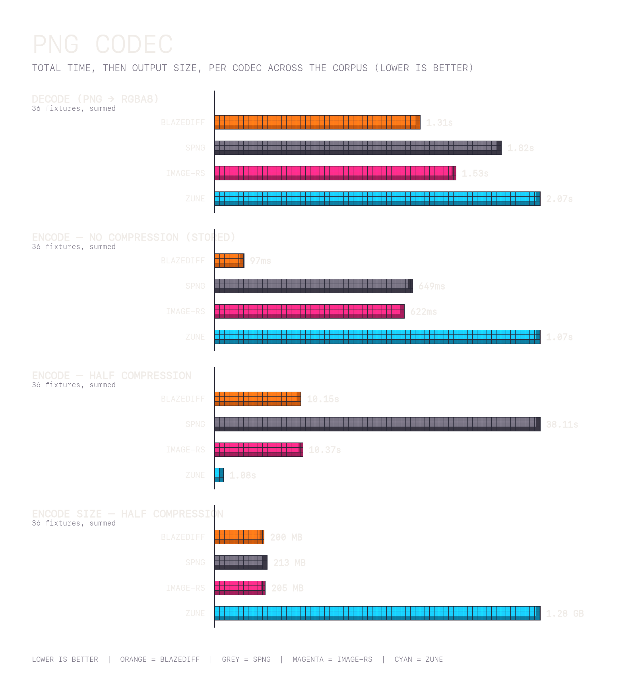

# PNG Codec Benchmarks

A from-scratch PNG codec in Rust — `blazediff-png` — against [spng](https://libspng.org), image-rs (`png`), and [zune-png](https://github.com/etemesi254/zune-image). Decode and encode are timed (best-of, size-scaled iteration counts) over the full fixture corpus (36 PNGs, 342.8 MPx), single-threaded on Apple Silicon. Lower is better.

Encode is measured at two settings so the speed/size trade-off is explicit and zune's stored-only encoder is compared fairly: **no compression** (stored deflate blocks) and **half compression** (half of each codec's own max deflate level — libdeflate 12 → 6, zlib 9 → 4).

**Speed here, correctness elsewhere.** These are timing numbers. Byte-identical *decode* parity with spng is verified separately on a large public-image corpus — Urban100, BSD100, Set14, Set5 (real high-res photos) plus the full [PngSuite](http://www.schaik.com/pngsuite/) (every format corner and the intentionally-malformed files), ~395 files — by the `corpus_differential` test: every file decodes byte-identically to spng at RGBA8 and at every `SPNG_FMT_*`, malformed files reject in lockstep, and every accepted image survives a blazediff encode → decode round-trip. Fetch the corpus with `crates/blazediff-png/scripts/fetch-corpus.sh` and run with `BLAZEDIFF_PNG_CORPUS` set; the `Benchmark PNG` GitHub workflow runs the benchmark and this verification.

## Decode

> blazediff decodes **~1.39×** faster than spng across the corpus.

<table>
  <thead>
    <tr>
      <th width="500">Benchmark</th>
      <th width="500">MPx</th>
      <th width="500">blazediff</th>
      <th width="500">spng</th>
      <th width="500">image-rs</th>
      <th width="500">zune</th>
      <th width="500">BlazeDiff vs spng</th>
    </tr>
  </thead>
  <tbody>
    <tr>
      <td>4k/1a.png</td>
      <td>17.9</td>
      <td>134.36ms</td>
      <td>173.00ms</td>
      <td>148.31ms</td>
      <td>200.29ms</td>
      <td>22.3%</td>
    </tr>
    <tr>
      <td>4k/1b.png</td>
      <td>17.9</td>
      <td>122.79ms</td>
      <td>161.47ms</td>
      <td>143.69ms</td>
      <td>189.08ms</td>
      <td>24.0%</td>
    </tr>
    <tr>
      <td>4k/2a.png</td>
      <td>20.0</td>
      <td>154.98ms</td>
      <td>212.88ms</td>
      <td>199.04ms</td>
      <td>233.36ms</td>
      <td>27.2%</td>
    </tr>
    <tr>
      <td>4k/2b.png</td>
      <td>20.0</td>
      <td>159.96ms</td>
      <td>221.32ms</td>
      <td>197.15ms</td>
      <td>231.84ms</td>
      <td>27.7%</td>
    </tr>
    <tr>
      <td>4k/3a.png</td>
      <td>24.0</td>
      <td>160.13ms</td>
      <td>220.40ms</td>
      <td>195.15ms</td>
      <td>262.18ms</td>
      <td>27.3%</td>
    </tr>
    <tr>
      <td>4k/3b.png</td>
      <td>24.0</td>
      <td>161.35ms</td>
      <td>222.93ms</td>
      <td>194.20ms</td>
      <td>261.72ms</td>
      <td>27.6%</td>
    </tr>
    <tr>
      <td>alpha/1a.png</td>
      <td>0.0</td>
      <td>0.08ms</td>
      <td>0.19ms</td>
      <td>0.08ms</td>
      <td>0.11ms</td>
      <td>58.0%</td>
    </tr>
    <tr>
      <td>alpha/1b.png</td>
      <td>0.0</td>
      <td>0.09ms</td>
      <td>0.20ms</td>
      <td>0.08ms</td>
      <td>0.11ms</td>
      <td>57.1%</td>
    </tr>
    <tr>
      <td>blazediff/1a.png</td>
      <td>0.4</td>
      <td>0.61ms</td>
      <td>0.68ms</td>
      <td>0.75ms</td>
      <td>1.02ms</td>
      <td>11.2%</td>
    </tr>
    <tr>
      <td>blazediff/1b.png</td>
      <td>0.4</td>
      <td>0.61ms</td>
      <td>0.68ms</td>
      <td>0.73ms</td>
      <td>1.03ms</td>
      <td>10.4%</td>
    </tr>
    <tr>
      <td>blazediff/2a.png</td>
      <td>0.4</td>
      <td>0.60ms</td>
      <td>0.80ms</td>
      <td>0.71ms</td>
      <td>0.91ms</td>
      <td>24.5%</td>
    </tr>
    <tr>
      <td>blazediff/2b.png</td>
      <td>0.4</td>
      <td>0.64ms</td>
      <td>0.86ms</td>
      <td>0.78ms</td>
      <td>1.02ms</td>
      <td>25.5%</td>
    </tr>
    <tr>
      <td>blazediff/3a.png</td>
      <td>1.6</td>
      <td>10.73ms</td>
      <td>13.02ms</td>
      <td>12.85ms</td>
      <td>17.09ms</td>
      <td>17.6%</td>
    </tr>
    <tr>
      <td>blazediff/3b.png</td>
      <td>1.6</td>
      <td>10.68ms</td>
      <td>12.97ms</td>
      <td>12.80ms</td>
      <td>17.44ms</td>
      <td>17.6%</td>
    </tr>
    <tr>
      <td>blazediff/4a.png</td>
      <td>3.8</td>
      <td>2.78ms</td>
      <td>3.40ms</td>
      <td>3.44ms</td>
      <td>4.38ms</td>
      <td>18.4%</td>
    </tr>
    <tr>
      <td>blazediff/4b.png</td>
      <td>3.8</td>
      <td>2.80ms</td>
      <td>3.44ms</td>
      <td>3.50ms</td>
      <td>4.48ms</td>
      <td>18.5%</td>
    </tr>
    <tr>
      <td>page/1a.png</td>
      <td>58.9</td>
      <td>155.34ms</td>
      <td>234.00ms</td>
      <td>182.39ms</td>
      <td>243.58ms</td>
      <td>33.6%</td>
    </tr>
    <tr>
      <td>page/1b.png</td>
      <td>58.9</td>
      <td>164.35ms</td>
      <td>250.52ms</td>
      <td>182.81ms</td>
      <td>243.28ms</td>
      <td>34.4%</td>
    </tr>
    <tr>
      <td>page/2a.png</td>
      <td>41.7</td>
      <td>26.18ms</td>
      <td>35.93ms</td>
      <td>20.86ms</td>
      <td>61.65ms</td>
      <td>27.1%</td>
    </tr>
    <tr>
      <td>page/2b.png</td>
      <td>41.7</td>
      <td>26.16ms</td>
      <td>36.34ms</td>
      <td>20.84ms</td>
      <td>63.65ms</td>
      <td>28.0%</td>
    </tr>
    <tr>
      <td>pixelmatch/1a.png</td>
      <td>0.1</td>
      <td>0.69ms</td>
      <td>0.92ms</td>
      <td>0.72ms</td>
      <td>1.05ms</td>
      <td>25.7%</td>
    </tr>
    <tr>
      <td>pixelmatch/1b.png</td>
      <td>0.1</td>
      <td>0.53ms</td>
      <td>0.71ms</td>
      <td>0.59ms</td>
      <td>0.88ms</td>
      <td>24.7%</td>
    </tr>
    <tr>
      <td>pixelmatch/2a.png</td>
      <td>0.1</td>
      <td>0.10ms</td>
      <td>0.36ms</td>
      <td>0.12ms</td>
      <td>0.15ms</td>
      <td>70.8%</td>
    </tr>
    <tr>
      <td>pixelmatch/2b.png</td>
      <td>0.1</td>
      <td>0.11ms</td>
      <td>0.37ms</td>
      <td>0.12ms</td>
      <td>0.16ms</td>
      <td>71.1%</td>
    </tr>
    <tr>
      <td>pixelmatch/3a.png</td>
      <td>0.1</td>
      <td>0.48ms</td>
      <td>0.71ms</td>
      <td>0.51ms</td>
      <td>0.74ms</td>
      <td>32.2%</td>
    </tr>
    <tr>
      <td>pixelmatch/3b.png</td>
      <td>0.1</td>
      <td>0.49ms</td>
      <td>0.72ms</td>
      <td>0.50ms</td>
      <td>0.73ms</td>
      <td>32.0%</td>
    </tr>
    <tr>
      <td>pixelmatch/4a.png</td>
      <td>0.2</td>
      <td>1.07ms</td>
      <td>1.83ms</td>
      <td>1.34ms</td>
      <td>1.74ms</td>
      <td>41.6%</td>
    </tr>
    <tr>
      <td>pixelmatch/4b.png</td>
      <td>0.2</td>
      <td>1.29ms</td>
      <td>1.74ms</td>
      <td>1.38ms</td>
      <td>2.19ms</td>
      <td>26.0%</td>
    </tr>
    <tr>
      <td>pixelmatch/5a.png</td>
      <td>0.1</td>
      <td>0.29ms</td>
      <td>0.43ms</td>
      <td>0.28ms</td>
      <td>0.37ms</td>
      <td>32.5%</td>
    </tr>
    <tr>
      <td>pixelmatch/5b.png</td>
      <td>0.1</td>
      <td>0.29ms</td>
      <td>0.43ms</td>
      <td>0.26ms</td>
      <td>0.36ms</td>
      <td>31.8%</td>
    </tr>
    <tr>
      <td>pixelmatch/6a.png</td>
      <td>0.1</td>
      <td>0.34ms</td>
      <td>0.64ms</td>
      <td>0.38ms</td>
      <td>0.46ms</td>
      <td>46.5%</td>
    </tr>
    <tr>
      <td>pixelmatch/6b.png</td>
      <td>0.1</td>
      <td>0.58ms</td>
      <td>0.93ms</td>
      <td>0.53ms</td>
      <td>0.83ms</td>
      <td>37.7%</td>
    </tr>
    <tr>
      <td>pixelmatch/7a.png</td>
      <td>0.3</td>
      <td>0.18ms</td>
      <td>0.45ms</td>
      <td>0.18ms</td>
      <td>0.31ms</td>
      <td>60.8%</td>
    </tr>
    <tr>
      <td>pixelmatch/7b.png</td>
      <td>0.3</td>
      <td>0.19ms</td>
      <td>0.46ms</td>
      <td>0.19ms</td>
      <td>0.31ms</td>
      <td>59.9%</td>
    </tr>
    <tr>
      <td>same/1a.png</td>
      <td>1.7</td>
      <td>2.07ms</td>
      <td>2.49ms</td>
      <td>2.62ms</td>
      <td>9.07ms</td>
      <td>16.8%</td>
    </tr>
    <tr>
      <td>same/1b.png</td>
      <td>1.7</td>
      <td>2.06ms</td>
      <td>2.54ms</td>
      <td>2.62ms</td>
      <td>9.00ms</td>
      <td>19.0%</td>
    </tr>
    <tr>
      <td><strong>TOTAL</strong></td>
      <td></td>
      <td><strong>1305.96ms</strong></td>
      <td><strong>1820.76ms</strong></td>
      <td><strong>1532.50ms</strong></td>
      <td><strong>2066.58ms</strong></td>
      <td><strong>28.3%</strong></td>
    </tr>
  </tbody>
</table>

## Encode — No Compression

_Levels: blazediff stored · spng stored · image-rs stored · zune stored._

> blazediff encodes **~6.67×** faster than spng (stored) across the corpus.

<table>
  <thead>
    <tr>
      <th width="500">Benchmark</th>
      <th width="500">MPx</th>
      <th width="500">blazediff</th>
      <th width="500">spng</th>
      <th width="500">image-rs</th>
      <th width="500">zune</th>
      <th width="500">BlazeDiff vs spng</th>
    </tr>
  </thead>
  <tbody>
    <tr>
      <td>4k/1a.png</td>
      <td>17.9</td>
      <td>4.38ms</td>
      <td>30.75ms</td>
      <td>33.80ms</td>
      <td>52.86ms</td>
      <td>85.8%</td>
    </tr>
    <tr>
      <td>4k/1b.png</td>
      <td>17.9</td>
      <td>4.15ms</td>
      <td>30.26ms</td>
      <td>41.81ms</td>
      <td>52.47ms</td>
      <td>86.3%</td>
    </tr>
    <tr>
      <td>4k/2a.png</td>
      <td>20.0</td>
      <td>4.71ms</td>
      <td>36.80ms</td>
      <td>24.80ms</td>
      <td>57.09ms</td>
      <td>87.2%</td>
    </tr>
    <tr>
      <td>4k/2b.png</td>
      <td>20.0</td>
      <td>4.76ms</td>
      <td>34.96ms</td>
      <td>21.76ms</td>
      <td>61.17ms</td>
      <td>86.4%</td>
    </tr>
    <tr>
      <td>4k/3a.png</td>
      <td>24.0</td>
      <td>5.59ms</td>
      <td>32.82ms</td>
      <td>36.08ms</td>
      <td>76.48ms</td>
      <td>83.0%</td>
    </tr>
    <tr>
      <td>4k/3b.png</td>
      <td>24.0</td>
      <td>6.33ms</td>
      <td>62.41ms</td>
      <td>33.59ms</td>
      <td>85.75ms</td>
      <td>89.9%</td>
    </tr>
    <tr>
      <td>alpha/1a.png</td>
      <td>0.0</td>
      <td>0.01ms</td>
      <td>0.04ms</td>
      <td>0.04ms</td>
      <td>0.10ms</td>
      <td>78.3%</td>
    </tr>
    <tr>
      <td>alpha/1b.png</td>
      <td>0.0</td>
      <td>0.01ms</td>
      <td>0.04ms</td>
      <td>0.04ms</td>
      <td>0.10ms</td>
      <td>78.5%</td>
    </tr>
    <tr>
      <td>blazediff/1a.png</td>
      <td>0.4</td>
      <td>0.10ms</td>
      <td>0.43ms</td>
      <td>0.39ms</td>
      <td>1.17ms</td>
      <td>77.1%</td>
    </tr>
    <tr>
      <td>blazediff/1b.png</td>
      <td>0.4</td>
      <td>0.10ms</td>
      <td>0.44ms</td>
      <td>0.40ms</td>
      <td>1.16ms</td>
      <td>77.8%</td>
    </tr>
    <tr>
      <td>blazediff/2a.png</td>
      <td>0.4</td>
      <td>0.08ms</td>
      <td>0.36ms</td>
      <td>0.32ms</td>
      <td>0.96ms</td>
      <td>76.8%</td>
    </tr>
    <tr>
      <td>blazediff/2b.png</td>
      <td>0.4</td>
      <td>0.08ms</td>
      <td>0.36ms</td>
      <td>0.31ms</td>
      <td>0.94ms</td>
      <td>76.7%</td>
    </tr>
    <tr>
      <td>blazediff/3a.png</td>
      <td>1.6</td>
      <td>0.36ms</td>
      <td>2.68ms</td>
      <td>3.30ms</td>
      <td>5.34ms</td>
      <td>86.6%</td>
    </tr>
    <tr>
      <td>blazediff/3b.png</td>
      <td>1.6</td>
      <td>0.36ms</td>
      <td>2.52ms</td>
      <td>3.35ms</td>
      <td>5.08ms</td>
      <td>85.7%</td>
    </tr>
    <tr>
      <td>blazediff/4a.png</td>
      <td>3.8</td>
      <td>0.86ms</td>
      <td>5.76ms</td>
      <td>6.97ms</td>
      <td>13.18ms</td>
      <td>85.1%</td>
    </tr>
    <tr>
      <td>blazediff/4b.png</td>
      <td>3.8</td>
      <td>0.86ms</td>
      <td>5.02ms</td>
      <td>8.92ms</td>
      <td>12.28ms</td>
      <td>82.9%</td>
    </tr>
    <tr>
      <td>page/1a.png</td>
      <td>58.9</td>
      <td>16.47ms</td>
      <td>112.69ms</td>
      <td>134.00ms</td>
      <td>189.20ms</td>
      <td>85.4%</td>
    </tr>
    <tr>
      <td>page/1b.png</td>
      <td>58.9</td>
      <td>22.86ms</td>
      <td>128.56ms</td>
      <td>99.90ms</td>
      <td>167.92ms</td>
      <td>82.2%</td>
    </tr>
    <tr>
      <td>page/2a.png</td>
      <td>41.7</td>
      <td>11.99ms</td>
      <td>89.17ms</td>
      <td>114.14ms</td>
      <td>142.19ms</td>
      <td>86.6%</td>
    </tr>
    <tr>
      <td>page/2b.png</td>
      <td>41.7</td>
      <td>12.03ms</td>
      <td>65.43ms</td>
      <td>48.64ms</td>
      <td>126.12ms</td>
      <td>81.6%</td>
    </tr>
    <tr>
      <td>pixelmatch/1a.png</td>
      <td>0.1</td>
      <td>0.03ms</td>
      <td>0.15ms</td>
      <td>0.10ms</td>
      <td>0.34ms</td>
      <td>80.2%</td>
    </tr>
    <tr>
      <td>pixelmatch/1b.png</td>
      <td>0.1</td>
      <td>0.03ms</td>
      <td>0.13ms</td>
      <td>0.10ms</td>
      <td>0.34ms</td>
      <td>77.6%</td>
    </tr>
    <tr>
      <td>pixelmatch/2a.png</td>
      <td>0.1</td>
      <td>0.01ms</td>
      <td>0.07ms</td>
      <td>0.05ms</td>
      <td>0.17ms</td>
      <td>78.3%</td>
    </tr>
    <tr>
      <td>pixelmatch/2b.png</td>
      <td>0.1</td>
      <td>0.01ms</td>
      <td>0.07ms</td>
      <td>0.05ms</td>
      <td>0.17ms</td>
      <td>78.8%</td>
    </tr>
    <tr>
      <td>pixelmatch/3a.png</td>
      <td>0.1</td>
      <td>0.03ms</td>
      <td>0.15ms</td>
      <td>0.10ms</td>
      <td>0.34ms</td>
      <td>81.0%</td>
    </tr>
    <tr>
      <td>pixelmatch/3b.png</td>
      <td>0.1</td>
      <td>0.03ms</td>
      <td>0.15ms</td>
      <td>0.10ms</td>
      <td>0.33ms</td>
      <td>80.3%</td>
    </tr>
    <tr>
      <td>pixelmatch/4a.png</td>
      <td>0.2</td>
      <td>0.04ms</td>
      <td>0.21ms</td>
      <td>0.15ms</td>
      <td>0.47ms</td>
      <td>78.9%</td>
    </tr>
    <tr>
      <td>pixelmatch/4b.png</td>
      <td>0.2</td>
      <td>0.04ms</td>
      <td>0.18ms</td>
      <td>0.17ms</td>
      <td>0.47ms</td>
      <td>76.3%</td>
    </tr>
    <tr>
      <td>pixelmatch/5a.png</td>
      <td>0.1</td>
      <td>0.01ms</td>
      <td>0.07ms</td>
      <td>0.05ms</td>
      <td>0.17ms</td>
      <td>78.5%</td>
    </tr>
    <tr>
      <td>pixelmatch/5b.png</td>
      <td>0.1</td>
      <td>0.01ms</td>
      <td>0.08ms</td>
      <td>0.05ms</td>
      <td>0.17ms</td>
      <td>81.3%</td>
    </tr>
    <tr>
      <td>pixelmatch/6a.png</td>
      <td>0.1</td>
      <td>0.01ms</td>
      <td>0.07ms</td>
      <td>0.05ms</td>
      <td>0.17ms</td>
      <td>78.7%</td>
    </tr>
    <tr>
      <td>pixelmatch/6b.png</td>
      <td>0.1</td>
      <td>0.01ms</td>
      <td>0.07ms</td>
      <td>0.05ms</td>
      <td>0.17ms</td>
      <td>78.5%</td>
    </tr>
    <tr>
      <td>pixelmatch/7a.png</td>
      <td>0.3</td>
      <td>0.06ms</td>
      <td>0.24ms</td>
      <td>0.21ms</td>
      <td>0.65ms</td>
      <td>75.8%</td>
    </tr>
    <tr>
      <td>pixelmatch/7b.png</td>
      <td>0.3</td>
      <td>0.06ms</td>
      <td>0.24ms</td>
      <td>0.23ms</td>
      <td>0.65ms</td>
      <td>75.4%</td>
    </tr>
    <tr>
      <td>same/1a.png</td>
      <td>1.7</td>
      <td>0.39ms</td>
      <td>2.82ms</td>
      <td>4.00ms</td>
      <td>5.33ms</td>
      <td>86.1%</td>
    </tr>
    <tr>
      <td>same/1b.png</td>
      <td>1.7</td>
      <td>0.39ms</td>
      <td>2.81ms</td>
      <td>4.20ms</td>
      <td>5.34ms</td>
      <td>86.1%</td>
    </tr>
    <tr>
      <td><strong>TOTAL</strong></td>
      <td></td>
      <td><strong>97.28ms</strong></td>
      <td><strong>648.97ms</strong></td>
      <td><strong>622.25ms</strong></td>
      <td><strong>1066.82ms</strong></td>
      <td><strong>85.0%</strong></td>
    </tr>
  </tbody>
</table>

### Encode Size — No Compression

> Output bytes per codec; the final row is each codec's total as a percentage of spng's (the de-facto reference). zune-png has no compressed mode, so it always writes stored output — far larger than the rest.

<table>
  <thead>
    <tr>
      <th width="500">Benchmark</th>
      <th width="500">blazediff</th>
      <th width="500">spng</th>
      <th width="500">image-rs</th>
      <th width="500">zune</th>
    </tr>
  </thead>
  <tbody>
    <tr>
      <td>4k/1a.png</td>
      <td>70008.5 KB</td>
      <td>70113.9 KB</td>
      <td>70008.5 KB</td>
      <td>70111.1 KB</td>
    </tr>
    <tr>
      <td>4k/1b.png</td>
      <td>70008.5 KB</td>
      <td>70113.9 KB</td>
      <td>70008.5 KB</td>
      <td>70111.1 KB</td>
    </tr>
    <tr>
      <td>4k/2a.png</td>
      <td>77985.6 KB</td>
      <td>78102.8 KB</td>
      <td>77985.6 KB</td>
      <td>78099.8 KB</td>
    </tr>
    <tr>
      <td>4k/2b.png</td>
      <td>77985.6 KB</td>
      <td>78102.8 KB</td>
      <td>77985.6 KB</td>
      <td>78099.8 KB</td>
    </tr>
    <tr>
      <td>4k/3a.png</td>
      <td>93761.1 KB</td>
      <td>93901.8 KB</td>
      <td>93761.1 KB</td>
      <td>93898.5 KB</td>
    </tr>
    <tr>
      <td>4k/3b.png</td>
      <td>93761.1 KB</td>
      <td>93901.8 KB</td>
      <td>93761.1 KB</td>
      <td>93898.5 KB</td>
    </tr>
    <tr>
      <td>alpha/1a.png</td>
      <td>144.3 KB</td>
      <td>144.5 KB</td>
      <td>144.3 KB</td>
      <td>144.5 KB</td>
    </tr>
    <tr>
      <td>alpha/1b.png</td>
      <td>144.3 KB</td>
      <td>144.5 KB</td>
      <td>144.3 KB</td>
      <td>144.5 KB</td>
    </tr>
    <tr>
      <td>blazediff/1a.png</td>
      <td>1686.4 KB</td>
      <td>1689.0 KB</td>
      <td>1686.4 KB</td>
      <td>1688.8 KB</td>
    </tr>
    <tr>
      <td>blazediff/1b.png</td>
      <td>1686.4 KB</td>
      <td>1689.0 KB</td>
      <td>1686.4 KB</td>
      <td>1688.8 KB</td>
    </tr>
    <tr>
      <td>blazediff/2a.png</td>
      <td>1372.2 KB</td>
      <td>1374.3 KB</td>
      <td>1372.2 KB</td>
      <td>1374.2 KB</td>
    </tr>
    <tr>
      <td>blazediff/2b.png</td>
      <td>1372.2 KB</td>
      <td>1374.3 KB</td>
      <td>1372.2 KB</td>
      <td>1374.2 KB</td>
    </tr>
    <tr>
      <td>blazediff/3a.png</td>
      <td>6372.0 KB</td>
      <td>6381.7 KB</td>
      <td>6372.0 KB</td>
      <td>6381.3 KB</td>
    </tr>
    <tr>
      <td>blazediff/3b.png</td>
      <td>6372.0 KB</td>
      <td>6381.7 KB</td>
      <td>6372.0 KB</td>
      <td>6381.3 KB</td>
    </tr>
    <tr>
      <td>blazediff/4a.png</td>
      <td>14792.1 KB</td>
      <td>14814.7 KB</td>
      <td>14792.1 KB</td>
      <td>14813.8 KB</td>
    </tr>
    <tr>
      <td>blazediff/4b.png</td>
      <td>14792.1 KB</td>
      <td>14814.7 KB</td>
      <td>14792.1 KB</td>
      <td>14813.8 KB</td>
    </tr>
    <tr>
      <td>page/1a.png</td>
      <td>230305.6 KB</td>
      <td>230653.1 KB</td>
      <td>230305.6 KB</td>
      <td>230643.0 KB</td>
    </tr>
    <tr>
      <td>page/1b.png</td>
      <td>230305.6 KB</td>
      <td>230653.1 KB</td>
      <td>230305.6 KB</td>
      <td>230643.0 KB</td>
    </tr>
    <tr>
      <td>page/2a.png</td>
      <td>162963.6 KB</td>
      <td>163212.5 KB</td>
      <td>162963.6 KB</td>
      <td>163202.3 KB</td>
    </tr>
    <tr>
      <td>page/2b.png</td>
      <td>162963.6 KB</td>
      <td>163212.5 KB</td>
      <td>162963.6 KB</td>
      <td>163202.3 KB</td>
    </tr>
    <tr>
      <td>pixelmatch/1a.png</td>
      <td>512.4 KB</td>
      <td>513.1 KB</td>
      <td>512.4 KB</td>
      <td>513.1 KB</td>
    </tr>
    <tr>
      <td>pixelmatch/1b.png</td>
      <td>512.4 KB</td>
      <td>513.1 KB</td>
      <td>512.4 KB</td>
      <td>513.1 KB</td>
    </tr>
    <tr>
      <td>pixelmatch/2a.png</td>
      <td>256.3 KB</td>
      <td>256.7 KB</td>
      <td>256.3 KB</td>
      <td>256.7 KB</td>
    </tr>
    <tr>
      <td>pixelmatch/2b.png</td>
      <td>256.3 KB</td>
      <td>256.7 KB</td>
      <td>256.3 KB</td>
      <td>256.7 KB</td>
    </tr>
    <tr>
      <td>pixelmatch/3a.png</td>
      <td>512.4 KB</td>
      <td>513.1 KB</td>
      <td>512.4 KB</td>
      <td>513.1 KB</td>
    </tr>
    <tr>
      <td>pixelmatch/3b.png</td>
      <td>512.4 KB</td>
      <td>513.1 KB</td>
      <td>512.4 KB</td>
      <td>513.1 KB</td>
    </tr>
    <tr>
      <td>pixelmatch/4a.png</td>
      <td>705.4 KB</td>
      <td>706.5 KB</td>
      <td>705.4 KB</td>
      <td>706.5 KB</td>
    </tr>
    <tr>
      <td>pixelmatch/4b.png</td>
      <td>705.4 KB</td>
      <td>706.5 KB</td>
      <td>705.4 KB</td>
      <td>706.5 KB</td>
    </tr>
    <tr>
      <td>pixelmatch/5a.png</td>
      <td>256.3 KB</td>
      <td>256.7 KB</td>
      <td>256.3 KB</td>
      <td>256.7 KB</td>
    </tr>
    <tr>
      <td>pixelmatch/5b.png</td>
      <td>256.3 KB</td>
      <td>256.7 KB</td>
      <td>256.3 KB</td>
      <td>256.7 KB</td>
    </tr>
    <tr>
      <td>pixelmatch/6a.png</td>
      <td>256.3 KB</td>
      <td>256.7 KB</td>
      <td>256.3 KB</td>
      <td>256.7 KB</td>
    </tr>
    <tr>
      <td>pixelmatch/6b.png</td>
      <td>256.3 KB</td>
      <td>256.7 KB</td>
      <td>256.3 KB</td>
      <td>256.7 KB</td>
    </tr>
    <tr>
      <td>pixelmatch/7a.png</td>
      <td>977.2 KB</td>
      <td>978.7 KB</td>
      <td>977.2 KB</td>
      <td>978.6 KB</td>
    </tr>
    <tr>
      <td>pixelmatch/7b.png</td>
      <td>977.2 KB</td>
      <td>978.7 KB</td>
      <td>977.2 KB</td>
      <td>978.6 KB</td>
    </tr>
    <tr>
      <td>same/1a.png</td>
      <td>6789.5 KB</td>
      <td>6799.9 KB</td>
      <td>6789.5 KB</td>
      <td>6799.5 KB</td>
    </tr>
    <tr>
      <td>same/1b.png</td>
      <td>6789.5 KB</td>
      <td>6799.9 KB</td>
      <td>6789.5 KB</td>
      <td>6799.5 KB</td>
    </tr>
    <tr>
      <td><strong>TOTAL</strong></td>
      <td><strong>1339314.5 KB</strong></td>
      <td><strong>1341339.3 KB</strong></td>
      <td><strong>1339314.5 KB</strong></td>
      <td><strong>1341276.3 KB</strong></td>
    </tr>
    <tr>
      <td><strong>vs spng</strong></td>
      <td><strong>99.8%</strong></td>
      <td><strong>100.0%</strong></td>
      <td><strong>99.8%</strong></td>
      <td><strong>100.0%</strong></td>
    </tr>
  </tbody>
</table>

## Encode — Half Compression

_Levels: blazediff libdeflate 6 · spng zlib 4 · image-rs flate2 4 · zune stored._

> blazediff encodes **~3.75×** faster than spng (zlib 4) across the corpus.

<table>
  <thead>
    <tr>
      <th width="500">Benchmark</th>
      <th width="500">MPx</th>
      <th width="500">blazediff</th>
      <th width="500">spng</th>
      <th width="500">image-rs</th>
      <th width="500">zune</th>
      <th width="500">BlazeDiff vs spng</th>
    </tr>
  </thead>
  <tbody>
    <tr>
      <td>4k/1a.png</td>
      <td>17.9</td>
      <td>1073.90ms</td>
      <td>2817.41ms</td>
      <td>1064.54ms</td>
      <td>52.98ms</td>
      <td>61.9%</td>
    </tr>
    <tr>
      <td>4k/1b.png</td>
      <td>17.9</td>
      <td>922.19ms</td>
      <td>2367.31ms</td>
      <td>960.18ms</td>
      <td>52.68ms</td>
      <td>61.0%</td>
    </tr>
    <tr>
      <td>4k/2a.png</td>
      <td>20.0</td>
      <td>955.14ms</td>
      <td>3291.65ms</td>
      <td>1150.56ms</td>
      <td>58.93ms</td>
      <td>71.0%</td>
    </tr>
    <tr>
      <td>4k/2b.png</td>
      <td>20.0</td>
      <td>1014.24ms</td>
      <td>3021.96ms</td>
      <td>1140.25ms</td>
      <td>60.85ms</td>
      <td>66.4%</td>
    </tr>
    <tr>
      <td>4k/3a.png</td>
      <td>24.0</td>
      <td>1405.76ms</td>
      <td>3780.78ms</td>
      <td>1532.24ms</td>
      <td>78.94ms</td>
      <td>62.8%</td>
    </tr>
    <tr>
      <td>4k/3b.png</td>
      <td>24.0</td>
      <td>1411.98ms</td>
      <td>3830.02ms</td>
      <td>1607.11ms</td>
      <td>86.11ms</td>
      <td>63.1%</td>
    </tr>
    <tr>
      <td>alpha/1a.png</td>
      <td>0.0</td>
      <td>0.40ms</td>
      <td>2.74ms</td>
      <td>0.39ms</td>
      <td>0.10ms</td>
      <td>85.4%</td>
    </tr>
    <tr>
      <td>alpha/1b.png</td>
      <td>0.0</td>
      <td>0.41ms</td>
      <td>2.79ms</td>
      <td>0.39ms</td>
      <td>0.10ms</td>
      <td>85.4%</td>
    </tr>
    <tr>
      <td>blazediff/1a.png</td>
      <td>0.4</td>
      <td>4.32ms</td>
      <td>33.28ms</td>
      <td>2.96ms</td>
      <td>1.17ms</td>
      <td>87.0%</td>
    </tr>
    <tr>
      <td>blazediff/1b.png</td>
      <td>0.4</td>
      <td>4.33ms</td>
      <td>33.29ms</td>
      <td>2.98ms</td>
      <td>1.16ms</td>
      <td>87.0%</td>
    </tr>
    <tr>
      <td>blazediff/2a.png</td>
      <td>0.4</td>
      <td>3.72ms</td>
      <td>27.26ms</td>
      <td>2.61ms</td>
      <td>0.94ms</td>
      <td>86.4%</td>
    </tr>
    <tr>
      <td>blazediff/2b.png</td>
      <td>0.4</td>
      <td>3.77ms</td>
      <td>27.77ms</td>
      <td>2.69ms</td>
      <td>0.94ms</td>
      <td>86.4%</td>
    </tr>
    <tr>
      <td>blazediff/3a.png</td>
      <td>1.6</td>
      <td>38.35ms</td>
      <td>155.61ms</td>
      <td>38.61ms</td>
      <td>5.39ms</td>
      <td>75.4%</td>
    </tr>
    <tr>
      <td>blazediff/3b.png</td>
      <td>1.6</td>
      <td>37.92ms</td>
      <td>155.14ms</td>
      <td>38.00ms</td>
      <td>5.10ms</td>
      <td>75.6%</td>
    </tr>
    <tr>
      <td>blazediff/4a.png</td>
      <td>3.8</td>
      <td>33.90ms</td>
      <td>289.42ms</td>
      <td>20.44ms</td>
      <td>12.88ms</td>
      <td>88.3%</td>
    </tr>
    <tr>
      <td>blazediff/4b.png</td>
      <td>3.8</td>
      <td>33.95ms</td>
      <td>287.44ms</td>
      <td>20.45ms</td>
      <td>12.41ms</td>
      <td>88.2%</td>
    </tr>
    <tr>
      <td>page/1a.png</td>
      <td>58.9</td>
      <td>866.93ms</td>
      <td>5141.44ms</td>
      <td>767.40ms</td>
      <td>191.19ms</td>
      <td>83.1%</td>
    </tr>
    <tr>
      <td>page/1b.png</td>
      <td>58.9</td>
      <td>938.42ms</td>
      <td>5097.02ms</td>
      <td>716.03ms</td>
      <td>172.47ms</td>
      <td>81.6%</td>
    </tr>
    <tr>
      <td>page/2a.png</td>
      <td>41.7</td>
      <td>659.72ms</td>
      <td>3653.05ms</td>
      <td>611.90ms</td>
      <td>143.67ms</td>
      <td>81.9%</td>
    </tr>
    <tr>
      <td>page/2b.png</td>
      <td>41.7</td>
      <td>665.23ms</td>
      <td>3645.44ms</td>
      <td>615.96ms</td>
      <td>125.99ms</td>
      <td>81.8%</td>
    </tr>
    <tr>
      <td>pixelmatch/1a.png</td>
      <td>0.1</td>
      <td>1.75ms</td>
      <td>11.02ms</td>
      <td>1.73ms</td>
      <td>0.33ms</td>
      <td>84.1%</td>
    </tr>
    <tr>
      <td>pixelmatch/1b.png</td>
      <td>0.1</td>
      <td>1.79ms</td>
      <td>11.15ms</td>
      <td>1.78ms</td>
      <td>0.34ms</td>
      <td>83.9%</td>
    </tr>
    <tr>
      <td>pixelmatch/2a.png</td>
      <td>0.1</td>
      <td>2.46ms</td>
      <td>8.81ms</td>
      <td>3.24ms</td>
      <td>0.17ms</td>
      <td>72.1%</td>
    </tr>
    <tr>
      <td>pixelmatch/2b.png</td>
      <td>0.1</td>
      <td>2.48ms</td>
      <td>9.08ms</td>
      <td>3.37ms</td>
      <td>0.17ms</td>
      <td>72.7%</td>
    </tr>
    <tr>
      <td>pixelmatch/3a.png</td>
      <td>0.1</td>
      <td>1.51ms</td>
      <td>10.44ms</td>
      <td>1.16ms</td>
      <td>0.35ms</td>
      <td>85.6%</td>
    </tr>
    <tr>
      <td>pixelmatch/3b.png</td>
      <td>0.1</td>
      <td>1.48ms</td>
      <td>10.37ms</td>
      <td>1.18ms</td>
      <td>0.33ms</td>
      <td>85.8%</td>
    </tr>
    <tr>
      <td>pixelmatch/4a.png</td>
      <td>0.2</td>
      <td>7.07ms</td>
      <td>23.90ms</td>
      <td>8.86ms</td>
      <td>0.47ms</td>
      <td>70.4%</td>
    </tr>
    <tr>
      <td>pixelmatch/4b.png</td>
      <td>0.2</td>
      <td>7.17ms</td>
      <td>24.94ms</td>
      <td>9.38ms</td>
      <td>0.47ms</td>
      <td>71.2%</td>
    </tr>
    <tr>
      <td>pixelmatch/5a.png</td>
      <td>0.1</td>
      <td>0.68ms</td>
      <td>4.97ms</td>
      <td>0.58ms</td>
      <td>0.17ms</td>
      <td>86.4%</td>
    </tr>
    <tr>
      <td>pixelmatch/5b.png</td>
      <td>0.1</td>
      <td>0.69ms</td>
      <td>4.97ms</td>
      <td>0.58ms</td>
      <td>0.17ms</td>
      <td>86.1%</td>
    </tr>
    <tr>
      <td>pixelmatch/6a.png</td>
      <td>0.1</td>
      <td>2.12ms</td>
      <td>7.15ms</td>
      <td>2.52ms</td>
      <td>0.17ms</td>
      <td>70.4%</td>
    </tr>
    <tr>
      <td>pixelmatch/6b.png</td>
      <td>0.1</td>
      <td>2.05ms</td>
      <td>6.60ms</td>
      <td>2.16ms</td>
      <td>0.17ms</td>
      <td>68.9%</td>
    </tr>
    <tr>
      <td>pixelmatch/7a.png</td>
      <td>0.3</td>
      <td>3.99ms</td>
      <td>21.80ms</td>
      <td>4.10ms</td>
      <td>0.65ms</td>
      <td>81.7%</td>
    </tr>
    <tr>
      <td>pixelmatch/7b.png</td>
      <td>0.3</td>
      <td>4.06ms</td>
      <td>21.63ms</td>
      <td>4.12ms</td>
      <td>0.65ms</td>
      <td>81.2%</td>
    </tr>
    <tr>
      <td>same/1a.png</td>
      <td>1.7</td>
      <td>17.56ms</td>
      <td>134.05ms</td>
      <td>12.33ms</td>
      <td>5.33ms</td>
      <td>86.9%</td>
    </tr>
    <tr>
      <td>same/1b.png</td>
      <td>1.7</td>
      <td>17.57ms</td>
      <td>134.28ms</td>
      <td>12.35ms</td>
      <td>5.36ms</td>
      <td>86.9%</td>
    </tr>
    <tr>
      <td><strong>TOTAL</strong></td>
      <td></td>
      <td><strong>10149.01ms</strong></td>
      <td><strong>38105.96ms</strong></td>
      <td><strong>10365.13ms</strong></td>
      <td><strong>1079.30ms</strong></td>
      <td><strong>73.4%</strong></td>
    </tr>
  </tbody>
</table>

### Encode Size — Half Compression

> Output bytes per codec; the final row is each codec's total as a percentage of spng's (the de-facto reference). zune-png has no compressed mode, so it always writes stored output — far larger than the rest.

<table>
  <thead>
    <tr>
      <th width="500">Benchmark</th>
      <th width="500">blazediff</th>
      <th width="500">spng</th>
      <th width="500">image-rs</th>
      <th width="500">zune</th>
    </tr>
  </thead>
  <tbody>
    <tr>
      <td>4k/1a.png</td>
      <td>21101.4 KB</td>
      <td>21854.4 KB</td>
      <td>22052.3 KB</td>
      <td>70111.1 KB</td>
    </tr>
    <tr>
      <td>4k/1b.png</td>
      <td>17651.2 KB</td>
      <td>18677.4 KB</td>
      <td>18347.8 KB</td>
      <td>70111.1 KB</td>
    </tr>
    <tr>
      <td>4k/2a.png</td>
      <td>26682.0 KB</td>
      <td>27721.7 KB</td>
      <td>27255.9 KB</td>
      <td>78099.8 KB</td>
    </tr>
    <tr>
      <td>4k/2b.png</td>
      <td>27245.4 KB</td>
      <td>28215.9 KB</td>
      <td>27832.4 KB</td>
      <td>78099.8 KB</td>
    </tr>
    <tr>
      <td>4k/3a.png</td>
      <td>32854.0 KB</td>
      <td>35811.5 KB</td>
      <td>33914.6 KB</td>
      <td>93898.5 KB</td>
    </tr>
    <tr>
      <td>4k/3b.png</td>
      <td>32367.2 KB</td>
      <td>35368.2 KB</td>
      <td>33383.8 KB</td>
      <td>93898.5 KB</td>
    </tr>
    <tr>
      <td>alpha/1a.png</td>
      <td>2.8 KB</td>
      <td>2.9 KB</td>
      <td>3.0 KB</td>
      <td>144.5 KB</td>
    </tr>
    <tr>
      <td>alpha/1b.png</td>
      <td>2.8 KB</td>
      <td>3.0 KB</td>
      <td>3.0 KB</td>
      <td>144.5 KB</td>
    </tr>
    <tr>
      <td>blazediff/1a.png</td>
      <td>30.8 KB</td>
      <td>35.4 KB</td>
      <td>30.2 KB</td>
      <td>1688.8 KB</td>
    </tr>
    <tr>
      <td>blazediff/1b.png</td>
      <td>30.9 KB</td>
      <td>35.4 KB</td>
      <td>30.3 KB</td>
      <td>1688.8 KB</td>
    </tr>
    <tr>
      <td>blazediff/2a.png</td>
      <td>31.5 KB</td>
      <td>38.1 KB</td>
      <td>30.1 KB</td>
      <td>1374.2 KB</td>
    </tr>
    <tr>
      <td>blazediff/2b.png</td>
      <td>32.8 KB</td>
      <td>39.8 KB</td>
      <td>31.5 KB</td>
      <td>1374.2 KB</td>
    </tr>
    <tr>
      <td>blazediff/3a.png</td>
      <td>815.5 KB</td>
      <td>877.0 KB</td>
      <td>835.0 KB</td>
      <td>6381.3 KB</td>
    </tr>
    <tr>
      <td>blazediff/3b.png</td>
      <td>792.2 KB</td>
      <td>853.3 KB</td>
      <td>812.1 KB</td>
      <td>6381.3 KB</td>
    </tr>
    <tr>
      <td>blazediff/4a.png</td>
      <td>98.7 KB</td>
      <td>114.0 KB</td>
      <td>100.5 KB</td>
      <td>14813.8 KB</td>
    </tr>
    <tr>
      <td>blazediff/4b.png</td>
      <td>98.3 KB</td>
      <td>114.1 KB</td>
      <td>100.4 KB</td>
      <td>14813.8 KB</td>
    </tr>
    <tr>
      <td>page/1a.png</td>
      <td>11324.3 KB</td>
      <td>12237.3 KB</td>
      <td>11321.4 KB</td>
      <td>230643.0 KB</td>
    </tr>
    <tr>
      <td>page/1b.png</td>
      <td>11315.0 KB</td>
      <td>12227.2 KB</td>
      <td>11313.6 KB</td>
      <td>230643.0 KB</td>
    </tr>
    <tr>
      <td>page/2a.png</td>
      <td>10595.2 KB</td>
      <td>11285.2 KB</td>
      <td>10674.2 KB</td>
      <td>163202.3 KB</td>
    </tr>
    <tr>
      <td>page/2b.png</td>
      <td>10614.5 KB</td>
      <td>11291.1 KB</td>
      <td>10702.0 KB</td>
      <td>163202.3 KB</td>
    </tr>
    <tr>
      <td>pixelmatch/1a.png</td>
      <td>31.8 KB</td>
      <td>32.2 KB</td>
      <td>33.4 KB</td>
      <td>513.1 KB</td>
    </tr>
    <tr>
      <td>pixelmatch/1b.png</td>
      <td>31.9 KB</td>
      <td>32.2 KB</td>
      <td>33.4 KB</td>
      <td>513.1 KB</td>
    </tr>
    <tr>
      <td>pixelmatch/2a.png</td>
      <td>90.8 KB</td>
      <td>96.9 KB</td>
      <td>91.0 KB</td>
      <td>256.7 KB</td>
    </tr>
    <tr>
      <td>pixelmatch/2b.png</td>
      <td>94.4 KB</td>
      <td>99.9 KB</td>
      <td>94.3 KB</td>
      <td>256.7 KB</td>
    </tr>
    <tr>
      <td>pixelmatch/3a.png</td>
      <td>13.9 KB</td>
      <td>14.7 KB</td>
      <td>13.8 KB</td>
      <td>513.1 KB</td>
    </tr>
    <tr>
      <td>pixelmatch/3b.png</td>
      <td>13.7 KB</td>
      <td>14.3 KB</td>
      <td>13.5 KB</td>
      <td>513.1 KB</td>
    </tr>
    <tr>
      <td>pixelmatch/4a.png</td>
      <td>240.1 KB</td>
      <td>254.1 KB</td>
      <td>241.3 KB</td>
      <td>706.5 KB</td>
    </tr>
    <tr>
      <td>pixelmatch/4b.png</td>
      <td>251.0 KB</td>
      <td>268.1 KB</td>
      <td>251.9 KB</td>
      <td>706.5 KB</td>
    </tr>
    <tr>
      <td>pixelmatch/5a.png</td>
      <td>3.0 KB</td>
      <td>3.3 KB</td>
      <td>3.1 KB</td>
      <td>256.7 KB</td>
    </tr>
    <tr>
      <td>pixelmatch/5b.png</td>
      <td>3.2 KB</td>
      <td>3.3 KB</td>
      <td>3.2 KB</td>
      <td>256.7 KB</td>
    </tr>
    <tr>
      <td>pixelmatch/6a.png</td>
      <td>44.4 KB</td>
      <td>50.7 KB</td>
      <td>48.5 KB</td>
      <td>256.7 KB</td>
    </tr>
    <tr>
      <td>pixelmatch/6b.png</td>
      <td>32.0 KB</td>
      <td>37.9 KB</td>
      <td>36.5 KB</td>
      <td>256.7 KB</td>
    </tr>
    <tr>
      <td>pixelmatch/7a.png</td>
      <td>88.2 KB</td>
      <td>96.1 KB</td>
      <td>87.4 KB</td>
      <td>978.6 KB</td>
    </tr>
    <tr>
      <td>pixelmatch/7b.png</td>
      <td>87.3 KB</td>
      <td>94.8 KB</td>
      <td>86.5 KB</td>
      <td>978.6 KB</td>
    </tr>
    <tr>
      <td>same/1a.png</td>
      <td>124.9 KB</td>
      <td>140.3 KB</td>
      <td>126.7 KB</td>
      <td>6799.5 KB</td>
    </tr>
    <tr>
      <td>same/1b.png</td>
      <td>124.9 KB</td>
      <td>140.3 KB</td>
      <td>126.7 KB</td>
      <td>6799.5 KB</td>
    </tr>
    <tr>
      <td><strong>TOTAL</strong></td>
      <td><strong>204962.2 KB</strong></td>
      <td><strong>218181.8 KB</strong></td>
      <td><strong>210065.0 KB</strong></td>
      <td><strong>1341276.3 KB</strong></td>
    </tr>
    <tr>
      <td><strong>vs spng</strong></td>
      <td><strong>93.9%</strong></td>
      <td><strong>100.0%</strong></td>
      <td><strong>96.3%</strong></td>
      <td><strong>614.8%</strong></td>
    </tr>
  </tbody>
</table>
