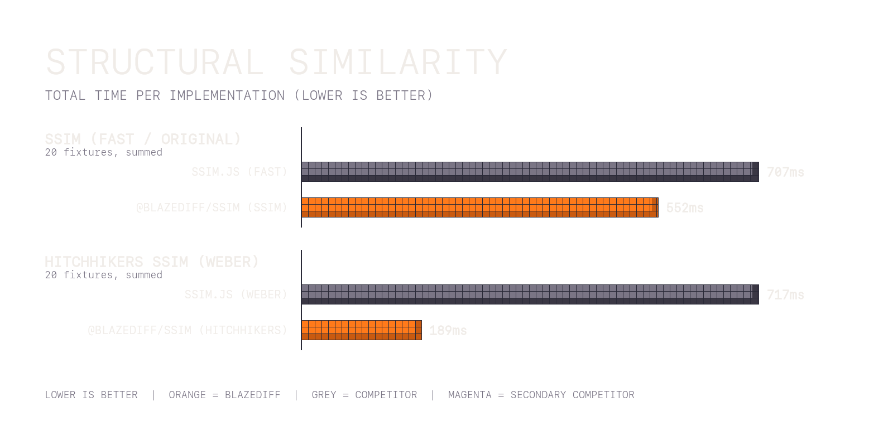

# Structural Similarity Benchmarks

Per-window image quality comparisons (SSIM family). Image decode is excluded.

## Fast Original ( `@blazediff/ssim` using `ssim` vs `ssim.js` using `fast` algorithm) (image IO excluded)

_25 iterations (3 warmup)_

> **~25%** performance improvement on average.

<table>
  <thead>
    <tr>
      <th width="500">Benchmark</th>
      <th width="500">ssim.js</th>
      <th width="500">BlazeDiff</th>
      <th width="500">Time Saved</th>
      <th width="500">% Improvement</th>
    </tr>
  </thead>
  <tbody>
    <tr>
      <td>blazediff/1</td>
      <td>86.51ms</td>
      <td>64.26ms</td>
      <td>22.25ms</td>
      <td>25.7%</td>
    </tr>
    <tr>
      <td>blazediff/1 (identical)</td>
      <td>86.16ms</td>
      <td>64.35ms</td>
      <td>21.81ms</td>
      <td>25.3%</td>
    </tr>
    <tr>
      <td>blazediff/2</td>
      <td>34.69ms</td>
      <td>22.91ms</td>
      <td>11.78ms</td>
      <td>34.0%</td>
    </tr>
    <tr>
      <td>blazediff/2 (identical)</td>
      <td>34.76ms</td>
      <td>22.64ms</td>
      <td>12.12ms</td>
      <td>34.9%</td>
    </tr>
    <tr>
      <td>blazediff/3</td>
      <td>99.29ms</td>
      <td>93.73ms</td>
      <td>5.55ms</td>
      <td>5.6%</td>
    </tr>
    <tr>
      <td>blazediff/3 (identical)</td>
      <td>99.03ms</td>
      <td>93.47ms</td>
      <td>5.56ms</td>
      <td>5.6%</td>
    </tr>
    <tr>
      <td>pixelmatch/1</td>
      <td>25.35ms</td>
      <td>19.43ms</td>
      <td>5.92ms</td>
      <td>23.4%</td>
    </tr>
    <tr>
      <td>pixelmatch/1 (identical)</td>
      <td>25.72ms</td>
      <td>19.31ms</td>
      <td>6.41ms</td>
      <td>24.9%</td>
    </tr>
    <tr>
      <td>pixelmatch/2</td>
      <td>12.90ms</td>
      <td>9.57ms</td>
      <td>3.34ms</td>
      <td>25.9%</td>
    </tr>
    <tr>
      <td>pixelmatch/2 (identical)</td>
      <td>13.08ms</td>
      <td>9.69ms</td>
      <td>3.40ms</td>
      <td>26.0%</td>
    </tr>
    <tr>
      <td>pixelmatch/3</td>
      <td>25.53ms</td>
      <td>19.37ms</td>
      <td>6.16ms</td>
      <td>24.1%</td>
    </tr>
    <tr>
      <td>pixelmatch/3 (identical)</td>
      <td>25.28ms</td>
      <td>19.37ms</td>
      <td>5.91ms</td>
      <td>23.4%</td>
    </tr>
    <tr>
      <td>pixelmatch/4</td>
      <td>18.44ms</td>
      <td>11.52ms</td>
      <td>6.93ms</td>
      <td>37.5%</td>
    </tr>
    <tr>
      <td>pixelmatch/4 (identical)</td>
      <td>18.37ms</td>
      <td>11.59ms</td>
      <td>6.78ms</td>
      <td>36.9%</td>
    </tr>
    <tr>
      <td>pixelmatch/5</td>
      <td>13.42ms</td>
      <td>9.72ms</td>
      <td>3.70ms</td>
      <td>27.6%</td>
    </tr>
    <tr>
      <td>pixelmatch/5 (identical)</td>
      <td>13.08ms</td>
      <td>9.49ms</td>
      <td>3.59ms</td>
      <td>27.4%</td>
    </tr>
    <tr>
      <td>pixelmatch/6</td>
      <td>12.90ms</td>
      <td>9.68ms</td>
      <td>3.22ms</td>
      <td>24.9%</td>
    </tr>
    <tr>
      <td>pixelmatch/6 (identical)</td>
      <td>13.02ms</td>
      <td>9.58ms</td>
      <td>3.45ms</td>
      <td>26.5%</td>
    </tr>
    <tr>
      <td>pixelmatch/7</td>
      <td>24.89ms</td>
      <td>16.07ms</td>
      <td>8.82ms</td>
      <td>35.4%</td>
    </tr>
    <tr>
      <td>pixelmatch/7 (identical)</td>
      <td>24.87ms</td>
      <td>16.12ms</td>
      <td>8.75ms</td>
      <td>35.2%</td>
    </tr>
  </tbody>
</table>

## Hitchhikers SSIM SSIM (`@blazediff/ssim` using `hitchhikers-ssim` vs `ssim.js` using `weber` algorithm) (image IO excluded)

_25 iterations (3 warmup)_

> **~70%** performance improvement on average.

<table>
  <thead>
    <tr>
      <th width="500">Benchmark</th>
      <th width="500">ssim.js</th>
      <th width="500">BlazeDiff</th>
      <th width="500">Time Saved</th>
      <th width="500">% Improvement</th>
    </tr>
  </thead>
  <tbody>
    <tr>
      <td>blazediff/1</td>
      <td>74.37ms</td>
      <td>12.33ms</td>
      <td>62.04ms</td>
      <td>83.4%</td>
    </tr>
    <tr>
      <td>blazediff/1 (identical)</td>
      <td>74.80ms</td>
      <td>12.59ms</td>
      <td>62.21ms</td>
      <td>83.2%</td>
    </tr>
    <tr>
      <td>blazediff/2</td>
      <td>34.76ms</td>
      <td>9.95ms</td>
      <td>24.80ms</td>
      <td>71.4%</td>
    </tr>
    <tr>
      <td>blazediff/2 (identical)</td>
      <td>34.41ms</td>
      <td>10.00ms</td>
      <td>24.41ms</td>
      <td>70.9%</td>
    </tr>
    <tr>
      <td>blazediff/3</td>
      <td>128.50ms</td>
      <td>46.36ms</td>
      <td>82.14ms</td>
      <td>63.9%</td>
    </tr>
    <tr>
      <td>blazediff/3 (identical)</td>
      <td>124.50ms</td>
      <td>45.99ms</td>
      <td>78.51ms</td>
      <td>63.1%</td>
    </tr>
    <tr>
      <td>pixelmatch/1</td>
      <td>22.32ms</td>
      <td>3.77ms</td>
      <td>18.55ms</td>
      <td>83.1%</td>
    </tr>
    <tr>
      <td>pixelmatch/1 (identical)</td>
      <td>22.56ms</td>
      <td>3.79ms</td>
      <td>18.77ms</td>
      <td>83.2%</td>
    </tr>
    <tr>
      <td>pixelmatch/2</td>
      <td>11.71ms</td>
      <td>1.87ms</td>
      <td>9.85ms</td>
      <td>84.1%</td>
    </tr>
    <tr>
      <td>pixelmatch/2 (identical)</td>
      <td>11.04ms</td>
      <td>1.82ms</td>
      <td>9.21ms</td>
      <td>83.5%</td>
    </tr>
    <tr>
      <td>pixelmatch/3</td>
      <td>22.89ms</td>
      <td>3.82ms</td>
      <td>19.07ms</td>
      <td>83.3%</td>
    </tr>
    <tr>
      <td>pixelmatch/3 (identical)</td>
      <td>22.55ms</td>
      <td>3.78ms</td>
      <td>18.77ms</td>
      <td>83.2%</td>
    </tr>
    <tr>
      <td>pixelmatch/4</td>
      <td>19.41ms</td>
      <td>5.36ms</td>
      <td>14.05ms</td>
      <td>72.4%</td>
    </tr>
    <tr>
      <td>pixelmatch/4 (identical)</td>
      <td>19.34ms</td>
      <td>5.18ms</td>
      <td>14.16ms</td>
      <td>73.2%</td>
    </tr>
    <tr>
      <td>pixelmatch/5</td>
      <td>11.22ms</td>
      <td>1.87ms</td>
      <td>9.35ms</td>
      <td>83.3%</td>
    </tr>
    <tr>
      <td>pixelmatch/5 (identical)</td>
      <td>11.03ms</td>
      <td>1.92ms</td>
      <td>9.10ms</td>
      <td>82.6%</td>
    </tr>
    <tr>
      <td>pixelmatch/6</td>
      <td>11.99ms</td>
      <td>1.95ms</td>
      <td>10.04ms</td>
      <td>83.8%</td>
    </tr>
    <tr>
      <td>pixelmatch/6 (identical)</td>
      <td>11.21ms</td>
      <td>1.90ms</td>
      <td>9.31ms</td>
      <td>83.1%</td>
    </tr>
    <tr>
      <td>pixelmatch/7</td>
      <td>24.27ms</td>
      <td>7.23ms</td>
      <td>17.04ms</td>
      <td>70.2%</td>
    </tr>
    <tr>
      <td>pixelmatch/7 (identical)</td>
      <td>24.61ms</td>
      <td>7.17ms</td>
      <td>17.44ms</td>
      <td>70.9%</td>
    </tr>
  </tbody>
</table>

_Benchmarks run on MacBook Pro M1 Max, Node.js 22_
