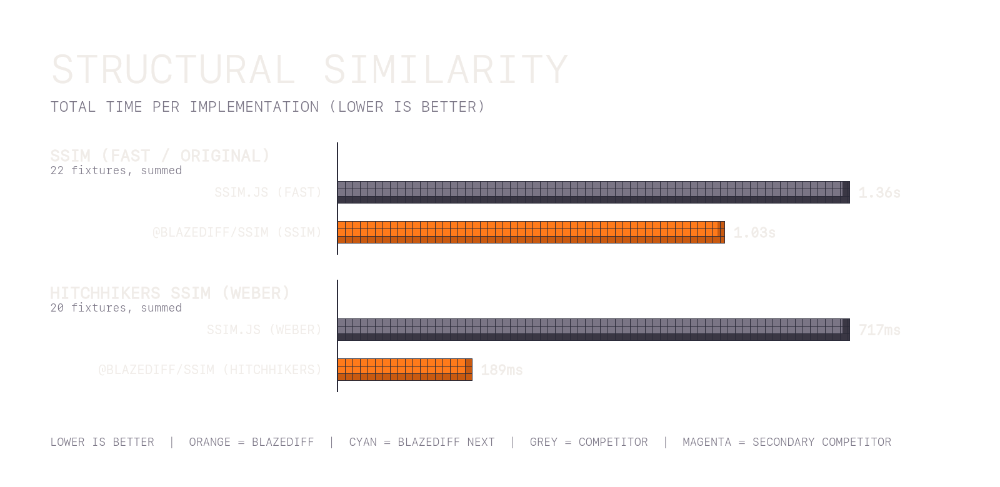

# Structural Similarity Benchmarks

Per-window image quality comparisons (SSIM family). Image decode is excluded.

Read each section against its own baseline, not against the other one. The two
metrics are not given the same amount of work: `ssim` follows MATLAB's `ssim.m`
and shrinks the image to ~256px on the short edge before it measures anything,
while `hitchhikers-ssim` always runs at full resolution. On the largest fixture
that is 264x573 pixels versus 3.8M.

That is also why the Rust port wins by so much more on one than the other
(~15x vs ~4x). Nearly all of Hitchhiker's time is the single full-resolution
pass that builds its lookup tables, not the comparison itself — widening the
window stride to compare 34x fewer positions moves it only 26.9ms -> 24.8ms.
That pass is a running total, so it has to go pixel by pixel in order, whereas
the convolutions it replaces vectorise. In JavaScript the trick is a large win
because the math it avoids is slow there; in Rust it costs more than it saves.

## Fast Original ( `@blazediff/ssim` using `ssim` vs `ssim.js` using `fast` algorithm) (image IO excluded)

_25 iterations (3 warmup)_

> **~31.5%** performance improvement on average.

The percentage above is the JavaScript port. `@blazediff/ssim-native` is the
Rust one, wrapping the same algorithm — roughly **15x** faster again than the JS
port, from the same decoded buffers.

<table>
  <thead>
    <tr>
      <th width="500">Benchmark</th>
      <th width="500">ssim.js</th>
      <th width="500">BlazeDiff</th>
      <th width="500">BlazeDiff (ssim-native)</th>
      <th width="500">BlazeDiff Saved</th>
      <th width="500">BlazeDiff %</th>
      <th width="500">BlazeDiff (ssim-native) Saved</th>
      <th width="500">BlazeDiff (ssim-native) %</th>
    </tr>
  </thead>
  <tbody>
    <tr>
      <td>blazediff/1</td>
      <td>96.08ms</td>
      <td>66.90ms</td>
      <td>5.57ms</td>
      <td>29.18ms</td>
      <td>30.4%</td>
      <td>90.50ms</td>
      <td>94.2%</td>
    </tr>
    <tr>
      <td>blazediff/1 (identical)</td>
      <td>97.84ms</td>
      <td>65.96ms</td>
      <td>5.53ms</td>
      <td>31.89ms</td>
      <td>32.6%</td>
      <td>92.32ms</td>
      <td>94.4%</td>
    </tr>
    <tr>
      <td>blazediff/2</td>
      <td>38.90ms</td>
      <td>23.56ms</td>
      <td>1.64ms</td>
      <td>15.34ms</td>
      <td>39.4%</td>
      <td>37.25ms</td>
      <td>95.8%</td>
    </tr>
    <tr>
      <td>blazediff/2 (identical)</td>
      <td>38.33ms</td>
      <td>24.37ms</td>
      <td>1.61ms</td>
      <td>13.96ms</td>
      <td>36.4%</td>
      <td>36.72ms</td>
      <td>95.8%</td>
    </tr>
    <tr>
      <td>blazediff/3</td>
      <td>124.34ms</td>
      <td>95.98ms</td>
      <td>5.24ms</td>
      <td>28.36ms</td>
      <td>22.8%</td>
      <td>119.10ms</td>
      <td>95.8%</td>
    </tr>
    <tr>
      <td>blazediff/3 (identical)</td>
      <td>112.10ms</td>
      <td>98.15ms</td>
      <td>5.56ms</td>
      <td>13.95ms</td>
      <td>12.4%</td>
      <td>106.54ms</td>
      <td>95.0%</td>
    </tr>
    <tr>
      <td>blazediff/4</td>
      <td>283.99ms</td>
      <td>228.75ms</td>
      <td>13.88ms</td>
      <td>55.25ms</td>
      <td>19.5%</td>
      <td>270.12ms</td>
      <td>95.1%</td>
    </tr>
    <tr>
      <td>blazediff/4 (identical)</td>
      <td>261.89ms</td>
      <td>224.39ms</td>
      <td>12.56ms</td>
      <td>37.50ms</td>
      <td>14.3%</td>
      <td>249.33ms</td>
      <td>95.2%</td>
    </tr>
    <tr>
      <td>pixelmatch/1</td>
      <td>29.94ms</td>
      <td>19.88ms</td>
      <td>1.66ms</td>
      <td>10.06ms</td>
      <td>33.6%</td>
      <td>28.27ms</td>
      <td>94.5%</td>
    </tr>
    <tr>
      <td>pixelmatch/1 (identical)</td>
      <td>29.22ms</td>
      <td>19.82ms</td>
      <td>1.61ms</td>
      <td>9.40ms</td>
      <td>32.2%</td>
      <td>27.61ms</td>
      <td>94.5%</td>
    </tr>
    <tr>
      <td>pixelmatch/2</td>
      <td>15.33ms</td>
      <td>9.82ms</td>
      <td>0.79ms</td>
      <td>5.51ms</td>
      <td>35.9%</td>
      <td>14.55ms</td>
      <td>94.9%</td>
    </tr>
    <tr>
      <td>pixelmatch/2 (identical)</td>
      <td>14.75ms</td>
      <td>9.93ms</td>
      <td>0.84ms</td>
      <td>4.82ms</td>
      <td>32.7%</td>
      <td>13.91ms</td>
      <td>94.3%</td>
    </tr>
    <tr>
      <td>pixelmatch/3</td>
      <td>28.52ms</td>
      <td>23.06ms</td>
      <td>1.67ms</td>
      <td>5.46ms</td>
      <td>19.1%</td>
      <td>26.85ms</td>
      <td>94.1%</td>
    </tr>
    <tr>
      <td>pixelmatch/3 (identical)</td>
      <td>29.82ms</td>
      <td>19.89ms</td>
      <td>1.65ms</td>
      <td>9.93ms</td>
      <td>33.3%</td>
      <td>28.17ms</td>
      <td>94.5%</td>
    </tr>
    <tr>
      <td>pixelmatch/4</td>
      <td>20.90ms</td>
      <td>11.85ms</td>
      <td>0.80ms</td>
      <td>9.05ms</td>
      <td>43.3%</td>
      <td>20.10ms</td>
      <td>96.2%</td>
    </tr>
    <tr>
      <td>pixelmatch/4 (identical)</td>
      <td>20.70ms</td>
      <td>12.27ms</td>
      <td>0.83ms</td>
      <td>8.43ms</td>
      <td>40.7%</td>
      <td>19.88ms</td>
      <td>96.0%</td>
    </tr>
    <tr>
      <td>pixelmatch/5</td>
      <td>14.71ms</td>
      <td>10.79ms</td>
      <td>0.79ms</td>
      <td>3.92ms</td>
      <td>26.7%</td>
      <td>13.91ms</td>
      <td>94.6%</td>
    </tr>
    <tr>
      <td>pixelmatch/5 (identical)</td>
      <td>15.50ms</td>
      <td>9.82ms</td>
      <td>0.77ms</td>
      <td>5.68ms</td>
      <td>36.6%</td>
      <td>14.73ms</td>
      <td>95.1%</td>
    </tr>
    <tr>
      <td>pixelmatch/6</td>
      <td>14.86ms</td>
      <td>9.82ms</td>
      <td>0.79ms</td>
      <td>5.04ms</td>
      <td>33.9%</td>
      <td>14.07ms</td>
      <td>94.7%</td>
    </tr>
    <tr>
      <td>pixelmatch/6 (identical)</td>
      <td>14.72ms</td>
      <td>9.79ms</td>
      <td>0.77ms</td>
      <td>4.94ms</td>
      <td>33.5%</td>
      <td>13.95ms</td>
      <td>94.8%</td>
    </tr>
    <tr>
      <td>pixelmatch/7</td>
      <td>28.88ms</td>
      <td>16.56ms</td>
      <td>1.16ms</td>
      <td>12.32ms</td>
      <td>42.7%</td>
      <td>27.73ms</td>
      <td>96.0%</td>
    </tr>
    <tr>
      <td>pixelmatch/7 (identical)</td>
      <td>28.21ms</td>
      <td>16.78ms</td>
      <td>1.12ms</td>
      <td>11.42ms</td>
      <td>40.5%</td>
      <td>27.09ms</td>
      <td>96.0%</td>
    </tr>
  </tbody>
</table>

## Hitchhikers SSIM SSIM (`@blazediff/ssim` using `hitchhikers-ssim` vs `ssim.js` using `weber` algorithm) (image IO excluded)

_25 iterations (3 warmup)_

> **~75.1%** performance improvement on average.

The percentage above is the JavaScript port. `@blazediff/ssim-native` is the
Rust one, wrapping the same algorithm — roughly **4x** faster again than the JS
port, from the same decoded buffers.

<table>
  <thead>
    <tr>
      <th width="500">Benchmark</th>
      <th width="500">ssim.js</th>
      <th width="500">BlazeDiff</th>
      <th width="500">BlazeDiff (ssim-native)</th>
      <th width="500">BlazeDiff Saved</th>
      <th width="500">BlazeDiff %</th>
      <th width="500">BlazeDiff (ssim-native) Saved</th>
      <th width="500">BlazeDiff (ssim-native) %</th>
    </tr>
  </thead>
  <tbody>
    <tr>
      <td>blazediff/1</td>
      <td>63.19ms</td>
      <td>12.58ms</td>
      <td>2.85ms</td>
      <td>50.61ms</td>
      <td>80.1%</td>
      <td>60.34ms</td>
      <td>95.5%</td>
    </tr>
    <tr>
      <td>blazediff/1 (identical)</td>
      <td>63.14ms</td>
      <td>12.59ms</td>
      <td>2.88ms</td>
      <td>50.55ms</td>
      <td>80.1%</td>
      <td>60.25ms</td>
      <td>95.4%</td>
    </tr>
    <tr>
      <td>blazediff/2</td>
      <td>34.91ms</td>
      <td>10.22ms</td>
      <td>2.26ms</td>
      <td>24.68ms</td>
      <td>70.7%</td>
      <td>32.64ms</td>
      <td>93.5%</td>
    </tr>
    <tr>
      <td>blazediff/2 (identical)</td>
      <td>34.65ms</td>
      <td>10.02ms</td>
      <td>2.28ms</td>
      <td>24.64ms</td>
      <td>71.1%</td>
      <td>32.37ms</td>
      <td>93.4%</td>
    </tr>
    <tr>
      <td>blazediff/3</td>
      <td>134.85ms</td>
      <td>46.12ms</td>
      <td>10.96ms</td>
      <td>88.72ms</td>
      <td>65.8%</td>
      <td>123.89ms</td>
      <td>91.9%</td>
    </tr>
    <tr>
      <td>blazediff/3 (identical)</td>
      <td>141.68ms</td>
      <td>47.06ms</td>
      <td>10.97ms</td>
      <td>94.62ms</td>
      <td>66.8%</td>
      <td>130.70ms</td>
      <td>92.3%</td>
    </tr>
    <tr>
      <td>blazediff/4</td>
      <td>389.62ms</td>
      <td>108.01ms</td>
      <td>25.77ms</td>
      <td>281.60ms</td>
      <td>72.3%</td>
      <td>363.85ms</td>
      <td>93.4%</td>
    </tr>
    <tr>
      <td>blazediff/4 (identical)</td>
      <td>351.85ms</td>
      <td>108.45ms</td>
      <td>25.43ms</td>
      <td>243.40ms</td>
      <td>69.2%</td>
      <td>326.42ms</td>
      <td>92.8%</td>
    </tr>
    <tr>
      <td>pixelmatch/1</td>
      <td>19.03ms</td>
      <td>3.97ms</td>
      <td>0.84ms</td>
      <td>15.06ms</td>
      <td>79.1%</td>
      <td>18.19ms</td>
      <td>95.6%</td>
    </tr>
    <tr>
      <td>pixelmatch/1 (identical)</td>
      <td>18.49ms</td>
      <td>3.93ms</td>
      <td>0.87ms</td>
      <td>14.57ms</td>
      <td>78.8%</td>
      <td>17.63ms</td>
      <td>95.3%</td>
    </tr>
    <tr>
      <td>pixelmatch/2</td>
      <td>9.33ms</td>
      <td>1.88ms</td>
      <td>0.44ms</td>
      <td>7.45ms</td>
      <td>79.9%</td>
      <td>8.90ms</td>
      <td>95.3%</td>
    </tr>
    <tr>
      <td>pixelmatch/2 (identical)</td>
      <td>9.34ms</td>
      <td>1.86ms</td>
      <td>0.40ms</td>
      <td>7.48ms</td>
      <td>80.1%</td>
      <td>8.94ms</td>
      <td>95.7%</td>
    </tr>
    <tr>
      <td>pixelmatch/3</td>
      <td>19.14ms</td>
      <td>3.77ms</td>
      <td>0.84ms</td>
      <td>15.37ms</td>
      <td>80.3%</td>
      <td>18.30ms</td>
      <td>95.6%</td>
    </tr>
    <tr>
      <td>pixelmatch/3 (identical)</td>
      <td>18.42ms</td>
      <td>3.82ms</td>
      <td>0.85ms</td>
      <td>14.60ms</td>
      <td>79.3%</td>
      <td>17.58ms</td>
      <td>95.4%</td>
    </tr>
    <tr>
      <td>pixelmatch/4</td>
      <td>18.59ms</td>
      <td>5.19ms</td>
      <td>1.20ms</td>
      <td>13.40ms</td>
      <td>72.1%</td>
      <td>17.39ms</td>
      <td>93.6%</td>
    </tr>
    <tr>
      <td>pixelmatch/4 (identical)</td>
      <td>19.22ms</td>
      <td>5.21ms</td>
      <td>1.19ms</td>
      <td>14.01ms</td>
      <td>72.9%</td>
      <td>18.03ms</td>
      <td>93.8%</td>
    </tr>
    <tr>
      <td>pixelmatch/5</td>
      <td>9.51ms</td>
      <td>1.89ms</td>
      <td>0.40ms</td>
      <td>7.62ms</td>
      <td>80.1%</td>
      <td>9.10ms</td>
      <td>95.7%</td>
    </tr>
    <tr>
      <td>pixelmatch/5 (identical)</td>
      <td>9.35ms</td>
      <td>2.07ms</td>
      <td>0.44ms</td>
      <td>7.28ms</td>
      <td>77.9%</td>
      <td>8.90ms</td>
      <td>95.2%</td>
    </tr>
    <tr>
      <td>pixelmatch/6</td>
      <td>9.28ms</td>
      <td>2.05ms</td>
      <td>0.41ms</td>
      <td>7.22ms</td>
      <td>77.9%</td>
      <td>8.86ms</td>
      <td>95.6%</td>
    </tr>
    <tr>
      <td>pixelmatch/6 (identical)</td>
      <td>9.44ms</td>
      <td>1.94ms</td>
      <td>0.40ms</td>
      <td>7.49ms</td>
      <td>79.4%</td>
      <td>9.04ms</td>
      <td>95.8%</td>
    </tr>
    <tr>
      <td>pixelmatch/7</td>
      <td>24.82ms</td>
      <td>7.38ms</td>
      <td>1.72ms</td>
      <td>17.44ms</td>
      <td>70.3%</td>
      <td>23.10ms</td>
      <td>93.1%</td>
    </tr>
    <tr>
      <td>pixelmatch/7 (identical)</td>
      <td>23.29ms</td>
      <td>7.25ms</td>
      <td>1.65ms</td>
      <td>16.04ms</td>
      <td>68.9%</td>
      <td>21.64ms</td>
      <td>92.9%</td>
    </tr>
  </tbody>
</table>

_Benchmarks run on MacBook Pro M1 Max, Node.js 22_
